In this part of the NAKIVO Backup &amp; Replication review I highlight the replication feature. With the replication feature you can replicate VMs. The source VMs are copied, a VM replica is created of each and replicated to the target VMware environment (also known as the recovery site).

VM Replication protects for example against the following type of disasters:

- Natural disasters  (earthquakes, floods, tornados etc.)
- Data center  problems such as power losses, fire and water damage
- Hardware problems such as host, network and storage failures
- Human errors
- VM failures caused by updates or patches, virus or manually removal

The replication feature can be used for business continuity as part of you're disaster recovery plan. When a disaster occurs, the protected VM(s) can be quick failed over from the primary site to the recovery site.

[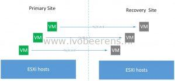](images/Tekening1.jpg)

When the primary site is restored the VM(s) can be failed back to the primary site.

Another use case it to use replication for migrating the VMs to a new VMware environment for example when moving from on-premises to a cloud provider.

**Configuration**

The configuration of the replication job can be done by using  a 7 step wizard:

[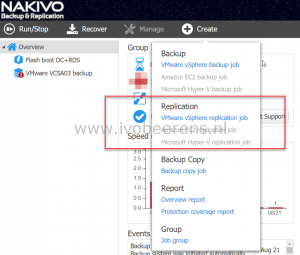](images/1-10.png)

**1\. VMs.** Select the VM(s) that will be replicated.

[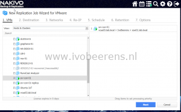](images/2-10.png)

2\. **Destination**. Select the destination host(s) and datastores the VM(s) will be replicated to.

[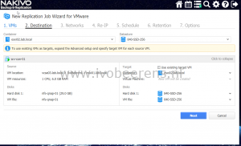](images/3-5.png)

3\. **Networks**. If the VM on the primary site has another network than on the recovery site you can make a mapping between them. In my test environment I have an stretched L2 network so the source and target network are the same.

[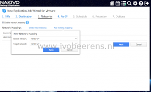](images/4-4.png)

4\. **Re-IP**. With this option the replicated VMs will be mapped to a new IP address. In my test environment I have an stretched L2 network so the IP address will not change.

[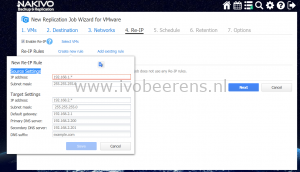](images/5-1.png)

5\. **Schedule**.Select the scheduling for the replication job. The VM replication will be executed at the schedules. So note that the VM(s) in primary site are not synchronous replicated.

[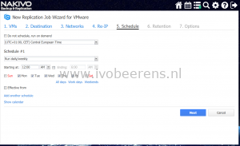](images/6-2.png)

6\. **Retention**. Set the retention for the replicated VMs. Per VM you can have up to 30 recovery points.

[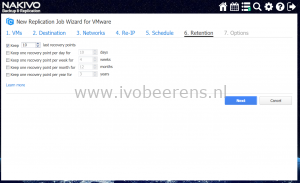](images/7-2.png)

7\. **Options**. Set the options for the job.

[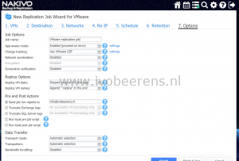](images/8-2.png)

Click on Finish & Run to start the first replication job. The VM will be replicated to the recovery site in a powered off state in the vSphere client.

[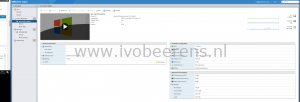](images/7-3.png)

**Perform a VM Failover.**

If a disaster occurs at the primary site or something happen with one or more protected VMs you can perform a failover from the primary to the recovery site. To perform a VM failover follow these steps using the following wizard:

In the recover menu select VM failover to replica.

[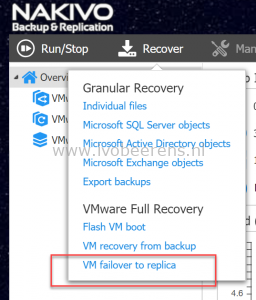](images/1-11.png)

1\. **Source**. Select the VM and recovery point to use.

[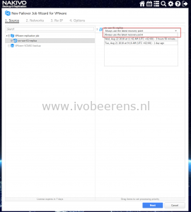](images/2-12.png)

2\. **Networks**. If the VM on the primary site has another network than on the recovery site you can make a mapping between them. In my test environment I have an stretched L2 network so the source and target network are the same.

3\. **Re-IP**. With this option the replicated VMs will be mapped to a new IP address. In my test environment I have an stretched L2 network so the IP address will not change.

[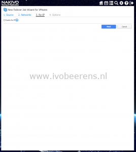](images/4-6.png)

4\. **Options**. In the options section enter the job name. I checked the "Power off source VMs" box to prevent IP conflicts.

[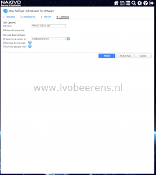](images/5-2.png)

Click on the "**Finish & Run**" button to start the recovery job. The VM in the primary site is powered off and the replica VM is powered on in the recovery site. In the vSphere client, the replica VM is running after the failover.

[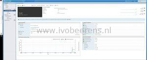](images/6-3.jpg)

**VM Failback.**

After the disaster, the protected VMs are at the recovery site. When the infrastructure at the primary is restored you may want to return these VMs back. With the replication feature these VMs can be transferred back to the primary site. Transferring the VMs back involves performing some manual steps such as deleting the recovery job (with the keep recovered VMs option) and create a new replication job.

[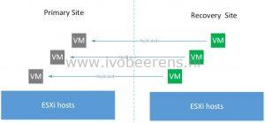](images/failback.jpg)

In a next release of NAKIVO Backup & Replication a new feature called "site recovery" will be introduced. Site recovery will enhance the replication feature with for example automated testing and workflow options. With these options you can test for example if the disaster recovery plan works as expected in a isolated environment.

**UppubDate: August 27, 2018**. NAKIVO announced today version 8 with Site Recovery feature. This powerful new feature allows you to:

- Build automated recovery workflows
- Run one-click failover, failback, and datacenter migration
- Perform non-disruptive recovery testing Make sure you meet your RTOs

More information about the Site Recovery feature can be found here [link](https://www.nakivo.com/vm-disaster-recovery/).

In the next NAKIVO Backup & Replication review I will highlight the editions, licensing and conclusion of my four reviews.