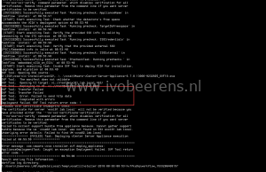

Installing the vCenter Server Aplliance (vCSA) automatically using an unattended scripted deployment can be done by command line (CLI) in combination with a JSON config file. In this example an embedded vCenter Server Appliance with the Platform Service Controller (PSC) and vCenter Server role will be deployed.

**Prerequisites:**

- This example is based on a Windows Operating System. Using a Linux or MAC OS is also possible but not highlighted in this blog.
- Make sure the FQDN of the vCSA is resolvable by a DNS server and check if reverse lookup works.

**Steps to perform:**

- Download the vCenter Server Appiance (VCSA) ISO (version 6.5 or 6.7)
- Mount the ISO
- The CLI installer for Windows requires a Microsoft Visual C++ Redistributable version 14.0. This requirement can be checked with the following command:

```
\vcsa-cli-installer\win32\check_windows_vc_redist.bat
```

- Navigate to the JSON templates. The vCSA ISO contains template JSON files that can be used for deploying the vCSA. The templates can be found on the ISO in the following map:

```
 \vcsa-cli-installer\templates\install
```

The types of templates are avalable:

```
           embedded_vCSA_on_*.json: Platform Services Controller (PSC) and vCSA
                                     together on one system
            PSC_on_*.json:           Only a PSC
            vCSA_on_*.json:          Only a vCSA
            *_on_ESXi.json:          Install onto the ESXi host specified in the JSON
                                     file
            *_on_VC.json:            Install onto a host managed by the vCenter
                                     instance specified in the JSON file
```

- Edit a template "**embedded\_vCSA\_on\_ESXi.json**" or **use the example below** with you're favorite editor (I use Notepad ++) and save it to a writable location (in the CLI syntax you need to point to this modified JSON file). The template contains the minimal parameters needed to deploy the embedded vCSA. The vCSA will deployed as tiny (2 vCPU, 10 GB memory, 300 GB storage). An overview of all parameters that can be used are found here, [link](https://docs.VMware.com/en/VMware-vSphere/6.7/com.VMware.vcenter.install.doc/GUID-457EAE1F-B08A-4E64-8506-8A3FA84A0446.html).

Example JSON file to deploy an embedded vCenter Server Appliance with the PSC and vCenter components:

```
{
    "__version": "2.13.0",
    "__comments": "Sample template to deploy a vCenter Server Appliance with an embedded Platform Services Controller on an ESXi host.",
    "new_vcsa": {
        "esxi": {
            "hostname": "192.168.11.10",
            "username": "root",
            "password": "VMwaaare01!",
            "deployment_network": "vlan13-srv",
            "datastore": "SSD-M2-01"
        },
        "appliance": {
            "__comments": [
                "You must provide the 'deployment_option' key with a value, which will affect the VCSA's configuration parameters, such as the VCSA's number of vCPUs, the memory size, the storage size, and the maximum numbers of ESXi hosts and VMs which can be managed. For a list of acceptable values, run the supported deployment sizes help, i.e. vcsa-deploy --supported-deployment-sizes"
            ],
            "thin_disk_mode": true,
            "deployment_option": "tiny",
            "name": "vcsa03.lab.local"
        },
        "network": {
            "ip_family": "ipv4",
            "mode": "static",
            "ip": "192.168.13.13",
            "dns_servers": [
                "192.168.13.101"
            ],
            "prefix": "24",
            "gateway": "192.168.13.254",
            "system_name": "vcsa03.lab.local"
        },
        "os": {
            "password": "VMware01!",
            "ntp_servers": "pool.ntp.org",
            "ssh_enable": true
        },
        "sso": {
            "password": "VMware01!",
            "domain_name": "vsphere.local"
        }
    },
    "ceip": {
        "description": {
            "__comments": [
                "++++VMware Customer Experience Improvement Program (CEIP)++++",
                "VMware's Customer Experience Improvement Program (CEIP) ",
                "provides VMware with information that enables VMware to ",
                "improve its products and services, to fix problems, ",
                "and to advise you on how best to deploy and use our ",
                "products. As part of CEIP, VMware collects technical ",
                "information about your organization's use of VMware ",
                "products and services on a regular basis in association ",
                "with your organization's VMware license key(s). This ",
                "information does not personally identify any individual. ",
                "",
                "Additional information regarding the data collected ",
                "through CEIP and the purposes for which it is used by ",
                "VMware is set forth in the Trust &amp;amp;amp;amp;amp; Assurance Center at ",
                "http://www.vmware.com/trustvmware/ceip.html . If you ",
                "prefer not to participate in VMware's CEIP for this ",
                "product, you should disable CEIP by setting ",
                "'ceip_enabled': false. You may join or leave VMware's ",
                "CEIP for this product at any time. Please confirm your ",
                "acknowledgement by passing in the parameter ",
                "--acknowledge-ceip in the command line.",
                "++++++++++++++++++++++++++++++++++++++++++++++++++++++++++++++"
            ]
        },
        "settings": {
            "ceip_enabled": true
        }
    }
}
```

The first deployments failed when using the FQDN ESXi hostname in the JSON file, with the following error:

> OVF Tool: Transfer Failed
  OVF Tool: Error: Failed to send http data
  Deployment failed. OVF Tool return error code: 1

[](images/1-9.png)

I checked the logs but didn't find any clue. The FQDN of the ESXi host was revolvable by DNS but after changing the ESXi FQDN to the IP address of the ESXi  host in the JSON file the deployment finished without errors.

- Perform a template JSON verification without installing:

```
vcsa-deploy install --accept-eula --verify-template-only <JSON file path>
```

- Perform the actually deployment

```
vcsa-deploy.exe install --accept-eula --acknowledge-ceip --terse --no-ssl-certificate-verification <JSON file path>
```

When the unattended deployment finished, an embedded vCenter Server Appliance with the Platform Service Controller (PSC) and vCenter Server role is ready to rumble.

I created a GitHub repository for the deployment and parameters, [link](https://github.com/ibeerens/VCSA).

VMware documentation about the CLI deployment can be found here, [link](https://docs.VMware.com/en/VMware-vSphere/6.7/com.VMware.vcenter.install.doc/GUID-C17AFF44-22DE-41F4-B85D-19B7A995E144.html).