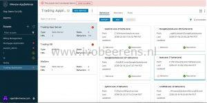
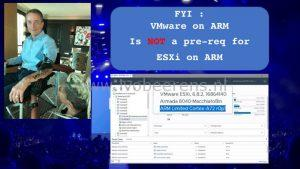
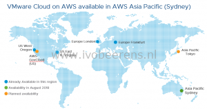
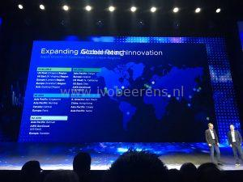
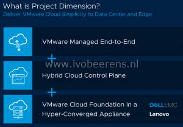
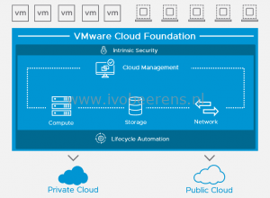
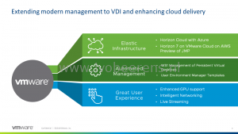

This blog post will be updated with the latest and greatest VMworld 2018 US announcements. At VMworld, VMware is celebrating there **20th** anniversary! Congrats for this awesome journey! VMworld 2018 US (Las Vegas) is the biggest (over 21000 attendees) event of the year for VMware. In November there is a VMworld in Barcelona (Europe). But for now we focuses on the announcements made at VMworld 2018 US.

Besides announcements, links to the general and breakout sessions are listed below and some vendor updates.

## **Day 1, August 27, 2018**

- **vSphere Platinum**. vSphere Platinum is a new offering that includes VMware vSphere Enterprise plus and VMware AppDefense. VMware AppDefense is a data center endpoint security product that protects applications running in virtualized environments. This bundle comes with a own AppDefense vCenter plugin that is built for the Platinum version. More information can be found here [link](https://blogs.VMware.com/vSphere/2018/08/under-the-hood-vSphere-platinum.html).

- **vSphere 6.7 Update 1**. With this update it is possible to upgrade from vSphere 6.5 U2 to vSphere 6.7 U1. The General Availability is planned later this year! So what are they enhancements:
    - **vMotion for NVIDIA Quadro vDWS and Intel FPGA Support**. NVIDIA demonstrated this last year at VMworld. In vSphere 6.7 the suspend and resume options were introduced.With vSphere 6.7U1 it is possible to perform maintenance operations on the underlying GPU accelerated VDI or VMs with a vMotion. So no downtime is involved. I have a lot NVIDIA GPU customers who will be very happy with this. More information can be found here, [link](https://blogs.nvidia.com/blog/2018/08/27/gpu-live-migration-vmotion-virtualization/).
    - **Fully Featured HTML5-based vSphere Client**. The Sphere Client (HTML5) will include all administrative functions!  No more switching between the vSphere Web Client and vSphere Client. One fast client that does the job. Hooray!
    - **vCenter Server Converge Tool**. Allows you to migrate from an external Platform Services Controller (PSC) to an embedded PSC architecture.
    - **Enhancements for HCI and vSAN**. Includes workflow based configuration wizard called "Cluster Quickstart". With "Cluster Quickstart" it's possible to create a fully functional vSAN cluster in minutes. Another improvement is that vSphere Update Manager (VUM) can perform I/O controller firmware updates. This version will be called vSAN 6.7U1.
    - **Enhanced Content Library**. Importing of OVA templates from a HTTPS endpoint and local storage, as well as syncing content from OVA templates to other vCenter Servers.

More information can be found here [link](https://blogs.VMware.com/vSphere/2018/08/under-the-hood-vSphere-6-7-update-1.html).

- **vSAN Private Beta**. You can subscribe to the vSAN Private Beta by signing a NDA.  This beta will include Data Protection by using snapshots, file services and persistent storage for containers. Subscribe here [link](http://www.surveyanalytics.com/a/TakeSurvey?tt=sv4g%2BzqQ9Dc%3D).
- **ESXi  on 64-bit Arm**. Bring the power of ESXi  virtualization to 64-bit Arm devices. For example run ESXi on a Raspberry Pi (don't know if VMware is supporting the PI). Great for IoT devices. ESXi on 64-bit ARM will be available as Tech Preview.

- **vRealize Operations (vROps) 7.0**. More information can be found here [link](https://blogs.VMware.com/management/2018/08/whats-new-in-vrealize-operations-7-0.html).
- **vRealize Automation 7.5**. More information can be found here [link](https://blogs.VMware.com/management/2018/08/whats-new-vrealize-automation-7-5.html?src=af_5b804a92462da&cid=70134000001sqAf).
- **VMware vCloud Director 9.5**. More information can be found here [link](https://blogs.VMware.com/vcloud/2018/08/VMware-vcloud-director-9-5.html?src=vmw_so_vex_mande_12).
- **VMware Cloud on AWS (VMWonAWS**). Today it's the 1 year anniversary of the VMware Cloud on AWS  with the following enhancements:
    - **New Regional Expansion**.  With Australia and New Zealand. Below is an overview of available regions:

- **50% lower entry-level price**. A 3-host SDDC minimum is now possible as starting point (instead of the original 4-host). VMware is currently offering the 3-Host SDDC environment for the cost of a two-host configuration. In addition, for a limited time period, customer could take advantage of a new promotion that offers three hosts at the price of two. For the start, duration and terms and conditions of the promotion. More information about the costs can be found here [link](https://cloud.VMware.com/vmc-aws/get-started).
- **Custom CPU core counts**: Customers can now configure their environments with the number of physical cores per host they want to be enable in a cluster. This is useful for applications that are licensed per physical core (for example Oracle).
- **VMware NSX with AWS Direct Connect integration**. This integration eliminates the need for using separate VPN tunnels when using applications that needs to be migrate or operate in a hybrid manner.
- **VMware NSX Hybrid Connect**.  Migrate VMs live without downtime using vMotion and vSphere replication technology. It's now possible to perform bulk VM migrations.
- **Real-time log management**.

More information can be found here [link](https://cloud.VMware.com/community/2018/08/26/VMware-cloud-aws-charging-ahead/).

- **Amazon Relational Database Service (RDS) on VMware.** Amazon Relational Database Service (RDS) on VMware makes it easy for you to set up, operate, and scale databases in on-premises and hybrid environments, and to migrate them to AWS**.** Supported database are for example Microsoft SQL Server, Oracle, PostgreSQL and MySQL.Are there coming more awesome AWS services available on-premises? RDS on VMware will be available as Tech Preview.
    - More information can be found here [link](https://ir.VMware.com/overview/press-releases/press-release-details/2018/AWS-and-VMware-Announce-Amazon-Relational-Database-Service-on-VMware/default.aspx).
    - For a Tech Preview register here [link](https://aws.amazon.com/rds/VMware/).
- **Project Magna**. This Tech Preview is about the self-driving Data Center using machine learning.  Products that are used in Project Magna are for example: Wavefront, AppDefense and Workspace ONE Intelligence. Project Magna will make managing the data center infrastructure much easier.
- **Project Dimension**. Project Dimension will extend VMware Cloud to deliver SDDC infrastructure and hardware as-a-service to on-premises locations. Because this is will be a service, it means that VMware can take care of managing the infrastructure, troubleshooting issues, and performing patching and maintenance. This in turn means customers can focus on differentiating their business building innovative applications rather than spending time on day-to-day infrastructure management.  So Project Dimension delivers VMware Cloud simplicity (such as VMware Cloud on AWS) to the data center and edge with:
    - VMware-Operated End-to-End
    - Hybrid Cloud Control Plane
    - VMware Cloud Foundation in a Hyper-Converged Appliance (DellEMC and Lenovo)

More information can be found here [link](https://blogs.VMware.com/vSphere/2018/08/introducing-project-dimension.html).

- Three new cloud services are announced:
    - **Cloud Assembly**. This is a multi cloud provisioning service. More information can be found here [link](https://cloud.VMware.com/cloud-assembly).
    - **Service Broker**. Aggregate native content from multiple clouds and platforms into a single catalog with role-based policies. More information can be found here [link](https://cloud.VMware.com/service-broker).
    - **Code Stream**. Speed software delivery and streamline troubleshooting with release pipelines and analytics. More information can be found here [link](https://cloud.VMware.com/code-stream).
- **Intent to Acquire CloudHealth Technologies to provide Multi-Cloud Operations at Global Scale**. More information can be found here [link](https://www.VMware.com/radius/intent-to-acquire-cloudhealth-technologies/).

## **Day 2, August 28, 2018**

- **Pulse IoT Center 2.0 announced.**  Pulse IoT center offers infrastructure management for the device Edge. More information can be found here [link](https://blogs.VMware.com/pulseiot/2018/08/28/pulse-iot-center-2-0-management-for-the-device-edge/).
- **VMware Cloud Foundation (VCF) 3.0**. VMware Cloud Foundation brings together the different virtualization technologies – compute, storage, networking and management – to enable customers to build and operate a private or hybrid cloud as a single entity in an automated fashion. More information can be found here [link](https://blogs.VMware.com/cloud-foundation/2018/08/28/introduction-to-VMware-cloud-foundation-3-0/).

- **WorkSpace ONE:**
    - **WorkSpace ONE Unified Endpoint Management (UEM) enhancements**. More information can be found here [link](https://blogs.VMware.com/euc/2018/08/workspaceone-eum-vmworld.html).
    - **Workspace ONE Intelligent Hub**. More information can be found here [link](https://blogs.VMware.com/euc/2018/08/workspaceone-intelligent-hub.html).
- **Horizon announcements**. The innovations are at the VDI management and cloud delivery level. More information can be found here [link](https://blogs.VMware.com/euc/2018/08/sneak-peek-horizon.html).

## **Streams  and breakout sessions overview**

- VMworld General Session "Technology Superpowers" day 1 replay, [link](https://youtu.be/mjYP2IuZK6k).
- VMworld General Session "Pioneers of the Possible" day 2 replay, [link](https://youtu.be/SXstDLKUC3w).
- VMware VMworld YouTube videos, [link](https://www.youtube.com/user/VMwaretv/videos).
- Lamw VMworld 2018 breakout sessions Github, [link](https://github.com/lamw/vmworld2018-session-urls).
- vBrownBag Techtalks stream [link](https://www.twitch.tv/vbrownbag).
- VMworld 2018 US (breakout) session videos, [link](https://videos.vmworld.com/searchsite/2018).
- VMware Code Power sessions, [link](https://www.facebook.com/VMwarecode/).
- theCUBE VMworld 2018 Las Vegas talks, [link](https://www.youtube.com/playlist?list=PLenh213llmcZTuws43j18I-5QGC8k3Ae_).

## **Vendor updates**

- **NAKIVO Backup & Replication version 8**.  Today version 8 of NAKIVO Backup & Replication is Generally Available (GA). This version includes the Business Continuity and Site Recovery Orchestration Solution.  With v8 can automate and orchestrate the entire site recovery process. Perform scheduled non-disruptive disaster recovery testing, planned failover, emergency failover, failback, and datacenter migration.  More information can be found here [link](https://www.ivobeerens.nl/2018/08/01/nakivo-backup-replication-v7-5-released/).
- **RuneCast Analyzer 2.0**. I will dedicate a blog about version 2.0 soon. More information can be found here [link](https://www.runecast.com/blog/announcements/introducing-runecast-analyzer-20).
- **Veeam Hyper-Availability Platform on Cisco HyperFlex**. More information can be found here [link](https://www.veeam.com/news/availability-solution-cisco-hyperflex.html).