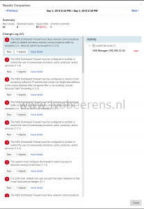
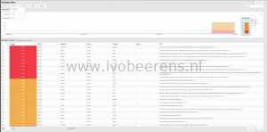
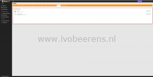

Runecast Analyzer provides proactive management for VMware environments. It discovers potential risks in the VMware environment before they can cause a major outage. In 90% of the outages with VMware environments, the root cause is based on a known issue that is already available in the VMware knowledge base. Runecast Analyzer uses information from the VMware knowledge base, security hardening guides (VMware, DISA STG and PCI-DSS), and best practices to proactively identify problems or outages before they occur.

In my last review of Runecast Analyzer I tested version 1.7 ([link](https://www.ivobeerens.nl/2018/02/27/proactively-manage-vSphere-environment-runecast-analyzer/)) with vSphere and vSAN support. The next version (1.8) included NSX-V support and a couple of weeks ago version 2.0 is of Runecast Analyzer is released. This version includes the following new enhancements.

## **New User Interface (UI)**

Runecast Analyzer 2.0 has a complete redesigned User Interface(UI) that includes new widgets such as:

- Historical Trending
- Host with Most Issues

**History trending**

It includes historical trending for at least 3 months of vSphere, vSAN and NSX-V scan results. By default every day (this can be changed) a scan is performed against one of more vCenter environment(s). The scans contains the description, IP address and why the issues was detected. The trending information is showed in widgets in the UI.

With this functionality you can keep track how compliant you are and what progress you made to solve issues. All the detected issues are summarized in the "Issue History" widget per day or weeks.

**Hosts with Most Issues**

Another new widget in the UI is the "Hosts with Most Issues". It shows which ESXi host that has the most issues and deserves the most priority to investigate.

## History Analysis

History Analysis is a new functionality that helps with isolating the root cause of the reported incident as quick as possible.

The first section shows a chart with a trend of detected and fixed issues over time. There are interactive dots in the chart trend that shows  issues and details of the scan. The second section shows a table with detailed descriptions of the issues.

Within the history analysis there can be filtered on:

- Severity (Critical, Major, Medium or Low)
- Source ( PCIDSS, SH, BP or KB)
- Applies to (Network, Compute, vCenter, Management or VM)
- Products (NSX-V or vSphere)

The issue results can be compared with previous scan results and the differences are showed.

This makes the new history analysis very powerful for finding issues in the vSphere environment for example after a maintenance window when performing configuration changes.

## **vSphere 6.7 with vSphere HTML5 client support**

Runecast Analyzer supports vSphere 6.7 and has a HTML5 web-plugin for the vSphere Client and even integrates in the NSX dashboard.

## **PCI-DSS compliance** 

Runecast Analyzer 2.0 includes a new profile with 226 different checks for the Payment Card Industry Data Securiy Standard (PCI-DSS). The profile can be enabled and automatically checks if you are compliant with the PCI-DSS profile (Runecast Analyzer supports PCI DSS 3.2.1).

This helps with becoming PCI-DSS compliant and very helpful for companies in the financial space.

The PCI-DSS results can be easily filtered and exported in different formats (PDF, CSV or clipboard copy). This can be useful when having for example an audit.

## **Latest VMware Knowledge Base updates**

When there are new knowledge definitions available the definition database can be (automated) updated. For example with the Spectre, Meltdown and L1TF vulnerabilities, Runecast Analyzer can quickly identify those vulnerabilities when VMware releases the KB articles.

## **Appliance Update**

In version 2.0 of Runecast Analyzer the internal components of the appliance are updated to the latest versions (such as Ubuntu, 14.04.05 LTS, PostgreSQL 10, Apache Tomcat  9.0.10 and TLS 1.2 is used). The appliance meets the latest security compliance. The appliance and knowledge definitions can be easily updated when a new version is available.

For new users deploying a new appliance (OVF) is a piece of cake. Runecast Analyzer is installed en operational within a couple of minutes. A free Runecast Analyzer trail or demo can be requested by using the following [link](https://www.runecast.com/).

Version 2.0 of Runecast Analyzer adds great new enhancements that helps better to proactively identify problems or outages before they occur and easily check the compliance of the VMware vSphere, vSAN en NSX-V environment.