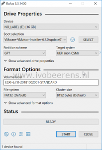
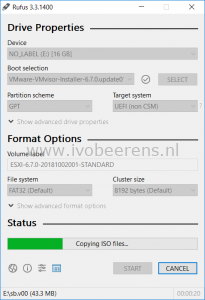

There are multiple tools available to create a bootable VMware ESXi USB stick/drive/key such as:
- UNetbootin, [link](https://unetbootin.github.io/)
- Rufus, [link](https://rufus.ie/)

My favorite tool to create a VMware ESXi USB stick/key is Rufus. I use Rufus because it's small, fast, Windows-based, open-sourced and the tool is updated frequently.

### Requirements

Requirements for creating a VMware ESXi key:

- Windows Operating System (Windows 7 or later)
- Rufus download
- VMware ESXi ISO download.

### Create a USB Stick

To create a VMware ESXi stick is easy. Perform the following steps:

- Start Rufus
- Select the USB device
- Select the ESXi ISO
- Press Start
- Data on the USB key will be destroyed.

 

When the progress status bar is READY, the VMware ESXi bootable is created and ready to boot. I tested the creation of the ESXi USB stick with the latest version of VMware ESXi 6.7 and VMware ESXi 7.

