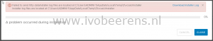
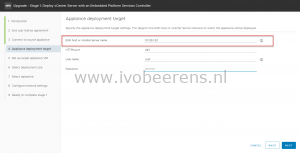
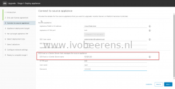

When trying to upgrade the vCenter Server Appliance (VCSA) to version 6.7 using the GUI wizard, I’ve got the following error:

> Failed to send http data.

I checked the logs but didn't find any clue. When installing the VCSA using the CLI I've got the same "Failed to send http data" error ([link](https://www.ivobeerens.nl/2018/08/20/vcenter-server-appliance-vcsa-automated-unattended-deployment/)).  The FQDN of the ESXi host was revolvable by DNS and reverse lookup worked.  After changing the ESXi FQDN to the IP address of the ESXi  host, the deployment finished without errors. I changed the "ESXi host or vCenter Server name" in the wizard step 3 and 4 to fix the problem.

 

I couldn't find  what causes the "Failed to send http data" error. I had this error during installs and upgrades in different environments. Hopefully someone can explain what happen or it is a bug that will be solved in future releases.