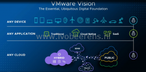
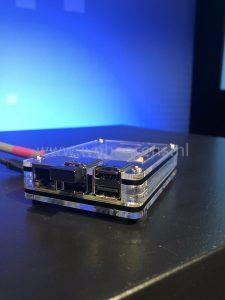

In Augustus I did a blog post ([link](http://www.ivobeerens.nl/2018/08/27/whats-announced-at-vmworld-2018-us/)) about the announcements made at VMworld 2018 US. This week it’s time for VMworld Europe in Barcelona with 12000 attendees. The vision of VMware is still the same as the last years: **any cloud, any application, any device**.

In this blog post an overview of new announcements made from VMworld Europe 2018:
- **vCloud Suite Platinum announced**. vCloud Suite platinum is a bundle with vRealize Suite and vSphere Enterprise Plus that includes now VMware AppDefense. VMware AppDefense is a security product that learn the application behavior, with this knowledge secure the application. More information can be found here, [link](https://blogs.VMware.com/management/2018/11/introducing-VMware-vcloud-suite-2018-platinum.html).

- **VMware Cloud Foundation  3.5 announced**. VMware Cloud Foundation is an integrated software stack with compute, storage, networking with cloud management and monitoring software to built a SDDC. VCF 3.5 has greater deployment options and support for example vSphere 6.7 U1 and Kubernetes. More information can be found here, [link](https://blogs.VMware.com/cloud-foundation/2018/11/06/announcing-VMware-cloud-foundation-3-5).

- **VMware and AWS Accelerate Global Roll Out of VMware Cloud on AWS**. VMware announced the expansion of VMware Cloud on AWS in Europe and the United States, with expected additional new regions forthcoming in AWS EU (Ireland), AWS West (N. California) and AWS East (Ohio) in Q4 2018.

- **VMware Cloud on AWS added disaster recovery options for the hybrid cloud.** This enables hybrid cloud disaster recovery options with Site Recovery Manager that eliminates costs because there no need for pre-provisioning the entire cloud. It's called a elastic cloud model for disaster recovery.
- **Announcing Project Dimension Beta**. Project Dimension delivers edge and data center infrastructure as-a-service, combining VMware's compute, storage, networking solutions with hyper converged hardware, managed by VMware.

- **Pivotal Container Service (PKS) will be available as cloud service**.

- **Expanding the VMware PKS portfolio with a new acquired partner called Heptio**. Heptio helps organizations to deploy and operationalize Kubernetes. More information can be found here: [link](https://blogs.VMware.com/cloudnative/2018/11/06/welcome-heptio/)

- **VMware blockchain beta program**. More information can be found here, [link](https://ir.VMware.com/overview/press-releases/press-release-details/2018/IBM-and-VMware-Advance-Partnership-to-Accelerate-Enterprise-Hybrid-Cloud-Adoption-and-Digital-Transformation/default.aspx).
- **VMware ESXi on a Raspberry PI as prototype**. How cool is this for the IoT edge space! I'm interested in the use cases for ESXi on Arm.

- **Workspace One.** With the following new enhancements:
    - Workspace ONE Intelligence Automation Connector
    - Workspace ONE Sensors for macOS.
    - Dell Provisioning for VMware Workspace ONE

More information can be found here, [link](https://ir.VMware.com/overview/press-releases/press-release-details/2018/IBM-and-VMware-Advance-Partnership-to-Accelerate-Enterprise-Hybrid-Cloud-Adoption-and-Digital-Transformation/default.aspx).

- **Horizon 7 on VMware Cloud on AWS**:
    - General availability of Horizon 7 (VDI and RDSH, Full Clones and Instant Clones) and App Volumes on VMware Cloud on AWS with the upcoming releases of Horizon 7.7 and App Volumes 2.15.
    - Second, we are enhancing Horizon 7 on-premises and on VMware Cloud on AWS by integrating with the Horizon Cloud Service and taking the first step to extend Horizon 7 with cloud-based management service. This will help consolidate and simplify management of global hybrid and multi-cloud deployments. With this announcement, we will be releasing unified visibility, health monitoring, and helpdesk services delivered from the Horizon Cloud Service for Horizon 7 deployments for both on-premises and on VMware Cloud on AWS. And specifically, for Horizon 7 on VMware Cloud on AWS, we will be previewing the automated installation of the Horizon 7 infrastructure.

More information can be found here, [link](https://ir.VMware.com/overview/press-releases/press-release-details/2018/IBM-and-VMware-Advance-Partnership-to-Accelerate-Enterprise-Hybrid-Cloud-Adoption-and-Digital-Transformation/default.aspx).

## **Streams  and breakout sessions overview**

- VMworld 2018 Europe Day 1 General Session, [Link](https://youtu.be/PdKmdsMuNPM)
