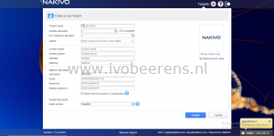
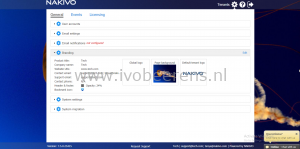
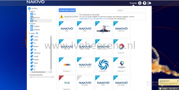

In the last part of the NAKIVO Backup & Replication review I highlight the Multi-Tenancy option, licensing and the final conclusion.

### **Multi-Tenancy and branding**

NAKIVO supports multi-tenancy to deliver Backup-as-a-Service (BAAS) and Disaster-Recovery as a Service (DRaas). The tenants are isolated from each other and cannot access other tenants. Each tenant can access their own environment through  a self-service portal and perform all data protection of recovery tasks.

For each tenant custom branding can be used.

  

A single copy of NAKIVO can create and manage up to 1000 tenants providing a single pane of glass. The multi-tenancy option is available in the Enterprise Essentials en Enterprise license.

### **Licensing**

The following licensing options are available for NAKIVO Backup and Replication for VMware and Hyper-V.

<table style="border-collapse: collapse; width: 100%; height: 192px;" border="1"><tbody><tr style="height: 48px;"><td style="width: 20%; height: 48px;"></td><td style="width: 20%; height: 48px;"><strong>Number of licenses available per&nbsp; organization</strong></td><td style="width: 20%; height: 48px;"><strong>Support</strong></td><td style="width: 20%; height: 48px;"><strong>Price (€) per socket</strong></td><td style="width: 20%; height: 48px;"><strong>Description</strong></td></tr><tr style="height: 24px;"><td style="width: 20%; height: 24px;"><strong>Basic</strong></td><td style="width: 20%; height: 24px;">4</td><td style="width: 20%; height: 24px;">1 year included</td><td style="width: 20%; height: 24px;">84</td><td style="width: 20%; height: 24px;">Basic backup</td></tr><tr style="height: 24px;"><td style="width: 20%; height: 24px;"><strong>PRO Essentials</strong></td><td style="width: 20%; height: 24px;">From 2 to 6</td><td style="width: 20%; height: 24px;">1 year included</td><td style="width: 20%; height: 24px;">169</td><td style="width: 20%; height: 24px;">Basic backup including backup copy and Backup to Cloud services for small environments up to 6 socket licenses.</td></tr><tr style="height: 48px;"><td style="width: 20%; height: 48px;"><strong>Enterprise Essentials</strong></td><td style="width: 20%; height: 48px;">From 2 to 6</td><td style="width: 20%; height: 48px;">1 year included</td><td style="width: 20%; height: 48px;">249</td><td style="width: 20%; height: 48px;">All the backup options are included such as Disaster Recovery and Multi-Tenancy (BAAS and DRaaS) for small environments up to 6 socket licenses..</td></tr><tr style="height: 24px;"><td style="width: 20%; height: 24px;"><strong>Pro</strong></td><td style="width: 20%; height: 24px;">Unlimited</td><td style="width: 20%; height: 24px;">1 year included</td><td style="width: 20%; height: 24px;">329</td><td style="width: 20%; height: 24px;">Same as the Pro Essentials edition with unlimited licenses.</td></tr><tr style="height: 24px;"><td style="width: 20%; height: 24px;"><strong>Enterprise</strong></td><td style="width: 20%; height: 24px;">Unlimited</td><td style="width: 20%; height: 24px;">1 year included</td><td style="width: 20%; height: 24px;">Request price</td><td style="width: 20%; height: 24px;">Same as the Enterprise Essentials edition with unlimited licenses.</td></tr></tbody></table>

More information about the editions, options and pricing can be found here, [link](https://www.nakivo.com/how-to-buy/VMware-hyper-v-pricing/).

Another licensing option is the NAKIVO **Cloud Provider Edition** for cloud providers who host multiple customers. With this edition you can buy a pool of licenses per Virtual Machine. All the license are pooled together and can be used over the tenants.

### **Final conclusion**

In  the last months I did multiple blog posts about NAKIVO Backup & Replication v7.5 and v8. I highlighted the following topics:

- Review NAKIVO Backup & Replication v7.5 released, [link](https://www.ivobeerens.nl/2018/08/01/nakivo-backup-replication-v7-5-released/)
- Installation and basic configuration, [link](https://www.ivobeerens.nl/2018/08/03/nakivo-backup-replication-v7-5-installation/)
- Backup and Recovery, [link](https://www.ivobeerens.nl/2018/08/16/review-nakivo-backup-replication-v7-5-backup-and-recovery/)
- Replication, [link](https://www.ivobeerens.nl/2018/08/23/review-nakivo-backup-replication-v7-5-replication/)
- Multi-Tenancy, editions and licensing and the final conclusion (this post).

The installation, configuration and management of NAKIVO Backup & Replication is very simple. I really like the the Virtual Appliance option and the possibility to install NAKIVO B&R on a NAS device. This saves licensing and hardware costs. The management is done by web browser so no extra software is needed to install.

The backup, restore and replication jobs are wizard based. Within a couple of minutes the configuration is done. There a multiple ways to recover data such as individual files, objects such as Active Directory and SQL, complete VMs and recover VMs cross platform.

Replication of VMs can be done for Disaster Recovery. In version 8 a new feature is added called "Site Recovery". With this new feature you build automated recovery workflows with one-click failover, failback, and datacenter migration. The recovery workflows can be tested non-disruptive to make sure you meet the RTOs.

For cloud providers who offers Backup-as-a-Service (BAAS) and Disaster-Recovery as a Service (DRaas) there is a multi-tenancy option with custom branding for each tenant. Per VM licensing is available for cloud providers.

And as final the licensing and pricing of NAKIVO is very competitive and attractive when comparing them to other data protection solutions.

In short my final conclusion about NAKIVO Backup and Replication: **Simple, fast, lots of great features and competitive pricing.**

Next week VMworld Europe 2018 in Barcelona will start. NAKIVO will show at VMworld some new enhancements that will be available in NAKIVO Backup & Replication v8.1.

More information about NAKIVO can be found here: [link](https://www.nakivo.com)