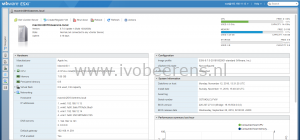

Begin November Apple released there new Apple Mini 2018 models. The last Mac Mini was from 2014. My first question: Is it possible to use the new Mac Mini 2018 as VMware ESXi host? So I’ve borrowed a Mac Mini 2018 model with the following specifications:

- Mac Mini 2018,
- CPU: Intel Core i3 3.6 GHz 4-core 6MB shared L3 cache
- Memory: 8 GB
- Disk: 128 GB SSD storage
- 1 Gb Ethernet adapter

 

The new Apple Mini 2018 comes in two basic configurations. The basic configurations can be changed (CPU, memory, disk and Ethernet adapter) during the ordering process.

**Model comparison**:

<table style="border-collapse: collapse; width: 75%; height: 1296px;" border="1"><tbody><tr style="height: 24px;"><td style="width: 25%; height: 24px;"></td><td style="width: 25%; height: 24px;"><strong>Models</strong></td><td style="width: 25%; height: 24px;"><strong>Models</strong></td></tr><tr style="height: 120px;"><td style="width: 25%; height: 120px;"><strong>Processor</strong></td><td style="width: 25%; height: 120px;">Intel Core i3 3.6 GHz 4-core 6MB shared L3 cache

<strong>configurable to</strong>:

Intel Core i7 3.2 GHz 6-core Turbo Boos 4.6 GHz 12MB shared L3 cache.</td><td style="width: 25%; height: 120px;">Intel Core i5 3.0 GHz 6 core&nbsp;Turbo Boost up to 4.1GHz 9MB shared L3 cache

<strong>configurable to:</strong>

Intel Core i7 3.2 GHz 6-core Turbo Boos 4.6 GHz 12MB shared L3 cache.</td></tr><tr style="height: 72px;"><td style="width: 25%; height: 72px;"><strong>Memory</strong></td><td style="width: 25%; height: 72px;">Two user-accessible slots for&nbsp;8,16,32 or 64 GB of 2666MHz DDR4 SO-DIMM (*1)</td><td style="width: 25%; height: 72px;">Two user-accessible slots for&nbsp;8,16,32 or 64 GB of 2666MHz DDR4 SO-DIMM (*1)</td></tr><tr style="height: 72px;"><td style="width: 25%; height: 72px;"><strong>Storage</strong></td><td style="width: 25%; height: 72px;">128,256, 512, 1 TB or 2 TB GB PCIe- based SSD</td><td style="width: 25%; height: 72px;">512, 1 TB or 2 TB GB PCIe- based SSD</td></tr><tr style="height: 48px;"><td style="width: 25%; height: 48px;"><strong>Graphics</strong></td><td style="width: 25%; height: 48px;">Intel UHD Graphics 630</td><td style="width: 25%; height: 48px;">Intel UHD Graphics 630</td></tr><tr style="height: 264px;"><td style="width: 25%; height: 264px;"><strong>Networking</strong></td><td style="width: 25%; height: 264px;">1 x Gigabit Ethernet port

802.11ac Wi-FI wireless networking

IEEE 802.11a/b/g/n compatible

<strong>Optional:</strong><ul><li>10 Gb Ethernet (optional)</li></ul></td><td style="width: 25%; height: 264px;">1 x Gigabit Ethernet port

802.11ac Wi-FI wireless networking

IEEE 802.11a/b/g/n compatible

<strong>Optional:</strong><ul><li>10 Gb Ethernet (optional)</li></ul></td></tr><tr style="height: 456px;"><td style="width: 25%; height: 456px;"><strong>Connections and Expansion</strong></td><td style="width: 25%; height: 456px;">Four Thunderbolt 3 (USB-C) port with support for:<ul><li>DisplayPort</li><li>Thunderbolt (up to 40 Gbps)</li><li>USB 3.1 Gen 2 (up to 10 Gbps)</li><li>Thunderbolt 2, HDMI, DVI and VGA supported</li></ul>Two USB 3 ports

HDMI 2.0 port

3.5 mm headphone jack</td><td style="width: 25%; height: 456px;">Four Thunderbolt 3 (USB-C) port with support for:<ul><li>DisplayPort</li><li>Thunderbolt (up to 40 Gbps)</li><li>USB 3.1 Gen 2 (up to 10 Gbps)</li><li>Thunderbolt 2, HDMI, DVI and VGA supported</li></ul>Two USB 3 ports

HDMI 2.0 port

3.5 mm headphone jack</td></tr><tr style="height: 24px;"><td style="width: 25%; height: 24px;"><strong>Dimensions</strong></td><td style="width: 25%; height: 24px;">19,7 x 19,7 x 3,6 cm</td><td style="width: 25%; height: 24px;">19,7 x 19,7 x 3,6 cm</td></tr><tr style="height: 24px;"><td style="width: 25%; height: 24px;"><strong>Weight</strong></td><td style="width: 25%; height: 24px;">1.3 kg</td><td style="width: 25%; height: 24px;">1.3 kg</td></tr><tr style="height: 24px;"><td style="width: 25%; height: 24px;"><strong>Warranty</strong></td><td style="width: 25%; height: 24px;">Your Mac mini comes with 90 days of complimentary technical support and a one-year limited warranty.</td><td style="width: 25%; height: 24px;">Your Mac mini comes with 90 days of complimentary technical support and a one-year limited warranty</td></tr><tr style="height: 48px;"><td style="width: 25%; height: 48px;"><strong>Remote Management</strong></td><td style="width: 25%; height: 48px;">No</td><td style="width: 25%; height: 48px;">No</td></tr><tr style="height: 96px;"><td style="width: 25%; height: 96px;"><strong>Listed in the VMware Compatibility Guide</strong></td><td style="width: 25%; height: 96px;">No. So there no official support from VMware.</td><td style="width: 25%; height: 96px;">No. So there no official support from VMware.</td></tr><tr style="height: 24px;"><td style="width: 25%; height: 24px;"><strong>Starting price</strong></td><td style="width: 25%; height: 24px;">€ 899&nbsp;<strong>(*2)</strong></td><td style="width: 25%; height: 24px;">€ 1.249&nbsp;<strong>(*3)</strong></td></tr></tbody></table>

**(\*1)** There are two memory slots available.

**(\*2)** The 2018 Mac mini starts at € 899,00 with an i3 processor, 8 GB RAM and 128 GB SSD storage and 1 Gb Ethernet adapter.

**(\*3)** The 2018 Mac mini starts at € 1249,00 with an i5 processor, 8 GB RAM and 256 GB storage and 1 Gb Ethernet adapter.

### Installation of VMware ESXi on the Mac Mini 2018 model

Is it possible to install and run VMware ESXi on the Mac Mini 2018? **Yes with some** **caveats such as hardware that is not** **recognized.** The Mac Mini 2018 model  is installed with VMware ESXi 6.7 Build 10302608 (ESXi 6.7 U1). Creating a VMware ESXi USB stick is explained in the following blog post, [link](https://www.ivobeerens.nl/2018/09/16/quick-tip-create-a-bootable-VMware-esxi-key/).

Configuration steps:

- The PCIe-based SSD is not recognized by VMware ESXi. Create an USB key with ESXi installed.
- The Mac Mini 2018 includes a T2 Security Chip, the T2 chip prevents booting booting non legitimate trusted operating systems using secure boot. For ESXi secure boot needs to be disabled. To disable secure boot, boot in the "macOS Utilities":
    - Turn on your Mac and press and hold the Command (⌘)-R key immediately after you see the Apple logo

- Select the "Startup Security Utility" in the Utilities menu.
- Choose "No Security" and select "Allow booting from external media".
- In the "Startup Security Utility" menu select the Apple icon and select "Shut down"
- Insert the USB drive in one of the USB ports on the back of the Mac Mini 2018
- Press the power button on the back of the Mac Mini and keep the Option (⌥) key pressed for the Startup Manager. Select "EFI Boot" to boot the USB key.

- The USB key will start with the ESXi installation.

### Overview

Here is a quick overview of screenshots from ESXi 6.7 U1 on the Mac Mini 2018:

   

### Some considerations

- VMware ESXi 6.7 U1 is tested on the Mac Mini 2018 model with a USB stick to boot ESXi. The new Apple Mini 2018 model includes a T2 security chip that use secure boot. Disable secure boot to run VMware ESXi.
- Around 50% CPU and 67% memory load will use around 35 watt.
- The Mac Mini 2018 comes assembled from Apple.
- The CPUs that Apple uses in the Mac Mini 2018 are based on Intel Coffee Lake 8th generation. The CPU is embedded and not upgradeable!
- The new Mac mini allows for memory upgrades up to 64GB on two slots. The memory is it not soldered on the motherboard and is SO-DIMM based. 16 GB cost € 240,00, 32 GB cost € 720,00 and 64 GB cost € 1680,00 extra. To save money go for third-party memory from Kingston or Corsair for example. On iFixit a Mac Mini 2018 memory replacement guide can be found, [link](https://www.ifixit.com/Guide/Mac+mini+Late+2018+Memory+(RAM)+Replacement/115309?fbclid=IwAR2tz8U4_nrhGx6pKLNsGMlThwQC21sTYDpOPxqvl3kUeS-208UMd1ctXis).
- The Apple storage in the Mac mini is PCIe-based and not upgradeable. So size the SSD for the future!
- The PCIe-based SSD is not recognized by VMware ESXi!
- The 1 Gb Ethernet NIC is recognized by ESXi as "Broadcom Corporation NetXtreme BCM57766 Gigabit Ethernet" adapter.
- The 10 GbE NIC is not recognized by VMware ESXi. The NIC is an Aquantia AQC107 and there are no ESXi driver on the moment.
- The Thundebolt controllers are not recognized by ESXi.
- The USB ports are redirected to VMware ESXi.
- A Teardown of the Mac Mini 2018 model can be found here, [link.](https://www.ifixit.com/Teardown/Mac+mini+Late+2018+Teardown/115210)

### Pros & Cons

<table style="border-collapse: collapse; width: 100%; height: 944px;" border="1"><tbody><tr style="height: 24px;"><td style="width: 33.3333%; height: 24px;"></td><td style="width: 33.3333%; height: 24px;"><strong>Pros</strong></td><td style="width: 33.3333%; height: 24px;"><strong>Cons</strong></td></tr><tr style="height: 48px;"><td style="width: 33.3333%; height: 48px;"><strong>Management</strong></td><td style="width: 33.3333%; height: 48px;"></td><td style="width: 33.3333%; height: 48px;">No remote management included</td></tr><tr style="height: 24px;"><td style="width: 33.3333%; height: 24px;"><strong>Form factor</strong></td><td style="width: 33.3333%; height: 24px;">Great looks and form factor</td><td style="width: 33.3333%; height: 24px;"></td></tr><tr style="height: 24px;"><td style="width: 33.3333%; height: 24px;"><strong>Noise level</strong></td><td style="width: 33.3333%; height: 24px;">Very low</td><td style="width: 33.3333%; height: 24px;"></td></tr><tr style="height: 96px;"><td style="width: 33.3333%; height: 96px;"><strong>Power consumption</strong></td><td style="width: 33.3333%; height: 96px;">Low. Between ~11w and ~40w with the i3 4-core CPU, 8 GB RAM and 128 GB SSD config and ESXi installed with 1 VM.</td><td style="width: 33.3333%; height: 96px;"></td></tr><tr style="height: 192px;"><td style="width: 33.3333%; height: 192px;"><strong>Memory</strong></td><td style="width: 33.3333%; height: 192px;">Up to 64 GB (2 memory banks) memory</td><td style="width: 33.3333%; height: 192px;">The memory from Apple is expensive (32 GB will cost € 720,00 and 64 GB will cost € 1680,00 extra). Go for third-party memory memory to save costs. Adding third-party memory&nbsp; means you need to dissemble the Mac Mini!</td></tr><tr style="height: 48px;"><td style="width: 33.3333%; height: 48px;"><strong>Upgradeability</strong></td><td style="width: 33.3333%; height: 48px;">Only the memory can be upgraded.</td><td style="width: 33.3333%; height: 48px;">The CPU and SSD are embedded, soldered and not upgradeable.</td></tr><tr style="height: 72px;"><td style="width: 33.3333%; height: 72px;"><strong>Ports</strong></td><td style="width: 33.3333%; height: 72px;">The USB&nbsp;controller and ports are recognized by ESXi.</td><td style="width: 33.3333%; height: 72px;">The Thunderbolt controllers are not recognized by VMware ESXi. When the Thunderbolt controllers are regornized great Direct Access Storage (DAS) solutions can be build.</td></tr><tr style="height: 72px;"><td style="width: 33.3333%; height: 72px;"><strong>Extension</strong></td><td style="width: 33.3333%; height: 72px;"></td><td style="width: 33.3333%; height: 72px;">There no room for adding add-on cards and extra disks inside the Mac Mini 2018 box.</td></tr><tr style="height: 152px;"><td style="width: 33.3333%; height: 152px;"><strong>Ethernet</strong></td><td style="width: 33.3333%; height: 152px;">1 GbE Ethernet NIC is recognized by ESXi</td><td style="width: 33.3333%; height: 152px;"><ul><li>Only one Ethernet adapter as port available.</li><li>The 10 GbE adapter is not recognized by VMware ESXi</li></ul></td></tr><tr style="height: 96px;"><td style="width: 33.3333%; height: 96px;"><strong>VMware ESXi support</strong></td><td style="width: 33.3333%; height: 96px;">Is tested with ESXi 6.7 U1 when booting from USB key. The 1 GbE NIC is recognized by ESXi. The VM runs from a NAS device over the 1 GbE adapter.</td><td style="width: 33.3333%; height: 96px;">Not on the HCL</td></tr><tr style="height: 72px;"><td style="width: 33.3333%; height: 72px;"><strong>Storage</strong></td><td style="width: 33.3333%; height: 72px;">Use an USB stick to boot ESXi and use remote storage such as a NAS to boot VMs.</td><td style="width: 33.3333%; height: 72px;">The&nbsp;PCIe-based SSD is not recognized by ESXi.</td></tr><tr style="height: 24px;"><td style="width: 33.3333%; height: 24px;"><strong>Pricing</strong></td><td style="width: 33.3333%; height: 24px;"></td><td style="width: 33.3333%; height: 24px;">For a new homelab host I'll need at least 32/64 GB memory. When buying the memory from Apple the pricing gets extremely high on the Apple Mac Min 2018.</td></tr></tbody></table>

### Conclusion

The new Mac Mini 2018 hardware specifications are a great refreshment compared to the old Mac Mini 2012 model, but it comes with a very high price for the most homelabers. The PCIe-based SSD, 10 Gb Ethernet adapter and Thunderbolt controllers are not (yet) recognized by VMware ESXi. I think there are better homelab options available on the moment for less money.

