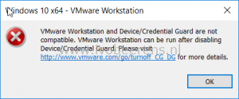

When using VMware Workstation 15 Pro with on Windows 10 with the Hyper-V role enabled I've got the following error when trying to install or start Windows 10 in VMware Workstation:

> VMware Workstation and Device/Credential Guard are not compatible. VMware Workstation can be run after disabling Device/Credential Guard. Please visit http://www.VMware.com/go/turnoff\_CG\_DG for more details.

In 2013 I did a post about using VMware Workstation and Hyper-V together on Windows 8, [link](https://www.ivobeerens.nl/2013/12/16/running-hyper-v-and-VMware-workstation-on-windows-8-x/). The bottom line that the Hyper-V role conflicts with VMware Workstation. It looks like this is still the case. The same solution can be used to disable the Hyper-V role in Windows 10.

To disable Hyper-V from starting the following command can be used:

`bcdedit /set hypervisorlaunchtype off`

A reboot of Windows 10 is necessary. After the reboot I was able to boot the Windows 10 VM.

To enable the Hyper-V role again use the following command:

`bcdedit /set hypervisorlaunchtype auto`

A reboot of of the Windows 10 is necessary.

VMware/Microsoft has a KB article how to disable Windows Defender Credential Guard, [link](https://kb.VMware.com/s/article/2146361) and [link](https://docs.microsoft.com/en-us/windows/security/identity-protection/credential-guard/credential-guard-manage). I did not try this because the solution in this worked for me.