There a multiple ways to install Home Assistant Hass.io on different platforms. The instructions for deploying Hass.io as Virtual Machine (VM) are not very clear when using VMware Workstation or VMware ESXi. In this blog post I highlight the steps needed to deploy Hass.io as VM using VMware Workstation 15 Pro.

Here are the steps:

- Download the VMDK image of Hass.io ([link)](https://www.home-assistant.io/hassio/installation/) and save it to a folder were the VMware Workstation Virtual Machine will be stored
- Unzip the downloaded VMDK file with 7zip
- Open VMware Workstation
- Choose a custom (advanced) configuration

[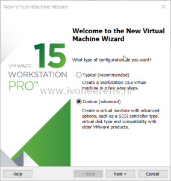](images/2019-01-14_19-53-49.png)

- For the VM hardware comparability select: **ESXi 6.5**
- Select: **I will install the operating system later**
- As Guest Operating System select: **Other 64-bit**
- Give the Virtual Machine a name and browse to the location the VMDK file stored. The will be a warning that there already resides a Virtual Machine in the same location. Select: **Continue**

[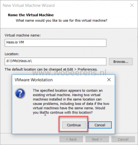](images/name1.png)

- Select the number of processors and cores. A minimum is 1 processor and 1 core.
- Assign memory to Hass.io VM. A minimum is: **1024 MB**.
- Select as network type: **NAT**
- Select as I/O controller: **LSI Logic (Recommended)**
- Select as disk type: **SATA**
- Select a disk: Use an existing virtual disk
- Browse to the VMDK file downloaded earlier
- There will be a question to convert the existing virtual disk to a newer format, select: **Convert**

[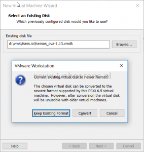](images/disk.png)

- The Hass.io VM is ready to be created, select **Finish**

[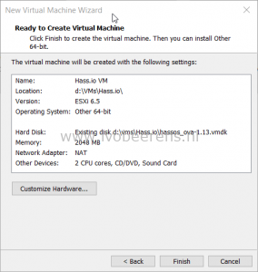](images/complete.png)

Before starting the VM, edit the Virtual Machine settings and modify to following:

- The disk is only 6 GB, expand the disk to 32 GB or higher.

[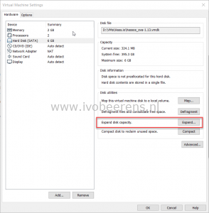](images/expand.png) [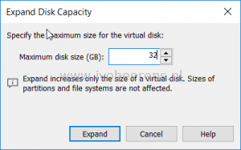](https://www.ivobeerens.nl/wp-content/uploads/2019/01/expand1.png)

- Remove the Sound Card in the hardware configuration.

[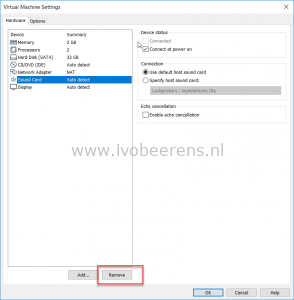](images/sound.png)

- Change the firmware from BIOS to UEFI. Do not select "Enable secure boot"!

[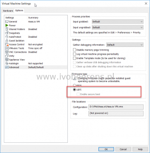](images/uefi.png)

- Select OK and Power On the VM.
- When the boot is completed press "enter" in the console and the login prompt appears. To log in, use "**root**" without a password.

[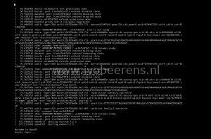](images/screen.png)

- The Hassio console prompt appears, enter "**login**" for host access.
- To find the IP address assigned, use the "**ip a**" command in the console and look for the IP address on the **enp2s0** nic.

[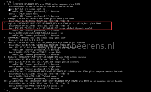](images/console2.png)

- Open a browser session and use the following format: **http://ip-address:8123**

[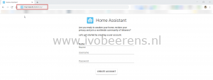](images/HA.png)

Now you're ready to update Home Assistant and let's start playing.