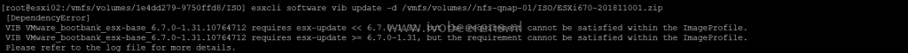
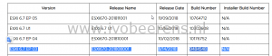
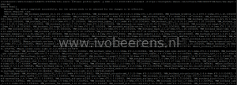

When trying to update a VMware ESXi 6.7 build 9484548 host to the latest ESXi 6.7 Update 1 build I’ve got the following error:

> [DependencyError]
VIB VMware_bootbank_esx-base_6.7.0-1.28.10302608 requires esx-update << 6.7.0-1.29, but the requirement cannot be satisfied within the ImageProfile.
VIB VMware_bootbank_esx-base_6.7.0-1.28.10302608 requires esx-update >= 6.7.0-1.28, but the requirement cannot be satisfied within the ImageProfile.
Please refer to the log file for more details.

When searching around it looks like there are more people who experiencing this problem ([link](https://community.spiceworks.com/topic/2170328-VMware-dependecy-error-10302608)) when trying to update to 6.7U1. Using these steps I was able to update the ESXi 6.7 host from build 9484548 to the latest version (10764712):

- SSH to the ESXi host
- Put the ESXi host in Maintenance Mode

`esxcli system maintenanceMode set --enable true`

- Open the ESXi firewall for HTTP traffic. The ESXi host must have internet access.

`esxcli network firewall ruleset set -e true -r httpClient`

- Find the latest ESXi release name in the VMware build numbers overview, [link](https://kb.VMware.com/s/article/2143832?lang=en_US). When writing this blog post the latest release name/patch is "ESXi670-201811001" which has build number 10764712.

- The VMware patch depot contains a huge list of builds, to make it easier filter and find the right profile using the following command:

esxcli software sources profile list -d https://hostupdate.VMware.com/software/VUM/PRODUCTION/main/vmw-depot-index.xml | grep ESXi-6.7.0-201811

- This results in two profiles:

`ESXi-6.7.0-20181104001-no-tools VMware, Inc. PartnerSupported 2018-11-08T08:39:18 2018-11-08T08:39:18`
`ESXi-6.7.0-20181104001-standard VMware, Inc. PartnerSupported 2018-11-08T08:39:18 2018-11-08T08:39:18`

- Update the host by adding the "ESXi-6.7.0-20181104001-standard" profile and point to to the VMware patch depot using this command:

`esxcli software profile update -p ESXi-6.7.0-20181104001-standard -d https://hostupdate.VMware.com/software/VUM/PRODUCTION/main/vmw-depot-index.xml`

- Check if the update completed successfully

- Disable the HTTP client in the ESXi firewall

`esxcli network firewall ruleset set -e false -r httpClient`

- Reboot the ESXi hosts

`reboot`

- When the ESXi hosts is rebooted exit maintenance mode by using SSH

`vim-cmd hostsvc/maintenance_mode_exit`

- Check the update completed successfully

`VMware -v`

When all the steps are successfully the build version of VMware ESXi 6.7.0 is 10764712.