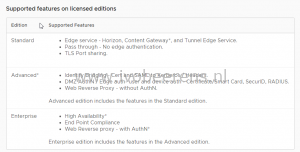
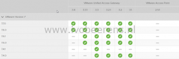

The VMware Unified Access Gateway (UAG) acts as reverse proxy and tunnels sessions (PCoIP and Blast) to desktops and remote apps. Besides Horizon support, new features are added for AirWatch and Identity Manager. With version 3.4, the VMware Unified Access Gateway is offered in three editions based on the Horizon or Workspace ONE licenses:
- Standard
- Advanced
- Enterprise

Per edition the following features are supported:

One of the new features is high availability support for the Unified Access Gateway. Without the use of load balancers a UAG high availability environment can be created. This makes the environment less complex and is available as enterprise feature.

Another feature is RADIUS support. RADIUS is not a new feature and is available for a very long time. RADIUS offers two-factor authentication and is always a requirement for production environments. When looking at the editions table you see that this is now an advanced feature. **Before version 3.4 of the UAG, with VMware Access Point and VMware Security Server, RADIUS was supported in all the editions!**

In my opinion RADIUS is not a advance feature and belongs to all the editions of Horizon. This was always the case!

I'll have a lot of customers who are using Horizon Standard with RADIUS support for two-factor authentication. Now they are stuck with the UAG 3.3.1 appliance or must heavily invest ($$$$$) in the advanced (or higher) edition of Horizon.

I'll hope VMware will  judge again and make RADIUS support available in all the editions of Horizon.

**UppubDate: March 13, 2019:** VMware Unified Access Gateway 3.5 is released. In this version there is no license requirement anymore based on the edition. All the features have been made available for all the Workspace ONE or Horizon editions. This is great news! RADIUS support is available for all editions in version 3.5 of the UAG.  More information: [link](https://docs.VMware.com/en/Unified-Access-Gateway/3.5/rn/Unified-Access-Gateway-35-Release-Notes.html).

