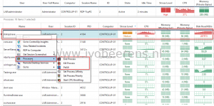

One of the new enhancements of ControlUp 7.3 is vSAN monitoring support. ControlUp will detect the vSAN cluster(s), objects and displays real-time vSAN specific metrics and metadata. In this blog post I highlight the features of the new vSAN integration in ControlUp 7.3.

## **Installation**

The vSAN cluster is automatically recognized by ControlUp when the following requirements are met:

- PowerShell minimum Version 5.0
- VMware PowerCLI 10.1.1.x
- .NET framework version 4.5
- vSAN Performance service should be turned on on the cluster
- The user account configured for the hypervisor connection requires the “storage.View” permission.

Running ControlUp is easy, no installation is needed, simple execute a single executable (ControlUpConsole.exe). After starting ControlUp, add the vCenter server and the vSAN cluster(s) are automatically recognized. When clicking on the vSAN cluster you see real-time metadata and performance metrics.

## **Views**

There are several preset views available with vSAN metrics such as:

- **vSAN Performance**. Includes vSAN performance metrics such as IOPS, latency, cache and buffers.
- **vSAN Health**. Includes the vSAN health checks
- **vSAN Host Network**. Includes vSAN network I/O and packet loss metrics.

  

You can easily switch between predefined views in the "Colum Preset". Here is an overview of vSAN metrics used by ControlUp:

>Datastores: Name, Type, Capacity, Read/Write IOPS, Read/Write Rate, Read/Write Latency, Compression, Capacity Deduplication, Congestion, Outstanding IO, Disk Configuration, Total Used Capacity, Total Used – Physically Written, Total Used – VM Overreserved, Total Used – System Overhead, vSAN Free Capacity, vSAN Health, vSAN Cluster Health, vSAN Network Health, vSAN Physical Disk Health, vSAN Data Health, vSAN Limits Health, vSAN Hardware Compatibility Health, vSAN Performance Service Health, vSAN Build Recommendation, vSAN Online Health.
Datastores on Hosts: Name, Type, Capacity, Read/Write IOPS, Read/Write Rate, Read/Write Latency, Compression, Capacity Deduplication, Congestion, Outstanding IO, Local Client Cache Hit IOPS, Local Client Cache Hit Rate, vSAN Max Read Cache Read Latency, vSAN Max Write Buffer Write Latency, vSAN Max Read Cache Write Latency, vSAN Max Write Buffer Read Latency, vSAN Min Read Cache Hit Rate, vSAN Write Buffer Min Free Percentage, vSAN Host Network Inbound/Outbound I/O Throughput, vSAN Host Network Inbound/Outbound Packets Per Second, vSAN Host Network Inbound/Outbound Packet Loss Rate

When navigating you see all those metrics available on the vSAN cluster, vSAN datastores on hosts, virtual disks and vSAN Host network utilization views. You can easily drill down by double clicking from the vSAN datastore to the diskgroup(s) on each ESXi host and then drill down to the the virtual disk(s). From the virtual disk(s) you can drill down to the Windows process.

## **Example: Find the root cause of high IOPS load on the vSAN cluster.**

In the following example we will identify a Windows process that is causing high IOPS stress on the vSAN cluster. We drill down from the vSAN cluster to the vSAN diskgroup of the ESXi host to the virtual disk to the process level in the VM to find the root cause of the high IOPS.

- In the vSAN Performance view we see the stress level has changed and a high IOPS load.

- In the IOPS we see that the threshold of 2000 is crossed. This threshold is default and can be adjusted. The Virtual Expert suggest to navigate to the "Datastore on Hosts (IOPS detailed View).

- When double clicking on the "Datastore on Host" we see that "esxin04.lab.local" is generating the IOPS load.

- The vSAN diskgroup of the "esxin04.lab.local" host has a virtual disk that belongs to the "ControlUp-vSAN-Test" VM that is causing the high IOPS load.

- When double clicking on the virtual disk we go the the "Processes" view and see that "diskspd.exe" process is causing the high IOPS load.

- **Optional**: Right click on the process and select kill to end the "diskspd.exe" process. This stops the IOPS load on the vSAN cluster.

This example shows how easy it is to identify what process is causing stress on the vSAN cluster.

## **Alerting and reporting**

For alerting you can add triggers in ControlUp to notify you when something happens on the vSAN cluster such as a change in the stress level for a period of time.

When using the triggers you're able to start investigating it right away when something happening on the vSAN cluster. All the vSAN data is transferred to ControlUp Insight for historical reporting and analytics. This is great for analyzing data and trends over time and can be very useful when investigate issues and understanding what is going on you're environment.

## **Conclusion**

ControlUp is easy to set-up and great for fast troubleshooting. In version 7.3 is vSAN support added. As shown in the this blog post with a couple of double clicks you're able to perform a root cause analysis and find what process is causing the high IOPS on the vSAN.

There is a free trail available. Give it a try here: [link](https://www.controlup.com/)