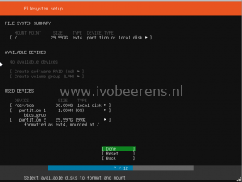

I started exploring Home Assistant Hass.io on a Raspberry Pi. After several SD card crashes I decided to installed Hass.io as Virtual Machine (VM) on VMware ESXi. There is a VMDK version available ([link](http://www.ivobeerens.nl/2019/01/15/install-home-assistant-hass-io-in-vmware-workstation/)) that can attached (this involves manual steps) but I prefer a clean installation. VMware ESXi is installed on my Shuttle SH370R6 plus home lab server ([link](http://www.ivobeerens.nl/2019/01/30/home-lab-extension-with-a-shuttle-sh370r6-plus/)).

**UppubDate: June 2021:** Ubuntu is not supported anymore as Operating System for Home Assistant. See my blog post about installing the Debian for Home Assistant for more information.

https://www.ivobeerens.nl/2021/06/21/run-home-assistant-supervised-as-virtual-machine-vm-on-VMware-esxi/

Other advantages of running Hass.io as VM on VMware ESXi are for example:

- The Raspberry PI has limited hardware resources and can be a performance bottleneck when using more and more sensors and installing Hass.io add-ons. A home lab server offers more CPU power, memory and storage performance.
- Snapshot functionality. Quickly make a Virtual Machine snapshot before upgrading the add-ons or Hass.io itself. When something went wrong during the upgrade, simply revert the snapshot and everything works again within seconds.
- The installation of Hass.io in a Ubuntu VM on ESXi is simple.
- USB sticks like Z-Wave or Zigbee2MQTT can be attached to the Hass.io VM using ESXi USB pass-through.

Here are the steps outlined how-to install an Ubuntu VM and install Hass.io.

## Configure the Virtual Machine hardware specifications

- Download Ubuntu 18.04.2 LTS (Long-Term Support), [link.](https://www.ubuntu.com/download/server)
- Make a connection to the ESXi host: https://<ip-address>/ui
- Upload the Ubuntu ISO to a datastore
- Create a new virtual machine with the following specifications:
    - **Name:** HA-01
    - **Compatibility:** ESXi 6.7 virtual machine
    - **Guest OS family:** Linux
    - **Guest OS version:** Ubuntu Linux (64-bit)
    - **Storage:** datastore with 30 GB free space
    - **CPUs**: 2
    - **Memory:** 2048 MB
    - **Hard disk 1:** 30 GB
        - **Disk Provisioning:** Thin provisioned
    - **SCSI Controller 0:** VMware Paravirtual
    - **USB controller 1:** USB 2.0 or 3.0 depending on the ESXi hardware
    - **Network adapter 1:** Select the portgroup
        - **Adapter type:** VMXNET 3
    - **CD/DVD Drive 1:** Datastore ISO file
        - Browse to the Ubuntu ISO
        - **Connect:** checked
    - **Video Card:** Default settings

[](images/1.png) [](https://www.ivobeerens.nl/wp-content/uploads/2019/04/2.png)

- Next
- Finish
- Power on the VM
- Open a console session

The VM has a paravirtualized SCSI controller (PVSCSI) and Virtual NIC (VMXNET3)

## Install Ubuntu on ESXi

- **Language:** English
- **Select:** Install Ubuntu Server
- **Choose your preferred language:** English
- **Keyboard configuration:** Select the layout and variant: English US (
- **Installation**: Install Ubuntu
- **Networking connections**: The VMXNET3 NIC of the VM is displayed. Select for the IPv4 method DHCP or a manual fixed IP address
- **Configure proxy**: leave this blank
- **Ubuntu mirror**: Use the mirror address suggested
- **Filesystem setup**: Use an Entire Disk
    - Choose the disk to install to: /dev/sda 30.00G
    - Filesystem summary: Done
    - Confirm destructive action. Are you sure you want to continue: Continue

[](images/filesystem-summary.png)

- **Profile setup**: Fill in the following fields (remember the username and password)
    - Your name:
    - Your server's name:
    - Pick a username:
    - Choose a password:
    - Confirm a password:
- **SSH Setup**: Install OpenSSH server
    - Import SSH identity: No
- **Featured Server Snaps**: Select none
- The installation of Ubuntu begins
- The installation is complete! Reboot the system

[](images/completed.png)

- Remove the attached Ubuntu ISO from the VM and press **enter**
- After the reboot it's time to install Hass.io in the VM

The Open VM Tools is already installed  by default so there no need to install this package.

## Install Hass.io

- Because we installed OpenSSH we are using a SSH session for the Hass.io configuration.
- Connect to the IP address of thje Ubuntu VM using SSH (i'm using putty) for the connection.
- Packages requirements ([link](https://www.home-assistant.io/hassio/installation/)) for Hass.io:
    - apparmor-utils
    - apt-transport-https
    - avahi-daemon
    - ca-certificates
    - curl
    - dbus
    - jq
    - network-manager
    - socat
    - software-properties-common (already installed in Ubuntu 18.04)
    - As docker package Docker-CE must be installed.
-  Use the following commands to install all the required packages and install Hass.io

```
sudo -i
add-apt-repository universe
apt-get update
apt-get install -y apparmor-utils apt-transport-https avahi-daemon ca-certificates curl dbus jq network-manager socat
curl -fsSL get.docker.com | sh
curl -sL https://raw.githubusercontent.com/home-assistant/hassio-installer/master/hassio_install.sh | bash -s
```

- After the installation check if there are two containers running using the following command:

```
root@ha-01:~# docker ps
CONTAINER ID IMAGE COMMAND CREATED STATUS PORTS NAMES
8def326c0ce7 homeassistant/qemux86-64-homeassistant "/bin/entry.sh pytho…" About a minute ago Up About a minute homeassistant
47945d4fe0f4 homeassistant/amd64-hassio-supervisor "python3 -m hassio" 2 minutes ago Up 2 minutes hassio_supervisor
root@ha-01:~#
```

- Connect to Hass.io: http://<IP address>:8123

[](images/HAini.png)

Home Assistant Hass.io is now running as VM on VMware ESXi.