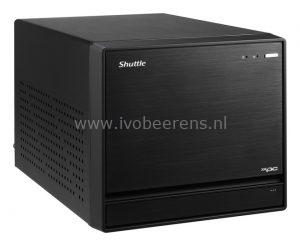
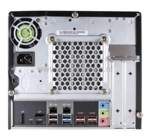
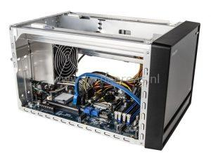
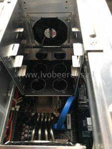
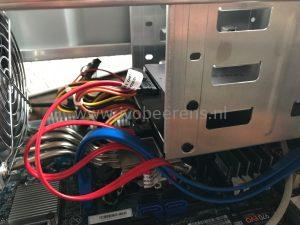
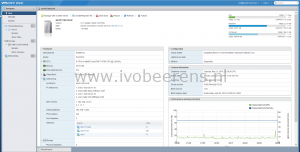
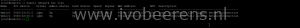
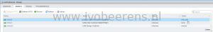
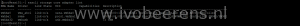
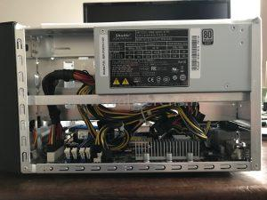

In January 2019 I did a review of the Shuttle SH370R6 ([link](http://www.ivobeerens.nl/2019/01/30/home-lab-extension-with-a-shuttle-sh370r6-plus/)) using VMware ESXi. A couple of weeks ago the new Shuttle SH370R8 is released. The main differences between the Shuttle SH370R6 and SH370R8 are:

- **Update October 19, 2020**: Supports up to 128 GB of RAM!
    - Memory compatibility list: [link](http://global.shuttle.com/products/productsSupportList?productId=2344)
- Ready for the 8th/9th Gen Intel Coffee Lake processors
- Dual Intel Gigabit Ethernet
- An extra fan in front of the chassis for a better airflow
- Front panel (Microphone input (3.5 mm), Headphones output (3.5 mm), 2x USB 3.0 (Type A, USB 3.1 Gen 1), Power button, Power indicator (Blue LED) and Hard disk drive indicator (Yellow LED).

  

- Supports four 3.5" hard drives (with an optional 2.5" kit available)

 

The recommended retail price from Shuttle for the SH370R8 is € 317.00 (ex VAT).

## Installation

The Shuttle SH370R8 comes with a Black aluminium chassis, a motherboard and a 500W Power Supply Unit (PSU)" that also the cooling is included. The only hardware you need to add is a CPU, Memory and disk(s) that match.

I'm  using the following hardware (same as in the Shuttle SH370R6 review) for testing the Shuttle SH370R8:

- Intel Core i7 8700 with 6 cores and 12 threads 65W
- 4 x 16 GB Kingston ValueRAM KVR26N19D8/16
- Samsung 970 EVO 1 TB M.2 SSD
- Samsung 250 and 500 GB SATA SSD
- Kingston Datatraveler 100 G3 32 GB USB stick for booting VMware ESXi

The 16 GB memory modules are now much cheaper as in January 2019 when i did the SH370R6 review. With four 16 GB module you can save around € 160,00. The documentation describes the installation steps very clear which makes the hardware installation easy.

## VMware ESXi

After installing the hardware and swapping the USB stick from the G6 to the G8, it's time to press the power button. First thing is to enter the BIOS and change the boot order so that the VMware ESXi hypervisor can boot. After a short time VMware ESXi 6.7 Update 2 is up and running.

The two onboard Intel Corporation I211 Gigabit NICs are recognized by default in ESXi 6.7. In my configuration one NIC is used for VM and management traffic and the other for NFS traffic to my QNAP storage. The optional wireless LAN adapter is not recognized in ESXi.

The USB, NVMe and 4x SATA 3.0 (6G) controllers are recognized by default in ESXi.

 

Most of my VMs are running from the NVMe SSD storage which makes them fast de power up. The power consumption is the same as the SH370R6 Plus, 20-24w with ESXi booted (no VMs active) and between 35-70w when 10 VMs are running.

## Conclusion

The differences between the Shuttle SH370 R6 and R8 are minimal but I really like the dual Intel Gigabit NICs and the extra space for placing 4x 3.5" hard drives. For 2.5" drives there is a optional adapter available. With the support for 4x 3.5" hard drives you can host a lot of storage.

With the Shuttle SH370R6 I uses one PCI-E slot for a NIC. With the onboard dual Intel Gigabit I have an extra PCIe slot available for an extra NVMe controller or a 10 Gigabit NIC for example. The PCI-E x 16 slot can be used for a large dual-slot graphics card (up to 280 mm).  The Shuttle has great expansion possibilities with the two PCIe slots and support for 4x 3.5" hard drives.

The Shuttle SH370R8 with VMware ESXi is running 24/7 for a couple weeks now without any problems and the performance is great with the Intel i7 CPU, 64 GB memory and NVMe storage. I like to welcome the Shuttle SH370R8 to the VMware ESXi homelab club :-).

## Specifications

The Shuttle SH370R8 specifications:

- **Chassis**: Black aluminium chassis (33.2 x 21,5 x 19.0 cm)
- **CPU**: Based on the Intel H370 chipset, the XPC Barebone SH370R8 supports all the latest Intel Core processors of the “Coffee Lake” series for socket LGA1151v2 with up to 95 W TDP, including the top model Core i9-9900K with eight cores and 16 threads
- **Cooling**: A special passive heatpipe I.C.E. (Integrated Cooling Engine) cooling system ensures cooling of the barebone.
- **Memory**: Four memory slots, up to 128 GB of DDR4-2400/2666 memory. Intel Optane Ready which boosts speed of one hard disk through data caching.
- **LAN**: Dual Intel Gigabit Ethernet.
- **Slots**:
    - M.2 2280M slot for a NVMe SSD.
    - M.2 2230E slot for WLAN cards.
    - 1x PCIe-x16 slot for powerful dual-slot graphics cards ((Max. size: 280 x 120 x 40 mm)
    - 1x PCIe-x4 slot for an expansion card
    - Optional accessories include a WLAN/Bluetooth module (WLN-M), an RS-232 port (H-RS232), and a bracket for two 2.5-inch drives (PHD3).
- **PSU**: A 500 Watt, 80-PLUS-Silver-certified power supply unit with the following connectors:
    - ATX main power 2x10 and 2x2 pins
    - Graphics power connector: 6 pins and 8 pins
    - 4 x SATA, 2x Molex and 1x floppy

- **Ports**:
    - 4x Serial ATA 6G connector onboard (rev. 3.0, max. 6 Gbit/s)
    - 4x USB 3.1 Gen 2, 4x USB 3.1 Gen 1, 4x USB 2.0
- Supports four 3.5" hard drives
- Official Operating system compatible: Windows 10 and Linux 64-bit
- The recommended retail price from Shuttle for the SH370R8 is EUR 317.00 (ex VAT)

More information about the Shuttle SH370R8 can be found here, [link](http://www.shuttle.eu/products/mini-pc/sh370r8/).

