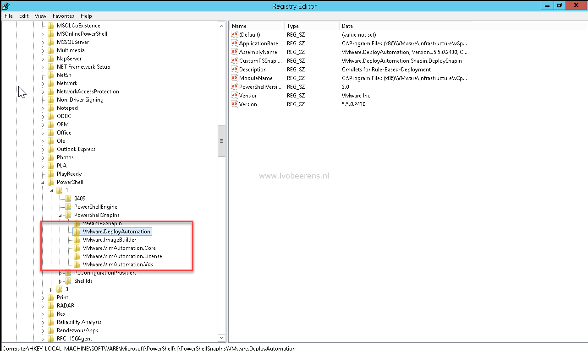

PowerCLI is a must-have tool for every VMware Administrator when you want to automate something in your VMware environment. In this blog, I highlight the installation, updating, and some troubleshooting tips for deploying and running PowerCLI on Windows OSes.

## PowerCLI installation

- Uninstall PowerCLI 6.x and earlier from the Add/remove programs or Programs and Features if exist.
- Make sure you have an internet connection.
- Check if Windows Management Framework 5.1 is installed for Windows 7,8 and Windows Server 2012 R2 and earlier OSes. Open PowerShell en enter:

```PowerShell
$PSVersionTable  
```

```PowerShell
PS C:\$PSVersionTable

Name Value
---- -----
PSVersion 5.1.17763.592
PSEdition Desktop
PSCompatibleVersions {1.0, 2.0, 3.0, 4.0...}
BuildVersion 10.0.17763.592
CLRVersion 4.0.30319.42000
WSManStackVersion 3.0
PSRemotingProtocolVersion 2.3
SerializationVersion 1.1.0.1
```

- If WMF 5.1 is not installed. Install the WMF 5.1 can be downloaded here, [link](https://www.microsoft.com/en-us/download/details.aspx?id=54616). Windows 10, Windows Server 2016, and above have PowerShell version 5.1 already installed.
- Installation PowerCLI


```PowerShell
Install-Module -Name VMware.PowerCLI
```

PowerCLI installation with admin rights:
```PowerShell
Install-Module VMware.PowerCLI -AllowClobber -SkipPublisherCheck
```
Use the `-AllowClobber` when you get: A command with the name `Export-VM` is already available on this system.

```PowerShell
Install-Module VMware.PowerCLI -AllowClobber
```

Update PowerCLI
```PowerShell
Update-Module -Name VMware.PowerCLI
```
These modules are installed in the following location:
```
%homepath%\Documents\WindowsPowerShell\Modules
```

- Allow the execution of local scripts
Admin rights needed:

```PowerShell
Set-ExecutionPolicy RemoteSigned
```

- Disable certificate checking and CEIP

```PowerShell
Set-PowerCLIConfiguration -InvalidCertificateAction Ignore -Confirm:$false -ParticipateInCeip $false
```

- PowerCLI upgrade fails with a certificate error. The following error can occur when try to upgrade VMware.PowerCLI.

```PowerShell
Install-Module VMware.PowerCLI -Force -SkipPublisherCheck
```

## **Install the VMware Horizon Module**

- Download the Horizon modules from GitHub: [Link](https://github.com/VMware/PowerCLI-Example-Scripts)
- Extract it
- Copy the VMware.Hv.Helper folder to the modules path

## **Updating PowerCLI**

The following steps can be used to update a PowerCLI 10 or 11 installation

- Make sure you have a internet connection.
- Check the PowerCLI version

```PowerShell
Get-Module VMware\* -ListAvailable
```

- Update the existing PowerCLI version
```PowerShell
Update-Module -Name VMware.PowerCLI
```

- Check the version of PowerCLI
```PowerShell
Get-Module -Name VMware.PowerCLI -ListAvailable
```

## Troubleshooting PowerCLI

The following troubleshooting options can be used when having problems with the installation and running of PowerCLI such as:

Could not load file or assembly……………….

- Disable the Anti Virus.
- Uninstall PowerCLI 6.x and earlier from the Add/remove programs or Programs and Features if exist.
- Uninstall PowerCLI.

```PowerShell
Get-Module VMware.PowerCLI -ListAvailable | Uninstall-Module -Force
```

- Check the paths for VMware modules entries in the path. Remove VMware folder if exist.

```PowerShell  
$env:PSModulePath.Split(';')
```

- List All the VMware modules and remove VMware modules.

```PowerShell
Get-Module -Name VMware\* -ListAvailable
```

- Check for old PowerCLI modules and installations such as:

```PowerShell
C:\Program Files (x86)\VMware\Infrastructure\PowerCLI\Modules
```

- List registered snapins.
```PowerShell
Get-PSSnapin -registered
```
- Delete the registry keys of the old PS snapins.

[

- Reboot the Windows system.

Try to install the PowerCLI module using a clean install as described above.

The PowerCLI page can be found here: [VMware Developer Documentation](https://developer.VMware.com/powercli)