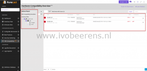
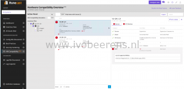
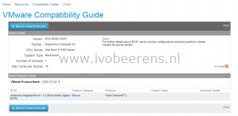
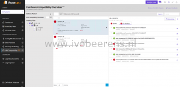
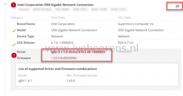
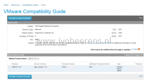
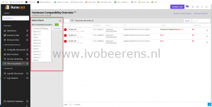
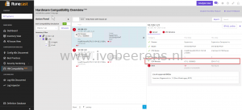

Runecast Analyzer is a tool that helps VMware administrators to proactive manage there vSphere environment. It discovers potential risks in the VMware environment before they can cause a major outage. It uses best practices, security hardening guides (VMware, DISA STIG, PCI-DSS v3.2.1 and HIPAA) and known issues found in the VMware Knowledge Base to protect the Software Defined Data Center (SDDC). Runecast Analyzer supports the following VMware products:
- VMware vSphere
- VMware vSAN
- VMware NSX-V
- VMware Horizon

Runecast Analyzer introduced a new feature called "**Automated VMware HCL**" and "**ESXi Compatibility Simulation**". The "**Automated VMware HCL**" feature checks the VMware ESXi host hardware, driver and firmware versions against the VMware Hardware Compatibility List (HCL). The VMware Hardware Compatibility List (HCL) lists all the physical hardware components, driver and firmware versions that are supported by VMware. Keeping the hardware aligned with the VMware HCL is essential for a healthy, stable and supported VMware environment but can be difficult to perform. For example see the blog post below how to identify a networkcard and the supported driver.

https://www.ivobeerens.nl/2014/04/15/identify-nic-driver-and-supported-driver-version-for-esxi-server/

Within the "**Automated VMware HCL"** feature you can enable "**ESXi Comparability Simulation**". ESXi comparability simulation checks the existing hardware against a newer VMware ESXi version before upgrading to this new version so you can verify if the hardware, driver and firmware levels are supported.

**Automated Hardware Compatibility**

After deploying the Runecast Analyzer appliance and connecting to one or more vCenter Servers, the first scan can be performed by clicking on the purple "**Analyze Now**" button. When the scan is completed select "HW Compatibility" on the left menu bar. By default all ESXi hosts are listed. In the action pane you can specify a specific clusters or one or more host(s).

The screenshot shows the host, ESXi release, hardware summary and the compatible status of the BIOS and I/O devices. The BIOS and I/O Devices are red in this example which means they need attention. All the hardware, firmware and driver  results can be exported to a CSV file. Per ESXi host you can drill down to the server hardware.

The BIOS state needs an update, it's reported as possible incompatibility "Not Found" in the HCL Data field. When clicking on the "HCL online" button we've got redirected to the VMware Compatibility List (HCL).

The VMware HCL tells that the BIOS level that matches is version 1.2. After the BIOS view we go to the I/O devices by clicking on the I/O Devices tab

The Intel I350 Gigabit and the Samsung NVMe SSD Controller needs attention. When looking at the Intel I350 in the HCL we see that the the firmware level is okay and that the installed driver version is 0.1.1.0 is old. The HCL reports that version 1.4.1 is needed.

 

**ESXi Compatibility Simulation**

With the Hardware Compatibility Overview there is another feature called "**ESXi Compatibility Simulation**".  ESXi Compatibility Simulation checks the existing hardware against a newer VMware ESXi version before upgrading to this new version so you can verify if the hardware, driver and firmware levels are supported.

After turning on the ESXi Compatibility Simulation feature and selecting the ESXi version to upgrade to you can fire the simulation. In this environment I want to upgrade to ESXi 6.7 U2 and it shows that the BIOS not compatible.

**Conclusion**

It can be difficult and time consuming for VMware admins to check if the server hardware is aligned with the VMware Hardware Compatibility List (HCL) for maintaining a healthy, stable and supported environment. Runecast Analyzer makes this very easy and fast by performing a simple scan and see if the hardware of the VMware environment is complaint with the VMware HCL.

Another great feature is the ESXi Compatibility Simulation. Again with a simple scan you check if the hardware is compatible against a newer version of ESXi before actually upgrading to this version. The **Automated Hardware Compatibility** and **ESXi Compatibility Simulation** are great new features that saves a lot of value time investigating if the VMware environment is compliant.

You can [download](https://portal.runecast.com/registration) a 30 day full trial version of Runecast Analyzer and try it yourself.