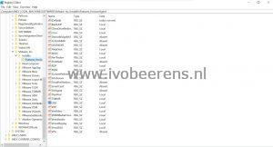

When performing a silent/unattended installation of the Horizon Agent client you must specify MSI properties and Horizon Agent options to define the configuration of the agent. When a new version of the Horizon Agent comes available the documentation is not always available yet or up to date. When using a silent install of the VMware Horizon Agent with wrong options can result in a setup failed 1603 error.

A quick way to determine what options are available for the Horizon Agent that can be used is to install the Horizon Agent and manually select/deselect the options. After the installation and reboot open Regedit an browse to the following location:

```
HKEY_LOCAL_MACHINE\Software\VMware, Inc.\Installer\Features_HorizonAgent
```

[](images/Latest.jpg)

Al the options/features are listed and have a value of:

- **Local** = Installed/enabled
- **Absent** = Not Installed/disabled

These options can be used for silent installing the VMware Horizon Agent. Here is an example that install the Horizon Agent:

```
VMware-Horizon-Agent-x86_64-7.10.0-14590940.exe  /s /v"/qn VDM_VC_MANAGED_AGENT=1 VDM_FLASH_URL_REDIRECTION=1 RDP_CHOICE=1 INSTALL_VDISPLAY_DRIVER=1 ADDLOCAL=BlastUDP,Core,HelpDesk,NGVC,PerfTracker,ClientDriveRedirection,RTAV,RDP,ThinPrint,TSMMR,USB,V4V,VMWMediaProviderProxy,VmwVaudio,VmwVdisplay,VmwVidd REBOOT=Reallysuppress"
```

In this example the following MSI properties are installed:
- RDP is enabled
- The agent is installed is a vCenter Managed desktop
- Flash URL redirection is enabled
- Installs the WDDM display driver

For the VMware Horizon Agent options refer to the following [link](https://docs.VMware.com/en/VMware-Horizon-7/7.10/horizon-published-desktops-applications/GUID-3096DA8B-034B-435B-877E-5D2B18672A95.html?hWord=N4IghgNiBcIM4EsIFMB2AXABA1d2QjHQQHtUQBfIA).