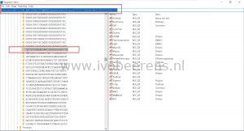
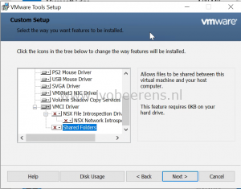
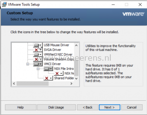

The VMware Tools package provides drivers (such as VMXNET3, PVSCSI, SVGA etc.) and services that enhance the performance of virtual machines and make several vSphere features easy to use. Here are some tips and tricks when working with VMware Tools:
- An overview of the VMware Tools versions mapping can be found here, [link](https://packages.VMware.com/tools/versions)
- The latest VMware Tools versions can be downloaded from the following links: [link](https://www.VMware.com/go/tools) and [link](https://packages.VMware.com/tools/esx/index.html)
- Within VMware ESXi, the VMware Tools are located under: /vmimages/tools-isoimages
- The latest VMware Tools version 10.3.10 is compatible with ESXi 6.0.0 to 6.7 U3
- To view what VMware Tools components are installed on a Windows operating system: open Regedit and browse to the following location.

```
HKEY_LOCAL_MACHINE\SOFTWARE\Classes\Installer\Features\10176710886A59A4C938D6DEE96B37D5
```

[](images/Tools_3.png)

Names with a squire or minus are not installed. Another method in Windows 10 for example is going to the Apps & Features and select: modify VMware Tools

- A silent or unattended default installation can be done using the following command. This command does not installed the NSX components:

```
Setup64.exe /s /v "/qb REBOOT=R" /l c:\windows\temp\vmware_tools_install.log
```

[](images/Tools_1.png)

- Use the ADDLOCAL and REMOVE option to define what components to install. The following command installs all the components expect the Hgfs, SVGA,VSS, AppDefense and the NetworkIntrospection component. This VMware Tools configuration can be used for example for a Horizon View Golden image.

```
setup64.exe /s /v" /qb REBOOT=R ADDLOCAL=All REMOVE=Hgfs,SVGA,VSS,AppDefense,NetworkIntrospection"" /l c:\windows\temp\vmware_tools_install.log
```

[](images/Tools_2.png)

The following VMware Tools component values can be used:

<table style="border-collapse: collapse; width: 100%; height: 816px;"><tbody><tr style="height: 24px;"><td style="width: 33.3333%; height: 24px;"><strong>Component Values</strong></td><td style="width: 33.3333%; height: 24px;"><strong>Component</strong></td><td style="width: 33.3333%; height: 24px;"><strong>Description</strong></td></tr><tr style="height: 24px;"><td style="width: 33.3333%; height: 24px;"><strong>Drivers</strong></td><td style="width: 33.3333%; height: 24px;">Audio</td><td style="width: 33.3333%; height: 24px;">Audio driver for 64-bit Operating Systems</td></tr><tr style="height: 24px;"><td style="width: 33.3333%; height: 24px;"></td><td style="width: 33.3333%; height: 24px;">BootCamp</td><td style="width: 33.3333%; height: 24px;">Driver for Mac BootCamp Support</td></tr><tr style="height: 48px;"><td style="width: 33.3333%; height: 48px;"></td><td style="width: 33.3333%; height: 48px;">MemCtl</td><td style="width: 33.3333%; height: 48px;">VMware Memory control driver for memory management</td></tr><tr style="height: 24px;"><td style="width: 33.3333%; height: 24px;"></td><td style="width: 33.3333%; height: 24px;">Mouse</td><td style="width: 33.3333%; height: 24px;">VMware mouse driver</td></tr><tr style="height: 24px;"><td style="width: 33.3333%; height: 24px;"></td><td style="width: 33.3333%; height: 24px;">PVSCSI</td><td style="width: 33.3333%; height: 24px;">VMware Paravirtual SCSI adapter</td></tr><tr style="height: 24px;"><td style="width: 33.3333%; height: 24px;"></td><td style="width: 33.3333%; height: 24px;">SVGA</td><td style="width: 33.3333%; height: 24px;">VMware SVGA driver</td></tr><tr style="height: 144px;"><td style="width: 33.3333%; height: 144px;"></td><td style="width: 33.3333%; height: 144px;">Sync</td><td style="width: 33.3333%; height: 144px;">Filesystem Sync driver, which enables backup applications to create application-consistent snapshots. <strong>This driver is used if the guest operating system is earlier than Windows Server 2003. Newer operating systems use the VSS driver.</strong></td></tr><tr style="height: 120px;"><td style="width: 33.3333%; height: 120px;"></td><td style="width: 33.3333%; height: 120px;">ThinPrint</td><td style="width: 33.3333%; height: 120px;">Driver that enables printers added to the host operating system to appear in the list of available printers in the virtual machine. VMware Tools does not support ThinPrint features for vSphere 5.5 and later.</td></tr><tr style="height: 96px;"><td style="width: 33.3333%; height: 96px;"></td><td style="width: 33.3333%; height: 96px;">VMCI</td><td style="width: 33.3333%; height: 96px;">Virtual Machine Communication Interface driver. This driver allows virtual machines to communicate with the hosts on which they run without using the network</td></tr><tr style="height: 120px;"><td style="width: 33.3333%; height: 120px;"></td><td style="width: 33.3333%; height: 120px;">Hgfs</td><td style="width: 33.3333%; height: 120px;">VMware shared folders driver. Use this driver if you plan to use this virtual machine with VMware Workstation, Player, or Fusion. Excluding this feature prevents you from sharing a folder between your virtual machine and the host system.</td></tr><tr style="height: 24px;"><td style="width: 33.3333%; height: 24px;"></td><td style="width: 33.3333%; height: 24px;">VMXNet</td><td style="width: 33.3333%; height: 24px;">VMware VMXnet networking driver.</td></tr><tr style="height: 24px;"><td style="width: 33.3333%; height: 24px;"></td><td style="width: 33.3333%; height: 24px;">VMXNet3</td><td style="width: 33.3333%; height: 24px;">Next-generation VMware VMXnet networking driver for virtual machines that use virtual hardware version 7 and higher (ESX(i) 4.x and higher)</td></tr><tr style="height: 24px;"><td style="width: 33.3333%; height: 24px;"></td><td style="width: 33.3333%; height: 24px;">FileIntrospection</td><td style="width: 33.3333%; height: 24px;">NSX File Introspection driver, vsepflt.sys.</td></tr><tr style="height: 24px;"><td style="width: 33.3333%; height: 24px;"></td><td style="width: 33.3333%; height: 24px;">NetworkIntrospection</td><td style="width: 33.3333%; height: 24px;">NSX Network Introspection driver, vnetflt.sys.</td></tr><tr style="height: 24px;"><td style="width: 33.3333%; height: 24px;"></td><td style="width: 33.3333%; height: 24px;">VSS</td><td style="width: 33.3333%; height: 24px;">Driver for creating automatic backups. This driver is used if the guest operating system is Windows Vista, Windows Server 2003, or other newer operating system. Linux and older Windows operating systems use the Filesystem Sync driver.</td></tr><tr><td style="width: 33.3333%;"></td><td style="width: 33.3333%;">AppDefense</td><td style="width: 33.3333%;">VMware AppDefense component. The AppDefense components consists of glxgi.sys kernel mode driver and gisvc.exe user mode service.</td></tr><tr style="height: 24px;"><td style="width: 33.3333%; height: 24px;"><strong>Toolbox</strong></td><td style="width: 33.3333%; height: 24px;">Perfmon</td><td style="width: 33.3333%; height: 24px;">Driver for WMI performance logging.</td></tr></tbody></table>

The latest version of the VMware Tools component values can be found here, [link](https://docs.VMware.com/en/VMware-Tools/index.html)

## Extract the VMware ISO for drivers

Sometimes is handy to extract the VMware ISO to get the VMXnet3 and PVSCSI drivers.

- Mount the ISO
- setup64.exe /A /P C:\\Folder to extract

## PowerCLI

To identify and upgrade the VMware Tools versions PowerCLI is your friend. First install the PowerCLI module, [link](https://www.ivobeerens.nl/2019/07/16/powercli-installation-updating-and-troubleshooting-tips/). After the module is installed, connect to the vCenter Server.

```powershell
$vcsa = "vcsa03.lab.local"
 
Import-Module VMware.PowerCLI
Connect-VIServer -Server $vcsa
```

**Identify VMware Tools versions**

To get the VMware Tools versions of the running VMs use the following PowerCLI command:

```powershell
Get-VM | Get-VMguest | Where {$_.State -eq 'Running'} | Select VmName, ToolsVersion
```

- Get all the running VMs that don't have VMware Tools version 10.3.10 installed:

```powershell
Get-VM | Get-VMguest | Where-Object {$_.State -eq 'Running' -and $_.ToolsVersion -notlike '10.3.10'} | Select VmName, ToolsVersion
```

- Get all the running VMs that have an outdated version of VMware Tools:

```powershell
Get-VM | Get-VMguest | where-object {$_.State -eq 'Running' -and $_.ExtensionData.ToolsversionStatus -eq 'GuestToolsNeedUpgrade'} | Select VmName
```

**Update VMware Tools**

Once you have an overview of all the VMware Tools versions that are outdated is easy to upgrade them to the latest version. In this example, the -NoReboot option is used so the OS will not be rebooted. Make sure when using -NoReboot option that the reboot will be planned in a maintenance window. This stops for example installing Windows Updates because there is a pending reboot action that needs to be performed first.

First export all the VMs to a CSV file that will be saved under c:\\temp\\vms.csv

```powershell
Get-VM | Get-VMguest | where-object {$_.State -eq 'Running' -and $_.ExtensionData.ToolsversionStatus -eq 'GuestToolsNeedUpgrade'} | Select VmName | export-csv c:\temp\vms.csv -NoTypeInformation
```

Verify the CSV file and make sure only the VMs are listed that need to be upgraded. After that import the CSV and update the VMware Tools using the following commands:

```powershell
$vms = Import-Csv c:\temp\vms.csv
$vms | % { get-vm -name $_.VmName | Update-Tools -NoReboot}
```