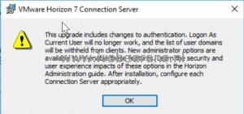
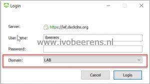
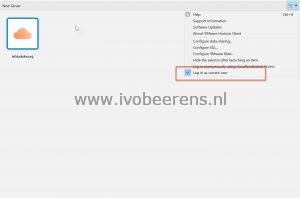
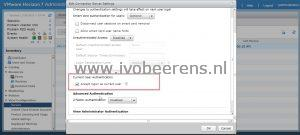
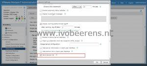

When upgrading a VMware Horizon Connection server to version 7.8 or higher the following message appears during the upgrade.

This means the following settings are disabled after the upgrade:

- Login As Current User will no longer work when selecting the "Log in as current user" in the Horizon Client
- List of user domains will be withheld from Horizon clients

<table style="border-collapse: collapse; width: 100%;"><tbody><tr><td style="width: 50%;"></td><td style="width: 50%;"></td></tr></tbody></table>

With this option, the Active Directory domain name is not visible and replace \*DefaultDomain\*

These settings are disabled to improve security but sometimes after a Horizon environment upgrade one or more settings needs re-enabled again. Here are the steps to enable these settings:

## **Enabling Login As Current User**

Allow the Connection Server to accept logon as current user authentication

1. Open: _**https://fqdn/admin**_
2. Enter the user name and password
3. Click on "View Configuration" and select Servers
4. Select the Connection Servers tab
5. Select the Connection Server and click on Edit
6. Select the Authentication tab
7. Scroll down the bottom and select "Accept logon as current user"
8. Click on OK

Repeat steps 5-8 for each VMware Horizon Connection Server.

## **Enabling the domain list in the Horizon Client**

1. Open: https://fqdn/admin
2. Enter the user name and password
3. Click on "View Configuration" and  Edit the "Global Settings"
4. Scroll down and select "Send domain list"
5. Click on OK

After enabling this global setting the Active Directory domain is visible again and it is possible to select another AD domain.

