In part 2 we highlight the native support for VMware Horizon 7 and higher environments in ControlUp 8.1. The integration is based on the SOAP API. Adding a VMware Horizon environment is easy, click on the Add EUC environment and enter the name a Horizon Connection Server and click ‘OK’. ControlUp discovers Horizon components such as Connection Servers, Cloud Pod Architecture (CPA), desktop pools and sessions automatically.

[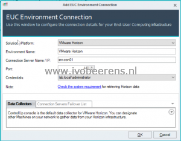](images/Hor1.png) [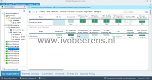](https://www.ivobeerens.nl/wp-content/uploads/2019/12/Hor2.png)

### Horizon Connection Servers

On the top level, you see the stress of all the Horizon Connection Servers and in the view below that each individually Horizon Connection Server is listed with there metrics.

For all the Connection Servers, the following metrics are added to the view:

- Horizon Pods
- Stress Level
- Connection Servers
- Connection Server health
- Connection Server Max connections
- Average machine memory
- Machine disk IO average latency
- Machine Disk Transfers/sec
- Machine Net Total

Per Horizon Connection Server, the following metrics are added such as:

- Connection server Health
- Amount of connection Servers
- Active connections
- Connection Server health
- External URL
- Connection Server certificate valid
- Connection Server certificate expiration date
- License model
- Connection Server version
- Horizon Pod
- Horizon Site

When installing the ControlUp agent on the Connection Servers or VDI desktop, the hypervisor and in-guest metrics are combined with the Horizon metrics.

[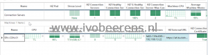](images/HorAgentMetrics-1.png)

### Desktop Pools

Below the Connection Servers, the desktop pools are displayed.

Each Desktop pool in the Horizon environment is displayed with metrics such as:

- Pool name
- Pools type
- Stress level
- Pool state
- Provisioning enabled
- Number of machines
- Number of machines enabled
- Sessions
- Disconnects
- Problem machines
- Default protocol
- Power policy
- Logoff timeout

[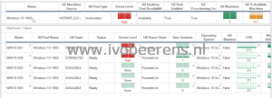](images/Pools1.png) [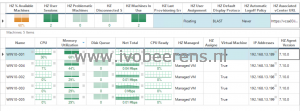](https://www.ivobeerens.nl/wp-content/uploads/2019/12/Pools2.png)

Per Horizon pool you can view the VDI desktop and Horizon Session with metrics such as:

- Pool name
- Session type
- Machine name
- State
- Session start time
- Protocol
- Desktop source
- Client name
- Horizon client version
- Horizon agent version

[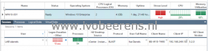](images/sessions.png)

And from the Horizon session, you can dive deeper into the processes view to troubleshoot further.

[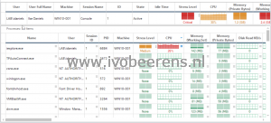](images/processes.png)

The Virtual Expert in ControlUp includes Horizon specific suggestions such as for example the available desktops remaining in a desktop pool.

[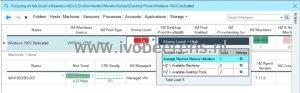](images/Virtual-Expert.jpg)

As you can see, the Horizon integration adds a lot of Horizon specific metrics. All these metrics gives great insight into what happens in the Horizon environment.

# Automation

ControlUp can use automation to solve Horizon issues for you. For example, it is possible the check the Horizon agent state of each VDI desktop. If the Horizon agent state goes bad (such as agent unreachable, error, unknown and already used for example) an automated action can be configured to resolve the problem. To configure automated actions, triggers are used in ControlUp.

In this example ([demoed by Trentent Tyle](https://youtu.be/l1ClNdH76_8)), 3 automation triggers are created:

- Trigger 1 operate at 10 minutes, action: Horizon Agent restart if the horizon state is wrong
- Trigger 2 operate at 15 minutes, action: VM restart if the horizon state is wrong
- Trigger 3 operate at 20 minutes, action: Cold Boot VM if the horizon state is wrong

### Trigger 1: operate at 10 minutes

When the VDI machine boots up it has 10 minutes to register the Horizon agent state in the Horizon Connection server. A normal VDI desktop has a READY state and is available. After 10 minutes, the trigger looks if the  Horizon agent reports the wrong state such as:

- UNKOWN
- \*ERROR
- ALREADY USED
- DOMAIN FAILURE
- AGENT UNREACHABLE

[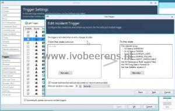](images/Trigger5min.jpg)

If the Horizon agent state is wrong, the following action is executed: Restart the VMware Horizon Agent.

[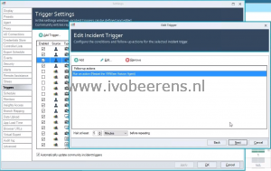](images/TriggerAction.png)

The restart VMware Horizon Agent is a PowerShell script that restarts the VMware Horizon Agent service.

[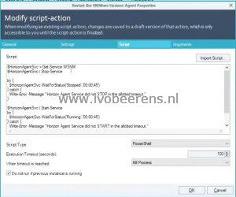](images/3.jpg)

It's easy to create scripts such as PowerShell, VBS, BAT, and CMD. ControlUp itself offers a huge library of predefined/community scripts that can be used also.

### Trigger 2: operate at 15 minutes

This trigger looks at the same wrong Horizon Agent states used in the 10 minutes trigger. As an action, the VDI desktop VM is restarted using a simple command.

### Trigger 3: operate at 20 minutes

This trigger looks at the same wrong Horizon Agent states used in the 10 minutes trigger. As an action, a hard reboot (cold boot) is executed using a simple command on the VDI Desktop.

Because of all the Horizon metrics available, it is possible to check and repair the Horizon agent states. For IT departments, morning checks can be easily automated to ensure the VDI desktops are ready for accepting connections.

Besides the example above, there is a huge list of other Horizon items/metrics that can be used for automated actions. Here is a short overview of some:

[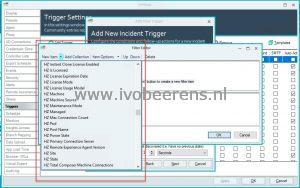](images/Trigger-actions.jpg)

This huge list of  Horizon metrics/items in combination with custom scripted actions that can be used makes ControlUp very powerful.

## Conclusion

ControlUp 8.1 adds support for VMware Horizon integration and discovers Horizon components such as Connection Servers, Cloud Pod Architecture (CPA), pools and sessions automatically. This integration gives great insight into what happens in the Horizon environment. Using automated actions (triggers) with the Horizon metrics and scripted actions makes it a very powerful tool for automating actions and solve specific issues as displayed for example in the example above.

More information and a trail can be found here, [link](https://www.controlup.com/).

