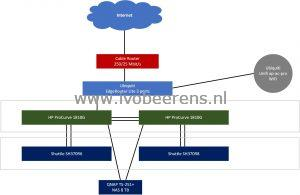
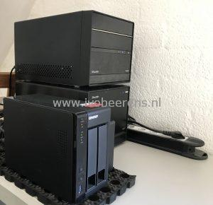

William Lam has started a great initiative. William asked ([link](https://t.co/coVQqnxG9N)) everyone who owns a homelab to share there build of materials (BOM) and configuration so the vCommunity can benefit and learn from. I have a simple homelab configuration, the materials I used and configuration are listed below:

**Internet**

Cable modem in bridge mode with 250 Mbit/s down and 25 Mbit/s upload.

**Router** 

Ubiquiti EdgeRouter Lite 3-Port router

**Access Point**

Ubiquiti UniFi AP AC PRO

**Layer 2 switches**

2 x HP ProCurve 1810G (8 x 1GbE) manageable switches.

**Compute**

Shuttle SH370R6 Plus and a Shuttle SH370R8 Plus. Each barebone has:
- 500 W Plus Silver PSU
- Intel Core i7 8700 with 6 cores and 12 threads
- 64 GB memory
- Samsung 970 EVO 1 TB m.2
- Kingston datatraveler 100 G3 32 GB USB disk
- 2 x 1 GbE Network cards

**Network Attached Storage** (NAS)

QNAP TS-251+ NAS with two Western Digital (WD) Red 8 TB disk in a RAID-1 configuration.

**Software**

- VMware vSphere (ESXi, vCenter)
- VMware vSAN
- VMware Horizon
- VMware NSX-V and NSX-T
- vRealize products
- IoT stuff

**Build of materials (BOM)**

<table style="border-collapse: collapse; width: 100%; height: 190px;"><tbody><tr style="height: 24px;"><td style="width: 25%; height: 24px;"><strong>Components</strong></td><td style="width: 25%; height: 24px;"><strong>Costs ~&nbsp;</strong></td><td style="width: 25%; height: 24px;"><strong>Links to blog posts</strong></td></tr><tr style="height: 48px;"><td style="width: 25%; height: 48px;">Ubiquiti EdgeRouter Lite 3-Poort Router</td><td style="width: 25%; height: 48px;">€ 93</td><td style="width: 25%; height: 48px;"></td></tr><tr><td style="width: 25%;">Ubiquiti UniFi AP AC PRO</td><td style="width: 25%;">€ 136</td><td style="width: 25%;"></td></tr><tr style="height: 24px;"><td style="width: 25%; height: 24px;">HP ProCurve 1810G</td><td style="width: 25%; height: 24px;">€ 75 each. Not available anymore.</td><td style="width: 25%; height: 24px;"></td></tr><tr style="height: 24px;"><td style="width: 25%; height: 24px;">Shuttle SH370R6 Plus</td><td style="width: 25%; height: 24px;">€ 1200</td><td style="width: 25%; height: 24px;"><a href="https://www.ivobeerens.nl/2019/01/30/home-lab-extension-with-a-shuttle-sh370r6-plus/" target="_blank" rel="noopener noreferrer">Link</a></td></tr><tr style="height: 22px;"><td style="width: 25%; height: 22px;">Shuttle SH370R8</td><td style="width: 25%; height: 22px;">€ 1200</td><td style="width: 25%; height: 22px;"><a href="https://www.ivobeerens.nl/2019/06/04/using-the-shuttle-sh370r8-as-home-lab-server-with-VMware-esxi/" target="_blank" rel="noopener noreferrer">Link</a></td></tr><tr style="height: 24px;"><td style="width: 25%; height: 24px;">QNAP TS-251+</td><td style="width: 25%; height: 24px;">€ 314</td><td style="width: 25%; height: 24px;"></td></tr><tr style="height: 24px;"><td style="width: 25%; height: 24px;">2 x Western Digital (WD) Red 8 TB</td><td style="width: 25%; height: 24px;">€ 258 each. Total € 516</td><td style="width: 25%; height: 24px;"></td></tr></tbody></table>

An overview of all the submitted community homelabs can be found here, [link.](https://github.com/lamw/homelab)