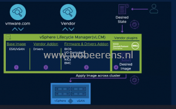

vSphere 7 is built for supporting modern applications and the hybrid cloud. In the coming years, enterprises will build more and more applications using cloud-native tools and methods. There is a lot more complexity in deploying and managing modern applications. vSphere 7 with Kubernetes (formerly known as Project Pacific) is based on VMware Cloud Foundation 4 (VCF) and will help with this complexity. The developer doesn’t need to deal with infrastructure anymore and the VI Admin can provision and manage the infrastructure workloads with the same tools they already known.

VMware Cloud Foundation 4 is a full Software-defined infrastructure with compute (vSphere 7), network (NSX-T), storage (vSAN 7), and management (vRealize 8.1). This modern infrastructure is for deploying Kubernetes at cloud scale.

Besides Kubernetes on VMware Cloud Foundation, vSphere 7 adds improvements on these three keys areas:

- **Simplified Lifecycle Management**
- **Intrinsic Security**
- **Application Acceleration**

Here an overview of the new improvements in these three key areas:

### **vCenter Server**

- **vCenter Server Profiles**. Profiles can import and export vCenter Server configuration via REST APIs (management, network, authentication and user configurations). This is not the same as Host Profiles. These are the settings you can make in the vCenter Server Appliance Management Interface (VAMI). With this, you can maintain version control between vCenter Servers (max 100 vCenter Servers are supported).

- **vCenter Server Multi-Homing is now officially supported**. It has a maximum of 4 NICs that are supported per vCenter Server. vCenter Server NIC1 is reserved for vCenter HA (vCHA).
- **vCenter Server Scalability Enhancements**. The scalability is improved as in each new release (for more information you can refer to the configmax.VMware.com website).

- **vCenter Server CLI tools**. The vSphere SSO domain consolidation tool (cmsso-util) has been simplified. The repointing option is gone, now you have the 'unregister' and 'domain-repoint' arguments for that.
- **Content Library VM templates versioning.** Check-in/Check-out and versioning. When editing a VM template you can check-out the template and make changes and check-in the template. After that, you see the versioning (history) information.

- **Automatic migration of a vCenter Server external Platform Services Controller (PSC)**. When migrating a vCenter Server with an external Platform Services Controller (PSC), it will be automatically converged to a vCenter Server with an embedded Platform Services Controller. The vCenter Server converged tool is no longer available from the ISO.
- **vCenter Server Update Planner**. vCenter Server Update Planner is a new tool that helps with discovering, planning and upgrading a vCenter Server. In the vSphere client you receive notifications when an upgrade or update is available. The cool thing is that it detects installed VMware products and if they are compatible or not.

 

### **vSphere Lifecycle Manager (vLCM)**

- **Single cluster Image Manager**. This is all about consistency across ESXi hosts in a cluster. The desired state of cluster can be managed with this model also known as single image management. When a host is not compliant (anymore) you can remediate it to the desired state. The host firmware management can be done from within vSphere and works in conjunction with vendor management tools like Dell OpenManage and HPE OneView. The VMware Compatibility Guide (VCG ) and Hardware Compatibility List (HCL) checks remove the risks of unsupported drivers and firmware levels. Single image cluster management is available in the GUI and REST API. vSphere Lifecycle Manager includes desired state vSAN management.

### **Hardware & Performance**

- **Improved Distributed Resource Scheduler (DRS)**. In earlier releases of vSphere DRS was based on a cluster-wide standard, equally utilized across the cluster. With vSphere 7, DRS is improved and based on a workload centric standard so it ready for the modern application. In the screenshot, you see the old DRS and the improved DRS standard with the VM DRS score. The VM DRS score is the new metric that migrate or balance the workload across the cluster. The VM DRS score is calculated using the following metrics such as performance, capacity, and migration:
    - CPU %RDY (Ready) time
    - Memory swap (overcommit)
    - CPU cache behavior
    - Headroom for the workload to burst
    - Migration cost

 

- **DRS Scalable shares**: Relative resource entitlement to other resource pools depending on a number of VMs in the resource pool. Setting a share level to 'high' ensures prioritization over lower share VM entitlements. The share allocation dynamically changes when spinning up more VMs. This is not enabled by default in vSphere 7.
- **Assignable Hardware**. It's a framework that allows Dynamic DirectPath I/O (supports NVIDIA GRID vGPU devices) to use vSphere HA and DRS for initial placement. In earlier releases of vSphere, the VM was stuck on the host. A VM with a pass-thru device. Assignable hardware requires hardware version 17 of the VM. When powering on a VM with a NVIDIA vGPU profile DRS will look if it can place that VM with the vGPU profile on a other host. DRS load balancing of  Dynamic DirectPath I/O devices is not available yet. So only for the initial placement of the VM.

 

- **vMotion.** vMotion is improved so that it reduces the performance impact on large (monster) VMs during a vMotion**.** This brings back vMotion capabilities for large workloads like SAP HANA or Oracle.
- Enhanced vMotion Compatability (EVC). In vSphere 7 there is support for the Intel Cascade Lake and AMD Zen2 generation.
- **Virtual Machine Hardware version 17**.  VM hardware version 17 is needed when using Assignable Hardware. Other new features in HW v17 are:
    - **Watchdog Timer**: Without a watchdog timer guest OSes and applications don't know they are crashed. A watchdog timer helps by resetting the VM if the guest OS is no longer responding. This is important for clustered applications like databases and filesystems.
    -   **Precision Time Protocol (PTP)**: This is for applications that require sub-millisecond accuracy such as financial and scientific applications. PTP requires both the in-guest device and ESXi service to be enabled. Choose between NTP or PTP for the entire ESXi host.

### **Security & Compliance**

- **vSphere Software Guard Extensions (vSGX)**. This is called hardware protection for secrets. It allows applications to work with hardware to create a secure enclave that cannot be viewed by the guest OS or hypervisor. Applications can move sensitive logic & storage into this enclave. This is only support by Intel.
- **Improved Certificate Management**. In vSphere  6.x you have a lot of certificates. In vSphere 7 the certificate management is much simpler. And you can manage the vCenter Server certificates programmatically by using APIs.
- **vSphere Trust Authority (vTA)**.  This is all about secure the vSphere infrastructure, how do we trust that our hosts are configured correctly. vTA takes care of this.
- **Identify Federation.** Standard-based federation authentication with an enterprise provider (idPs) such as ADFS. This reduces the audit scope and vSphere admin workload. SSO still exists.

### **vSAN 7.0** 

- **Simpler Lifecycle Management**. See the **vSphere Lifecycle Manager (vLCM)** paragraph above for more details on this.
- **Native File Services**. This integrated File Services is built-in the hypervisor and provides support for NFS v3 and 4.1 protocols. It is managed in vSAN and provides file shares within the vSAN cluster. The purpose for the integrated file services is for addressing file share needs from traditional and cloud-native workloads on vSAN cluster. So it is not built for replacing a large filer.

- **Enhanced Cloud Native Storage**. Integration of Kubernetes running on vSphere and vSAN using file-based persistent volumes.

 

Besides these main improvements, there are dozens of other great enhancements on operations, efficiency, and management level. My favorite vSphere 7 improvement is the **vSphere Lifecycle Manager (vLCM)** enhancement because it makes updating and maintaining vSphere clusters (with vSAN) a lot easier using the desired state model.