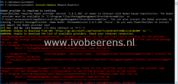

Lately, on several Windows Server 2016 servers, I wanted to install a PowerShell module such as VMware PowerCLI. When trying to install the module I’ve got the following error:

> NuGet provider is required to continue PowerShellGet requires NuGet provider version '2.8.5.201' or newer to interact with NuGet-based repositories. The NuGet provider must be available in 'C:\\Program Files\\PackageManagement\\ProviderAssemblies' or 'C:\\Users\\Administrator\\AppData\\Local\\PackageManagement\\ProviderAssemblies'. You can also install the NuGet provider by running 'Install-PackageProvider -Name NuGet -MinimumVersion 2.8.5.201 -Force'. Do you want PowerShellGet to install and import the NuGet provider now? \[Y\] Yes \[N\] No \[S\] Suspend \[?\] Help (default is "Y"): Y WARNING: Unable to download from URI 'https://go.microsoft.com/fwlink/?LinkID=627338&clcid=0x409' to ''. WARNING: Unable to download the list of available providers. Check your internet connection.
> 
> PackageManagement\\Install-PackageProvider : No match was found for the specified search criteria for the provider NuGet'. The package provider requires 'PackageManagement' and 'Provider' tags. Please check if the specified package has the tags. At C:\\Program Files\\WindowsPowerShell\\Modules\\PowerShellGet\\1.0.0.1\\PSModule.psm1:7405 char:21 + ... $null = PackageManagement\\Install-PackageProvider -Name $script:N ... + ~~~~~~~~~~~~~~~~~~~~~~~~~~~~~~~~~~~~~~~~~~~~~~~~~~~~~~~~~ + CategoryInfo : InvalidArgument: (Microsoft.Power...PackageProvider:InstallPackageProvider) \[Install-Pac kageProvider\], Exception + FullyQualifiedErrorId : NoMatchFoundForProvider,Microsoft.PowerShell.PackageManagement.Cmdlets.InstallPackagePro vider

[](images/1.png)

The required modules come from the PowerShell Gallery. Windows Server 2016 has PowerShell version 5.1 installed and supports TLS 1.0 and TLS 1.1. by default. The PowerShell Gallery has deprecated and discontinuing support for TLS 1.0 and 1.1  as of **April 2020**! TLS 1.2 is set as default for the PowerShell Gallery.

A temporary fix (that won't persist) is to add the following line before installing the PowerCLI module:

```
[Net.ServicePointManager]::SecurityProtocol = [Net.SecurityProtocolType]::Tls12
```

Another way is to add this line to your PowerShell profile. More information about the PowerShell TLS change can be found here, [link](https://devblogs.microsoft.com/PowerShell/PowerShell-gallery-tls-support/).