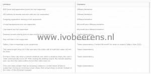

With VMware Horizon 8 or the new naming format, Horizon 2006 (YYMM) Microsoft Teams offloading / media optimization is supported. Media Optimization for Microsoft Teams redirects audio calls, video calls, and viewing desktop shares for a seamless experience between the client system and the remote session without negatively affecting the virtual infrastructure and overloading the network.

## What is supported

The Media Optimization for Microsoft Teams offers the following features:

- Accepting and making audio and video calls
- Multiparty audio and video conferencing
- Transfer, forward, mute, hold, and resume a call
- PSTN calls via dial pad
- Desktop screen sharing
- Multi monitor screen sharing and screen picker for screen sharing
- Volume control from the remote desktop
- Active speaker identification

## Limitations

Media Optimization for Microsoft Teams has the following limitations:

[](images/Limitations.png)

To enable this feature you need  to configure the following settings:
- Install Horizon 2006 client and enable media optimization.
- Import the Horizon 2006 GPOs and enable the Group Policy setting for Microsoft Teams
- Perform a machine-wide installation of Microsoft Teams on the golden image

In this example, I will configure a Windows 10 client with a custom Horizon 2006 client installation, import and configure the GPO settings for Microsoft Teams on the Domain Controller and install Microsoft Teams on the Windows 10 Golden Image.

## Horizon client

Install a custom installation of the Horizon client.

- Download the Horizon 2006 client, [link](https://my.VMware.com/en/web/VMware/downloads/info/slug/desktop_end_user_computing/VMware_horizon_clients/2006)
- Install the client and select "Customize installation"

[](images/Customize-install.png) [](https://www.ivobeerens.nl/wp-content/uploads/2020/08/Horizon-Client.png)

- Scroll down and select "Media Optimization for Microsoft Teams"
- After the installation reboot the Windows client

## VMware Horizon Group Policies

 Download and configure the Microsoft Teams GPO.

- Download the GPO bundle from the VMware  download site

[](images/GPO.png)

- Extract the .zip file
- Copy all the files to the %systemroot%\\PolicyDefinitions folder on your Active Directory
- Create a GPO and configure the Teams offloading settings:
    - Computer Configuration
        - Policies
            - Administrative Templates
                - VMware View Agent Configuration
                    - VMware HTML5 Features
                        - VMware WebRTC Redirection Features

[](images/ADMX.png)

- Enable the Media Optimization for Microsoft Teams setting

[](images/Settings.png)

## VDI - Golden Image

Install the Microsoft Teams client on a Windows 10 32 or 64 bits OS.

- Download the 32 or 64 bits Teams client, here is a link to the 64-bits version, [link](https://statics.teams.cdn.office.net/production-windows-x64/1.3.00.21759/Teams_windows_x64.msi)
- Perform a machine-wide installation because Teams won't work properly with a per-user installation on a non-persistent setup.

```
msiexec /i <path_to_msi> /l*v <install_logfile_name> ALLUSER=1 ALLUSERS=1
```

More information on installing Microsoft Teams can be found here, [link.](https://docs.microsoft.com/en-us/microsoftteams/teams-for-vdi) More information on installing VMware Teams can be found here, [link](https://docs.VMware.com/en/VMware-Horizon/2006/horizon-remote-desktop-features/GUID-F68FA7BB-B08F-4EFF-9BB1-1F9FC71F8214.html).

## Check session mode

To check if the Teams session is running in optimized, failback, or natively (without optimization) mode in the VDI session go the Teams client. In the Teams client go the the user account and navigate to about and select version. As you can see in the picture below, the session is optimized (VMware Media Optimized) which means offloading works.

[](images/Session.jpg)

## Conclusion

After configuring these settings Microsoft Teams offloading is configured. For Microsoft Teams offloading you need at least an advanced Horizon license. Microsoft Teams offloading is now available in the Horizon standard subscription license, see [link](https://www.VMware.com/content/dam/digitalmarketing/VMware/en/pdf/products/horizon/vmw-horizon-subscription-feature-comparison.pdf).