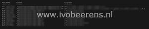

On my GitHub page ([link](https://github.com/ibeerens/PowerCLI)), I uploaded a PowerShell script that identifies all the active parent VM and snapshot per VMware Horizon pool. The parent VM is also known as Golden image.

With this script, you can quickly identify what parent VMs and snapshots are in use.