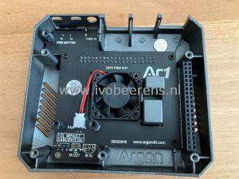

Shortly after VMworld 2020, VMware released (after years of announcing and demoing) the ESXi On ARM fling (*1). On Social media and the community ESXi on ARM is a very hot topic. The ESXi ARM fling makes it possible to run the VMware ESXi hypervisor on ARM platforms such as:
- Avantek Workstation and server (Ampere eMAG)
- Lenovo ThinkSystem HR330A and HR350A (Ampere eMAG)
- SolidRun Honeycomb LX2
- Raspberry Pi (rPi) 4b model (4GB and 8GB only).

Because it supports the Raspberry Pi 4b model is very interesting for the home labbers.

**(*1)** A fling shows an early stage of software to the VMware community. There is no official (only community) support available. The ESXi on ARM fling can be download for the following location: [link](https://flings.VMware.com/esxi-arm-edition).

## Use cases

Some use cases for ESXi On ARM are:

- vSAN Witness node, [link](https://www.virtuallyghetto.com/2020/10/vsan-witness-using-raspberry-pi-4-esxi-arm-fling.html)
- Automation environment for PowerCLI and Terraform and packer, [link](https://www.virtuallyghetto.com/2020/10/using-esxi-arm-fling-as-a-lightweight-vSphere-automation-environment-for-powercli-and-terraform.html).
- Security at the edge
- Other home lab projects such as running Home Assistant (See the next blog post).

For my home lab environment, I wanted to build an ESXi ARM cluster for my IoT stuff (such as Home Assistant) with two Pi nodes attached to my existing QNAP NAS. With the two ESXi ARM nodes, a vCenter Server, and shared storage, cluster functions such as vMotion, High Availability, DRS, and even FT are available. How cool is that!

Every day there are new use cases created in the community. That's one reason why ESXi on ARM is such a cool technology!

## My Environment build

Here is a simple diagram of how my setup looks like:

## build of materials (BOM)

In this blog article, I will mention the build of materials (BOM). The following components I use:
s
<table style="border-collapse: collapse; width: 100%; height: 224px;"><tbody><tr style="height: 24px;"><td style="width: 7.78739%;"><strong>Number</strong></td><td style="width: 35.0288%; height: 24px;"><strong>Component</strong></td><td style="width: 23.8505%; height: 24px;"><strong>~Cost €&nbsp;</strong></td><td style="width: 33.3333%; height: 24px;"><strong>Link (cheapest Pi shop in the Netherlands)</strong></td></tr><tr style="height: 56px;"><td style="width: 7.78739%;"><strong>1</strong></td><td style="width: 35.0288%; height: 56px;">Raspberry Pi 4 Model B with 8GB memory.</td><td style="width: 23.8505%; height: 56px;">87,50 (per Pi)</td><td style="width: 33.3333%; height: 56px;"><a href="https://www.raspberrystore.nl/PrestaShop/raspberry-pi-v4/279-raspberry-pi-4b-8gb-765756931199.html" target="_blank" rel="noopener noreferrer">Link</a></td></tr><tr style="height: 24px;"><td style="width: 7.78739%;"><strong>2</strong></td><td style="width: 35.0288%; height: 24px;">Raspberry Pi 15W USB-C Power Supply</td><td style="width: 23.8505%; height: 24px;">&nbsp;9,95 (per Pi)</td><td style="width: 33.3333%; height: 24px;"><a href="https://www.raspberrystore.nl/PrestaShop/raspberry-pi-v4/230-raspberry-pi-15w-usb-c-power-supply-eu-zwart.html" target="_blank" rel="noopener noreferrer">Link</a></td></tr><tr style="height: 24px;"><td style="width: 7.78739%;"><strong>3</strong></td><td style="width: 35.0288%; height: 24px;">Argon One Pi 4 case</td><td style="width: 23.8505%; height: 24px;">28,95 (per Pi)</td><td style="width: 33.3333%; height: 24px;"><a href="https://www.raspberrystore.nl/PrestaShop/behuizingen/292-argon-one-voor-raspberry-pi-4.html" target="_blank" rel="noopener noreferrer">Link</a></td></tr><tr style="height: 24px;"><td style="width: 7.78739%;"><strong>4</strong></td><td style="width: 35.0288%; height: 24px;">Official Raspberry Pi USB keyboard</td><td style="width: 23.8505%; height: 24px;">17,95</td><td style="width: 33.3333%; height: 24px;"><a href="https://www.raspberrystore.nl/PrestaShop/home/224-toetsenbord-zwartgrijs-0652508442150.html?search_query=keyboard&results=4" target="_blank" rel="noopener noreferrer">Link</a></td></tr><tr style="height: 24px;"><td style="width: 7.78739%;"><strong>5</strong></td><td style="width: 35.0288%; height: 24px;">Micro SD card, 32 GB</td><td style="width: 23.8505%; height: 24px;">13,95 (per Pi)</td><td style="width: 33.3333%; height: 24px;"><a href="https://www.raspberrystore.nl/PrestaShop/storage-usb-sticks-sd-kaarten/132-micro-sd-kaart-32gb.html" target="_blank" rel="noopener noreferrer">Link</a></td></tr><tr style="height: 24px;"><td style="width: 7.78739%;"><strong>6</strong></td><td style="width: 35.0288%; height: 24px;">Delock USB 3.2 16 GB flash drive</td><td style="width: 23.8505%; height: 24px;">&nbsp;8,99 (per Pi)</td><td style="width: 33.3333%; height: 24px;">I reused the USB drives</td></tr><tr style="height: 24px;"><td style="width: 7.78739%;"><strong>7</strong></td><td style="width: 35.0288%; height: 24px;">Micro-HDMI to HDMI cable 1,5m.</td><td style="width: 23.8505%; height: 24px;">&nbsp;7,95</td><td style="width: 33.3333%; height: 24px;"><a href="https://www.raspberrystore.nl/PrestaShop/raspberry-pi-v4/235-hdmi-micro-hdmi-zwart-1m-5412810180363.html" target="_blank" rel="noopener noreferrer">Link</a></td></tr></tbody></table>

**1. Raspberry Pi 4 Model B with 8GB memory**.

This Pi model has the following specifications:

- - 1.5GHz quad-core ARM Cortex-A72 CPU
    - VideoCore VI graphics
    - 4kp60 HEVC decode
    - True Gigabit Ethernet
    - 2 × USB 3.0
    - 2 × USB 2.0 ports
    - 2 × micro-HDMI ports (1 × 4kp60 or 2 × 4kp30)
    - USB-C for input power, supporting 5V 3A operation
    - 8Gb LPDDR4 memory

<table style="border-collapse: collapse; width: 100%;"><tbody><tr><td style="width: 50%;"></td><td style="width: 50%;"></td></tr></tbody></table>

**2\. Raspberry Pi 15W USB-C Power Supply**.

The power Supply uses the USB-C for charging the Pi. Make sure to use a decent power supply such as this one.

<table style="border-collapse: collapse; width: 100%;"><tbody><tr><td style="width: 100%;"></td></tr></tbody></table>

**3\. Argon One Pi 4 case**

This case (which looks like the Tesla Cybertruck) has an aluminum enclosure for passive cooling and a fan inside for active cooling. Proper cooling is very important for the Pi because when running VMware ESXi it can get hot. You can control the FAN by software or enable the always-on mode. In software mode when the CPU temp reaches 55 degrees, the fan will run at 10%, at 60 degrees it will run at 55%, and at 60 degrees it will run 100%. The driver does not work on VMware ESXi, it is designed for the Pi OS. Hopefully, there will be a VIB available in the future that makes software control of the fan possible.  For VMware ESXi, you need to enable the always-on mode by switching the jumper pen next to the fan.

The assembly of the Pi and case is very easy:

- Next to the fan, you see two cooling blocks (grey ones), one for the CPU and the other for the RAM chip
- Add some terminal paste to the cooling blocks
- Plug the PCB board into the Pi and the case. With the PCB board, all the ports and buttons are accessed from the back!
- Tighten the screws.

The GPIO pins are still available when removing the magnetic cap from the top of the case.

<table style="border-collapse: collapse; width: 100%;"><tbody><tr><td style="width: 50%;"></td><td style="width: 50%;"></td></tr><tr><td style="width: 50%;"></td><td style="width: 50%;"></td></tr><tr><td style="width: 50%;"></td><td style="width: 50%;"></td></tr></tbody></table>

**4\. Official Raspberry Pi USB keyboard**.

This is a 78-key QWERTY keyboard with a built-in 3 ports hub on the back. It has a small form factor.

<table style="border-collapse: collapse; width: 100%;"><tbody><tr><td style="width: 50%;"></td></tr></tbody></table>

**5 & 6. Micro SD card and USB disk**.

The SD card is for storing the UEFI firmware that is required to boot the VMware ESXi-ARM installer. I used 32 GB SD. The USB drive is for installing the VMware ESXi ARM ISO.

<table style="border-collapse: collapse; width: 100%;"><tbody><tr><td style="width: 50%;"></td></tr></tbody></table>

**7\. Micro-HDMI to HDMI cable 1,5m**.

The following components I already have in my home lab environment and will be re-used:

- Netgear switch
- 2 x Delock USB 3.2 16 GB flash drives
- 2 x UTP CAT 5e cables
- QNAP NAS

After the assembly of the case, connect the USB drive, SD card, Power-Supply, Monitor, keyboard, UTP cable, and you're ready to install the VMware ESXi for ARM fling.

<table style="border-collapse: collapse; width: 100%;"><tbody><tr><td style="width: 50%;"></td></tr></tbody></table>

In the next ESXi on ARM blog, I will highlight the ESXi on ARM installation process and how to install and configure Home Assistant.

Here are some great links to follow:

- [ESXi ARM Fling](https://flings.VMware.com/esxi-arm-edition)
- [VMware ESXI-ARM blog](https://blogs.VMware.com/arm)
- [William Lam ESXi-ARM](https://www.virtuallyghetto.com/category/esxi-arm)
- [The slack channel #esxi-arm on VMware{code}](https://code.VMware.com/web/code/join)
- [ESXi-ARM Twitter](https://twitter.com/esxi_arm)

Thanks to the [Raspberry Store](https://www.raspberrystore.nl/PrestaShop/) for the quick delivery.