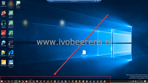

Sometimes it happens to me that the local taskbar of my Windows 10 laptop is in front and you don’t have access to the remote toolbar during a full-screen RDP session. This is quite annoying. In the picture below you see the local toolbar of my Windows 10 laptop is in front during a full-screen RDP session.

[](images/Taskbar.png)

Accessing the remote taskbar from the server is only possible when you don't run RDP in full-screen mode. The fix for this is to reboot the local Windows 10 device or kill the "explorer.exe" process.  You can do this manually using the Windows task manager or automated using the command line. The syntax is as follows:
```
C:\Windows\System32\cmd.exe /c "C:\Windows\System32\taskkill.exe /F /IM explorer.exe & start explorer"
```