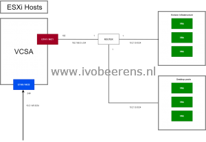
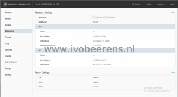

For a Disaster Recovery (DR) site, I designed a separate isolated VMware Horizon environment. The vCenter Server has an external (eth0) and internal (eth1) IP address. The external connection is for management and restoring production VMs to the DR environment. The internal connection is for Horizon infrastructure components that need access to the vCenter Server such as a VMware Horizon Server and VMware App Volumes. This looks simplified as follows:

[](images/overview.png)

There must be a static route to the Horizon subnet because the Horizon Connection Servers and VMware App Volumes integrate with the vCenter Server.

Here are the steps outlined to create such an environment:
- The first thing after deploying a new vCenter Server is adding an extra NIC (**VMXNET3**). The steps are explained in the following article: [KB2147155](https://kb.VMware.com/s/article/2147155)
- Add the NIC to the correct internal PortGroup
- Open the VAMI interface (**https://<IP\_Address>:5480**) of the vCenter Server and add the IP configuration of eth1 (NIC1).

[](images/1.png)

- Enable SSH in the VAMI interface (**Access - Edit - Enable SSH login**)
- Make an SSH session to vCenter Server and log in with root and the correct password
- Enter "shell" to launch the BASH shell
- Browse to the following location:

```
cd /etc/systemd/network
```

- There are two files available (**10-eth0.network** and **10-eth1.network**). The **10-eth0.network** represents eth0 and looks like:

```
[Match]
Name=eth0

[Network]
Gateway=10.2.145.249
Address=10.2.145.202/24
DHCP=no

[DHCP]
UseDNS=false
```

- The **10-eth1.network** file represents eth1 and looks like this.

```
[Match]
Name=eth0

[Network]
Gateway=10.2.145.249
Address=10.2.145.202/24
DHCP=no

[DHCP]
UseDNS=false
```

- Add a static route by adding the `[Route]` section of this file.

```
[Match]
Name=eth1
[Network]
Address=192.168.0.102/24
DHCP=no
[DHCP]
UseDNS=false

[Route]
Gateway=192.168.0.1
Destination=10.21.9.0/24
```

- Restart the network services

```
systemctl restart systemd-networkd.service
```

- Check if the route is added with the **route -n** command:

```
root@vcdr01 [ /etc/systemd/network ]# route -n
Kernel IP routing table
Destination Gateway Genmask Flags Metric Ref Use Iface
0.0.0.0 10.2.145.249 0.0.0.0 UG 0 0 0 eth0
10.2.145.0 0.0.0.0 255.255.255.0 U 0 0 0 eth0
10.21.9.0 192.168.0.1 255.255.255.0 UG 0 0 0 eth1
192.168.0.0 0.0.0.0 255.255.255.0 U 0 0 0 eth1
```

- Test with the ping command from the vCenter Server if you can reach the Horizon infra components in the subnet.