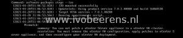
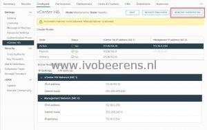

Last week I tried to patch a vCenter Server High Availability (VCHA) 7 cluster environment. I read the documentation and the procedure described looks still the same as in version 6.x. First patch the witness node, then the passive node, failover the active node, and patch the passive node using the *software-packages* tool. The whole process is described in this [link](https://docs.vmware.com/en/VMware-vSphere/7.0/com.vmware.vcenter.upgrade.doc/GUID-C27CD7DF-AB52-4A77-A6A6-A966498D5CA0.html).

When I tried to stage the ISO on the witness node the following error occurred:

> You can not patch a vCenter Server appliance in a vCenter HA cluster. **resolution**: You must remove the vCenter HA configuration, apply patches to vCenter Server appliance, and then reconfigure your vCenter HA deployment.
> 
> 

So I removed the vCenter Server HA cluster configuration and patched the single vCenter Server Appliance.

After the patching of the single VCSA, I redeployed the VCHA cluster again.

**Conclusion**: The vCenter Server HA cluster documentation still has the VCHA 6 update procedure documented that does not work anymore. I will update this blog article if there is more information available.