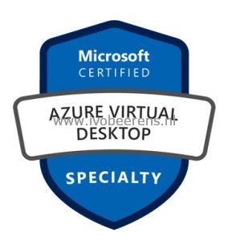

I’m preparing for the **AZ-140 Azure Virtual Desktop (AVD)** exam.

**Update**: June 10, 2021, the exam is out of beta and Generally Available ([Link](https://techcommunity.microsoft.com/t5/azure-virtual-desktop/azure-virtual-desktop-specialty-certification-is-here/m-p/2435757#M7210)).

The following resources I'm using for studying for the exam:

- [Exam AZ-140: Configuring and Operating Windows Virtual Desktop on Microsoft Azure – Skills Measured](https://query.prod.cms.rt.microsoft.com/cms/api/am/binary/RE4MFST)
- [Exam AZ-140: Configuring and Operating Windows Virtual Desktop on Microsoft Azure website](https://docs.microsoft.com/en-us/learn/certifications/exams/az-140)
- [Deliver remote desktops and apps from Azure with Windows Virtual Desktop free training from Microsoft](https://docs.microsoft.com/en-us/learn/paths/m365-wvd/?WT.mc_id=Azure_blog-wwl)
- The AZ-140 exam can be taken online. Know what to expect with an online proctored exam,  [link](https://techcommunity.microsoft.com/t5/microsoft-learn-blog/online-proctored-exams-what-to-expect-and-how-to-prepare/ba-p/1469424)

Create a free Azure account to get some hands-on lab experience
- [Create a Azure free account](https://azure.microsoft.com/en-us/free/)

The Azure Academy did a great job and created  a series of AZ-140 study guides on YouTube:

- [AZ-140 ep01 | Mgmt grp Subs Resource grp](https://www.youtube.com/watch?v=EG_Zqdm7OQ0&list=PL-V4YVm6AmwW1DBM25pwWYd1Lxs84ILZT&index=2)
- [AZ-140 ep02 | Configure Active Directory | Azure AD DNS](https://www.youtube.com/watch?v=kfOYWFpoglQ&list=PL-V4YVm6AmwW1DBM25pwWYd1Lxs84ILZT&index=3)
- [AZ-140 ep03 | Plan Windows Virtual Desktop Host Pool](https://www.youtube.com/watch?v=FLbcayyodqk&list=PL-V4YVm6AmwW1DBM25pwWYd1Lxs84ILZT&index=4)
- [AZ-140 ep04 | Plan Your WVD Session Hosts](https://www.youtube.com/watch?v=HNCZ2pzr9mo&list=PL-V4YVm6AmwW1DBM25pwWYd1Lxs84ILZT&index=5)
- [AZ-140 ep05 | WVD Network Planning](https://www.youtube.com/watch?v=O3AaPTWzpi4&list=PL-V4YVm6AmwW1DBM25pwWYd1Lxs84ILZT&index=6)
- [AZ-140 ep06 | Plan WVD Licenses](https://www.youtube.com/watch?v=oV3-w88lIu4&list=PL-V4YVm6AmwW1DBM25pwWYd1Lxs84ILZT&index=7)
- [AZ-140 ep07 | Plan FSLogix Storage](https://www.youtube.com/watch?v=tXVxuDbbNi4&list=PL-V4YVm6AmwW1DBM25pwWYd1Lxs84ILZT&index=8)
- [AZ-140 ep08 | Plan FSLogix Profiles](https://www.youtube.com/watch?v=tFyLeg1f8BQ&list=PL-V4YVm6AmwW1DBM25pwWYd1Lxs84ILZT&index=9)
- [AZ-140 ep09 | Plan AzureAD Identites](https://www.youtube.com/watch?v=9kO68Euy--g&list=PL-V4YVm6AmwW1DBM25pwWYd1Lxs84ILZT&index=10)
- [AZ-140 ep10 | Plan WVD Clients](https://www.youtube.com/watch?v=-ce3mqwvyBI&list=PL-V4YVm6AmwW1DBM25pwWYd1Lxs84ILZT&index=11)
- [AZ-140 ep11 | Windows Virtual Desktop Scenario](https://www.youtube.com/watch?v=t04-cLzdvNA&list=PL-V4YVm6AmwW1DBM25pwWYd1Lxs84ILZT&index=12)
- [AZ-140 ep12 | Implement WVD Network](https://www.youtube.com/watch?v=kjqFUN78lso&list=PL-V4YVm6AmwW1DBM25pwWYd1Lxs84ILZT&index=13)
- [AZ-140 ep13 | Implement WVD FSLogix Storage](https://www.youtube.com/watch?v=-GEHbrvEQdY&list=PL-V4YVm6AmwW1DBM25pwWYd1Lxs84ILZT&index=14)
- [AZ-140 ep14 | In An Image Gallery Far Far Away](https://www.youtube.com/watch?v=teOD3z0PIZ0)
- [AZ-140 ep15 | Warning The Host Pools Are Loose!](https://www.youtube.com/watch?v=AzufupX2zOI&list=PL-V4YVm6AmwW1DBM25pwWYd1Lxs84ILZT&index=16&t=33s)
- [AZ-140 ep16 | How To Configure All Things Apps](https://www.youtube.com/watch?v=8jGKoKzf9MM&list=PL-V4YVm6AmwW1DBM25pwWYd1Lxs84ILZT&index=17)
- [AZ-140 ep17 | How To Protect Yourself | Disaster Recovery](https://www.youtube.com/watch?v=OKaHNuo5ubg&list=PL-V4YVm6AmwW1DBM25pwWYd1Lxs84ILZT&index=18)
- [AZ-140 ep18 | Unlock The Potential of Technology](https://www.youtube.com/watch?v=CXD2FbODG-E&list=PL-V4YVm6AmwW1DBM25pwWYd1Lxs84ILZT&index=19)
- [AZ-140 ep19 | What's The Point of Cloud Monitoring](https://www.youtube.com/watch?v=Val6RL60YjE&list=PL-V4YVm6AmwW1DBM25pwWYd1Lxs84ILZT&index=20)

Travis Roberts has created a training course and a set of exam questions for the AZ-140 exam on Udemy:

- [Zero to Hero with Windows Virtual Desktop](https://www.udemy.com/course/zero-to-hero-with-windows-virtual-desktop/?referralCode=B2FE49E6FCEE7A7EA8D4)
- [Windows Virtual Desktop (WVD) AZ-140 Practice Test](https://www.udemy.com/course/wvd-az-140-practice-test/?couponCode=AZ140PROMO). Use promo code AZ140PROMO for a discount!

Pluralsight is free this month (April 2021). So take your change

- [Microsoft Azure Administrator: Preparing for the AZ-104 Exam by Tim Warner](https://app.pluralsight.com/library/courses/microsoft-azure-administrator-preparing-az-104-exam/table-of-contents)
- [Windows Virtual Desktop on Microsoft Azure: Implement a WVD Infrastructure by Greg Shields](https://www.pluralsight.com/courses/windows-virtual-desktop-implementing-infrastructure)

Exam tips:

- [AZ-140 Configuring and Operating Windows Virtual Desktop on Microsoft Azure – My Tips](http://www.tbone.se/2021/03/31/az-140-configuring-and-operating-windows-virtual-desktop-on-microsoft-azure-my-tips/)
- [Exam tips from the I am it geek](https://iamitgeek.com/2021/04/19/az-140-configuring-and-operating-windows-virtual-desktop-on-microsoft-azure-beta-exam-study-guide/)
- [What The Hack - Windows Virtual Desktop](https://github.com/microsoft/WhatTheHack/blob/master/037-WindowsVirtualDesktop/README.md)
- [How to pass AZ-140 certification exam - AVD specialisation](https://wvdlogix.net/how-to-pass-az-140-certification-exam-avd-specialisation)

I hope that these resources will help you pass the AZ-104 exam. Let me know in a comment below about your experience with the AZ-104 exam.