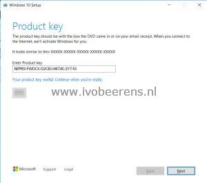
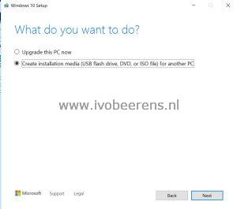
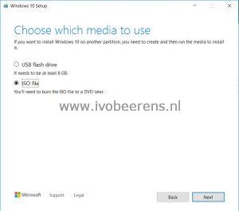
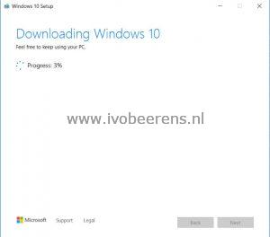
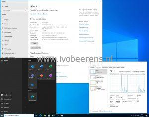

In my lab environment, I use the latest Windows 10 or Windows 11 versions (for example the new Windows 11 23H2) for creating and testing golden images for VDI environments.

To download the latest Windows ISOs file I use the Windows Media Creation Tool. This is a Windows-based tool. When starting the Windows Media Creation Tool it opens a Graphical User Interface and you are able to download Windows Home (N), Education (N), and the Pro (N) ISO. To download the Enterprise version you need to enter the command line. Here are the steps explained to download a Windows 10/11 Enterprise ISO:

- Download the Windows 10 Media Creation Tool ([Link)](https://www.microsoft.com/en-us/software-download/windows10) or Windows 11 Media Creation Tool ([Link](https://www.microsoft.com/software-download/windows11))
- Select: "Download Tool now"
- Open the command line
- Use the following command to download the English 64-bits Windows 10/11 Enterprise ISO:
```
mediacreationtool.exe /Eula Accept /Retail /MediaArch x64 /MediaLangCode en-US /MediaEdition Enterprise
```
- To download the Dutch 64-bits Windows 10/11 Enterprise ISO use the following command:
```
MediaCreationTool.exe /Eula Accept /Retail /MediaArch x64 /MediaLangCode nl-NL /MediaEdition Enterprise
```
- Enter the product key `NPPR9-FWDCX-D2C8J-H872K-2YT43`.  The KMS client keys can be found here: [link](https://docs.microsoft.com/sl-si/windows-server/get-started/kmsclientkeys)

[](images/1.jpg)

- Select: Create installation media (USB flash drive, DVD, or ISO file) for another PC

[](images/2.jpg)

- Select "Iso file" and browse to a location to store the ISO. You need at least 8GB free on the C-drive and the ISO size is between 4 and 5 GB.

[](images/3.jpg)

- The download of the Windows 10 ISO starts.

[](images/4.jpg)

Once the downloading of the ISO is completed it's ready for use.

[](images/w10-21h1-01.jpg)