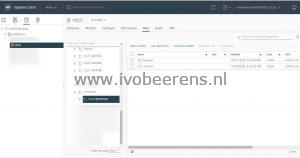
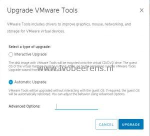

VMware Tools releases have been decoupled from VMware vSphere release since version 10.0. You can now standardize to the latest VMware Tools by configuring a centralized repository. This can be useful when you want to point to a new VMware Tools version when for example a security vulnerability in identified VMware Tools. This is recently happened and described in the VMSA-2021-0013 security advisory ([link](https://www.vmware.com/security/advisories/VMSA-2021-0013.html)) for example.

Requirements:
    - VMware ESXi 6.7 Update 1 or later
    - PowerCLI installed

Here are the steps to create a central VMware Tools repository:
- Create a folder structure on a central datastore (all VMware ESXi hosts have access to this datastore)  in the cluster. For example:
- On the nfs01 datastore is created a folder called "**vmwtools**", under that folder, I created another folder called "**11.3.0-18090558**"
- Download the latest VMware Tools version, [link](https://www.VMware.com/go/tools)
- Extract the VMware Tools ZIP file. Two folders are extracted:
    -   floppies
    -   vmtools
- Upload the two folders to the folder structure created. In this example I used: */vmfs/volumes/vmwtools/11.3.0-18090558*

[](images/1.jpg)

- Change the following variables so it matches the vSphere environment:
    - $cluster
    - $datastore
- The PowerCLI script below will point all the VMware ESXi hosts in a cluster to the central VMware Tools repository location.
- Execute this script

```powershell
# Import PowerCLI module
Import-Module VMware.PowerCLI
 
# VMware VirtualCenter server name 
$VCserver = read-host "Enter the vCenter server name"
 
# Connect to the vCenter server 
Connect-VIServer -server $VCserver
 
$cluster = 'CL-MGNT'
$hosts = Get-Cluster -Name $cluster | Get-VMHost
$datastore = '/vmfs/volumes/nfs01/vmwtools/11.3.0-18090558/'
 
# Display current VMware Location
$hosts | Get-AdvancedSetting -Name "UserVars.ProductLockerLocation" | Select-Object Entity,Value
 
# Change VMware Tools location 
Get-cluster -name $cluster | Get-VMhost | %{$_.ExtensionData.UpdateProductLockerLocation($datastore)}  
 
# Display current VMware Location
$hosts | Get-AdvancedSetting -Name "UserVars.ProductLockerLocation" | Select-Object Entity,Value
 
# Disconnect vCenter 
Disconnect-VIserver -server * -Confirm:$false
```

The default location of the VMware Tools is: **/locker/packages/vmtoolsRepo/**
- Select a Windows VM in the vSphere cluster. A message is displayed that there is a newer version of VMware Tools available.
- Select Upgrade VMware Tools (It is possible that the VM is automatically rebooted when choosing for an Automatic Upgrade).

[](images/2.jpg)[](https://www.ivobeerens.nl/wp-content/uploads/2021/07/3.jpg)

- After the installation, check if VMTools is running and if the version is current.

[](images/4.jpg)

Creating a central VMware Tools repository is an easy step that is very useful to stay up to date with the latest VMware Tools versions for the Virtual Machines.

The VMware PowerCLI script listed above can be found on my GitHub repository, [link](https://github.com/ibeerens/PowerCLI/blob/master/set-loc-vmwtools.ps1).