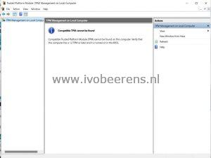
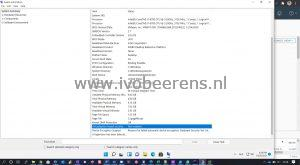
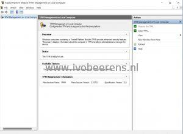
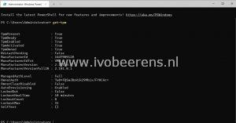
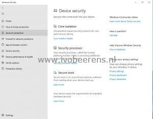
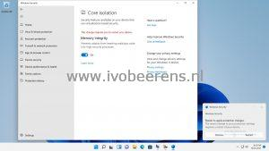
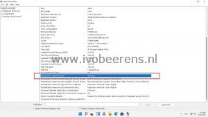

I use Packer for building images for VMware VDI environments. With the latest version (when writing this blog Packer version 1.7.7 is the latest version) it is not possible to configure a TPM in the Hashicorp Configuration Languag (HCL) config file. TPM 2.0 is required to install Windows 11. A vTPM emulates a physical TPM 2.0 and is available in VMware vSphere.

**UppubDate: January 27, 2022**: Packer with the VMware vSphere plugin ((V1.0.3) has now support for adding a vTPM device. More information can be found here: [link](https://www.ivobeerens.nl/2022/01/27/packer-has-now-virtual-tpm-vtpm-device-support/).

You can install Windows 11 using a registry hack ([link](https://www.ivobeerens.nl/2021/10/06/install-windows-11-as-vm-in-VMware-vSphere-workstation-without-tpm-2-0/)) to bypass the TPM check:

```
reg ADD "HKLM\SYSTEM\Setup\LabConfig" /f /v BypassSecureBootCheck /t REG_DWORD /d 1
```
vCommunity member Sidney Laan from vEUCaddict wrote a nice blog about using Packer to install Windows 11 using this registry hack ([link](https://veucaddict.com/blog/differences-in-creating-windows-10-and-windows-11-images-on-VMware-vSphere-with-packer/)). When using this hack, it doesn't enable vTPM or VBS.

[](images/TPMnotenabled.jpg) [](https://www.ivobeerens.nl/wp-content/uploads/2021/10/VBSnotenabled.jpg)

For LAB environments, this is no issue but for production, environments you want to have a vTPM enabled and even Virtualization-Based Security (VBS) depending on the security requirements.

### **So what are TPM and VBS**?

> TPM
> 
> Trusted Platform Module (TPM) technology is designed to provide hardware-based, security-related functions. A TPM chip is a secure crypto-processor that helps you with actions such as generating, storing, and limiting the use of cryptographic keys.
> 
> VBS
> 
> Virtualization-based security, or VBS, uses hardware virtualization features to create and isolate a secure region of memory from the normal operating system. Windows can use this "virtual secure mode" to host a number of security solutions, providing them with greatly increased protection from vulnerabilities in the operating system, and preventing the use of malicious exploits which attempt to defeat protections.
> 
> [source link](https://docs.microsoft.com/en-us/windows-hardware/design/device-experiences/oem-vbs)

After the Windows 11 installation with Packer, it is possible to add a vTPM and even enable Virtualization-Based Security (VBS)  by using VMware PowerCLI.

### **Requirements**

- Use vCenter Server system versions 6.7 or later
- Add a Key Provider ([link](https://www.ivobeerens.nl/2021/10/07/install-windows-11-on-VMware-vSphere-with-a-virtual-tpm/))
- Install PowerCLI by using the following command in PowerShell:
    ```powershellInstall-Module VMware.PowerCLI -Scope CurrentUser```
- The Windows 11 VM must be powered off
- Use VM hardware version 14 or higher
- Don't create a snapshot with Packer (create\_snapshot = false)

### **PowerCLI Script**

The following PowerCLI script can be executed after the Packer Windows 11 deployment. This script adds vTPM, enables VBS support, and creates a snapshot.

- Change the variables for your environment.

```powershell
# Import PowerCLI 
Import-Module VMware.PowerCLI
 
# Variables
$vcentername = "vcentername"
$VMTempName = "VMname"
$snapname = "v0.1"
$snapdescription = "Packer deployement with vTPM and VBS enabled"
 
# Connect to vCenter Server
Connect-VIServer -Server $vcentername
 
# Add vTPM
Write-Host 'Set vTPM'
New-VTpm -VM $VMTempName
 
# Enable Virtualization Based Security (VBS)
Write-Host 'Enable VBS'
$vm = Get-VM $VMTempName
$spec = New-Object VMware.Vim.VirtualMachineConfigSpec
$spec.Firmware = [VMware.Vim.GuestOsDescriptorFirmwareType]::efi
$spec.NestedHVEnabled = $true
$boot = New-Object VMware.Vim.VirtualMachineBootOptions
$boot.EfiSecureBootEnabled = $true
$spec.BootOptions = $boot
$flags = New-Object VMware.Vim.VirtualMachineFlagInfo
$flags.VbsEnabled = $true
$flags.VvtdEnabled = $true
$spec.flags = $flags
$vm.ExtensionData.ReconfigVM($spec)
 
# Create Snapshot
Write-Host 'Create snapshot' -ForegroundColor green
Get-VM -Name $VMTempName | New-Snapshot -Name $snapname -Description $snapdescription
     
# Disconnect vCenter Server
Disconnect-VIServer -Server * -Confirm:$false
```

- When the script is finished, vTPM and VBS support is added
- Start the VM
- Check if a TPM is displayed in Device Manager and with the TPM.MSC command

[](images/TPMDeviceManager.jpg) [](https://www.ivobeerens.nl/wp-content/uploads/2021/10/vTPMEnabled.jpg)

- Using PowerShell the command `Get-TPM` can check the presence of the TPM

[](images/Get-TPM.jpg)

- For Enabling VBS (**\*1**) go to "Device security" in Windows 11, select "Core isolation details" and **enable** "Memory Integrity"
- Enabling VBS can also be done by using the following registry settings

```
reg add "HKLM\SYSTEM\CurrentControlSet\Control\DeviceGuard" /v "EnableVirtualizationBasedSecurity" /t REG_DWORD /d 1 /f
reg add "HKLM\SYSTEM\CurrentControlSet\Control\DeviceGuard" /v "RequirePlatformSecurityFeatures" /t REG_DWORD /d 1 /f
reg add "HKLM\SYSTEM\CurrentControlSet\Control\DeviceGuard" /v "Locked" /t REG_DWORD /d 0 /f
reg add "HKLM\SYSTEM\CurrentControlSet\Control\DeviceGuard\Scenarios\HypervisorEnforcedCodeIntegrity" /v "Enabled" /t REG_DWORD /d 1 /f
reg add "HKLM\SYSTEM\CurrentControlSet\Control\DeviceGuard\Scenarios\HypervisorEnforcedCodeIntegrity" /v "Locked"
```

More info: [Link](https://docs.microsoft.com/en-us/windows/security/threat-protection/device-guard/enable-virtualization-based-protection-of-code-integrity)

(**\*1**) Adding VBS in Windows 11 can have a performance impact on the VM

- Reboot the VM

[](images/0VBS.jpg) [](https://www.ivobeerens.nl/wp-content/uploads/2021/10/VBS-1.jpg)

- When the VM is restarted run "msinfo32"
- Scroll down and check if "Virtualization-Based Security" is **running**

[](images/0MSinfo32.jpg)

Adding the PowerCLI script after the Packer deployment will enable vTPM and VBS for the Windows 11 VM. I hope the vTPM and VBS options will be added soon in Packer so we use the HCL config file without the need for an extra PowerCLI script.