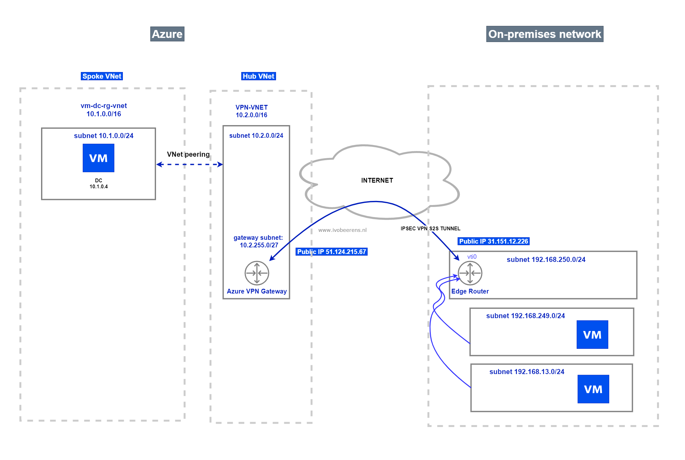
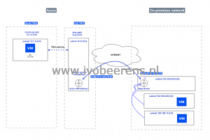
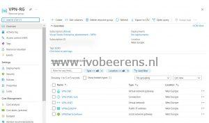
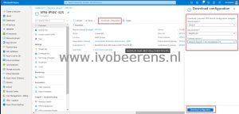

I have a Visual Studio Enterprise subscription in Azure. I use this subscription for testing new Azure stuff. From my on-premises environment, I want to create a Site-To-Site (S2S) VPN connection to Microsoft Azure. I have a physical Ubiquiti Edge Router in my on-premises network. When searching the internet I found a lot of information that was outdated or not completed. After figuring out how to configure all the steps I decided to create a blog post about the configuration steps. All the information is not limited to the Ubiquiti Edge Router but can be used for other vendors.



In this example, I create a Site-to-Site VPN between my on-premises network and Azure. From my on-premises network, I'm able to connect to the spoke network where my Domain Controller resides.

**Requirements**

- Create a network topology drawing. This makes it easier to set up and troubleshoot.

[](images/azure-1.png)

- Check if you have a compatible VPN device. More information: [About VPN devices for connections - Azure VPN Gateway | Microsoft Docs](https://docs.microsoft.com/en-us/azure/vpn-gateway/vpn-gateway-about-vpn-devices)
- Install the Az PowerShell module. All the steps are done in PowerShell.  [Install the Azure Az PowerShell module | Microsoft Docs](https://docs.microsoft.com/en-us/PowerShell/azure/install-az-ps?view=azps-6.6.0)

**The main steps are**

- **Step 1**: Configure the Azure VPN gateway
- **Step 2**: Configure the Ubiquiti Edge Router.
- **Step 3**: Create the network peerings
- **Step 4**: Open the firewall on the VMs

### Step 1: Configuring the Azure VPN Gateway

First, we begin in Azure by configuring the VPN Gateway. Microsoft has a good article that describes the process that can be found [here](https://docs.microsoft.com/en-us/azure/vpn-gateway/vpn-gateway-create-site-to-site-rm-PowerShell). I use PowerShell to configure the VPN gateway configuration.

- Fill in the variables with the correct values of your environment

```powershell
# Variables
$rg_vpn = "VPN-RG"
$vnetname = "VPN-VNET"
$location = "WestEurope"
$addressspacehub = "10.2.0.0/16"
$subnetname = "Frontend"
$subnet = "10.2.0.0/24"
$gatewaysubnet = "10.2.255.0/27"
$public_ip_onprem = "31.151.12.226"
$allowd_onprem_networks1 = "192.168.249.0/24"
$allowd_onprem_networks2 = "192.168.13.0/24"
$gatewayname = "VPN-GW"
$vpntype = "RouteBased"
# https://docs.microsoft.com/en-us/azure/vpn-gateway/vpn-gateway-about-vpn-gateway-settings#gwsku
$sku = "basic"
$gatewayType = "Vpn"
$connectionname = "VPN-VNetToOnPrem"
$vpnpip_azure = "VPN-AZURE-PIP"
$vpnconnection = "VPN-IPSEC-S2S"
$sharedkey = "!ThisisASecret!"
```

- Connect to Azure

```powershell
Connect-AzAccount
```

- Create the Azure VPN gateway

```powershell
# Create Azure Resource Group
Write-Host "Create a Resource Group called $rg_vpn" -ForegroundColor Green
New-AzResourceGroup -Name $rg_vpn -Location $Location
 
# Create networks
$subnet1 = New-AzVirtualNetworkSubnetConfig -Name 'GatewaySubnet' -AddressPrefix $gatewaysubnet
$subnet2 = New-AzVirtualNetworkSubnetConfig -Name $subnetname -AddressPrefix $subnet
 
# Create VNet
$vnet = New-AzVirtualNetwork -Name $vnetname -ResourceGroupName $rg_vpn `
-Location $location -AddressPrefix $addressspacehub -Subnet $subnet1,$subnet2
$vnet | Set-AzVirtualNetwork
 
# Create a local network gateway
New-AzLocalNetworkGateway -Name $connectionname -ResourceGroupName $rg_vpn `
-Location $location -GatewayIpAddress $public_ip_onprem -AddressPrefix $allowd_onprem_networks1,$allowd_onprem_networks2
 
# Request a public IP Address
$gwpip= New-AzPublicIpAddress -Name $vpnpip_azure -ResourceGroupName $rg_vpn -Location $location -AllocationMethod Dynamic
 
# Create Gatway IP addressing
$vnet = Get-AzVirtualNetwork -Name $vnetname -ResourceGroupName $rg_vpn
$subnet = Get-AzVirtualNetworkSubnetConfig -Name 'GatewaySubnet' -VirtualNetwork $vnet
$gwipconfig = New-AzVirtualNetworkGatewayIpConfig -Name gwipconfig1 -SubnetId $subnet.Id -PublicIpAddressId $gwpip.Id
 
# Create a Site to Site VPN gateway
Write-Host "Creating  the VPN gateway. This can take up to 45 minutes!" -ForegroundColor Green
New-AzVirtualNetworkGateway -Name $gatewayname -ResourceGroupName $rg_vpn `
-Location $location -IpConfigurations $gwipconfig -GatewayType $gatewayType `
-VpnType $vpntype -GatewaySku $sku
 
# Configure the VPN Connection configuration
$gateway1 = Get-AzVirtualNetworkGateway -Name $gatewayname -ResourceGroupName $rg_vpn
$local = Get-AzLocalNetworkGateway -Name $connectionname -ResourceGroupName $rg_vpn
 
New-AzVirtualNetworkGatewayConnection -Name $vpnconnection -ResourceGroupName $rg_vpn `
-Location $location -VirtualNetworkGateway1 $gateway1 -LocalNetworkGateway2 $local `
-ConnectionType IPsec -RoutingWeight 10 -SharedKey $sharedkey
```

- When all the parts are created you see the following resources in the resource group.

[](images/VPNRG.jpg)

- Click on the "VPN-IPSEC-S2S" Connection and click on Download configuration. For various vendors such as Cisco, Allied Telesis, Juniper and Ubiquiti there are sample configuration templates available. If the vendor is not listed you can choose a generic sample configuration.

[](images/VPNCOnnection.jpg)

- Select "download configuration" and the configuration will be downloaded as text file.

## Step 2: Configure the Ubiquiti Edge Router

- Create a SSH session to the Edge router and log in
- Set the router in config mode by using the following command

```powershell
configure
```

- Copy the downloaded sample configuration, starting from  the line that begins with "set vpn ipsec auto-firewall-nat-exclude enable" sample configuration

```powershell
set vpn ipsec auto-firewall-nat-exclude enable
 
set vpn ipsec esp-group FOO0 lifetime 3600
set vpn ipsec esp-group FOO0 pfs disable
set vpn ipsec esp-group FOO0 proposal 1 encryption aes256
set vpn ipsec esp-group FOO0 proposal 1 hash sha1
 
set vpn ipsec ike-group FOO0 key-exchange ikev2
set vpn ipsec ike-group FOO0 lifetime 3600
 
set vpn ipsec ike-group FOO0 proposal 1 dh-group 2
set vpn ipsec ike-group FOO0 proposal 1 encryption aes256
set vpn ipsec ike-group FOO0 proposal 1 hash sha1
 
set vpn ipsec site-to-site peer 51.124.215.67 authentication mode pre-shared-secret
set vpn ipsec site-to-site peer 51.124.215.67 authentication pre-shared-secret !ThisisASecret!
set vpn ipsec site-to-site peer 51.124.215.67 connection-type respond
set vpn ipsec site-to-site peer 51.124.215.67 description IPsecAzure
set vpn ipsec site-to-site peer 51.124.215.67 ike-group FOO0
set vpn ipsec site-to-site peer 51.124.215.67 local-address 31.151.12.227
 
set vpn ipsec site-to-site peer 51.124.215.67 vti bind vti0
set vpn ipsec site-to-site peer 51.124.215.67 vti esp-group FOO0
set interfaces vti vti0
set protocols static interface-route 10.2.0.0/16 next-hop-interface vti0
 
set firewall options mss-clamp interface-type vti
set firewall options mss-clamp mss 1350
set system offload ipsec enable 
```

- In this example, we don't use dynamic routing protocols such as BGP, so we must create static routes in the Edge Router for all the subnets we want to connect to. In this example, we connect the 10.1.0.0/24 subnet in Azure from the on-premises network. This subnet contains the Domain Controllers. The routing goes through Virtual Tunnel Interface 0 defined in the Edge Router.

```powershell
set protocols static interface-route 10.1.0.0/24 next-hop-interface vti0
```

- Commit and save the changes

```powershell
commit ; save ; exit
```

- Check if the tunnel is up. This can take a while

```powershell
show vpn ipsec sa
```

[](images/edgeshowvpn.jpg)

- The IPSEC tunnel must be **ESTABLISHED**

## Step 3: Create the network peerings

Connecting the spoke network where the Domain Controller resides is not possible because network peering is not configured yet.

- Open the PowerShell Window that is still authenticated to Azure
- Change the variables if Needed
- Execute the PowerShell script

```powershell
# Variables
$rg_vpn = "VPN-RG"
$rg_dc = "vm-dc-rg"
$peernamevpn = "peer-vpn-to-dc"
$peernamedc = "peer-dc-to-vpn"
$vnetvpnname = "VPN-VNET"
$vnetdcname = "vm-dc-rg-vnet"
 
$vnetvpn = Get-AzVirtualNetwork -Name $vnetvpnname -ResourceGroupName $rg_vpn
$vnetdc = Get-AzVirtualNetwork -Name $vnetdcname -ResourceGroupName $rg_dc
 
# Use this virtual network's gateway or Route Server
 
Add-AzVirtualNetworkPeering `
  -Name $peernamevpn `
  -VirtualNetwork $vnetvpn `
  -RemoteVirtualNetworkId $vnetdc.Id -AllowGatewayTransit:$true
   
Add-AzVirtualNetworkPeering `
  -Name $vnetdcname `
  -VirtualNetwork $vnetdc `
  -RemoteVirtualNetworkId $vnetvpn.Id -UseRemoteGateways:$true
```

- Check the status of the VNet peering

```powershell
Get-AzVirtualNetworkPeering -ResourceGroupName $rg_vpn `
-VirtualNetworkName $vnetvpn.Name | Format-Table VirtualNetworkName, peeringState
 
Get-AzVirtualNetworkPeering -ResourceGroupName $rg_dc `
-VirtualNetworkName $vnetdc.Name | Format-Table VirtualNetworkName, peeringState
```

- For both VNets the peeringState must be **Connected**

[](images/checkpeer.jpg)

## Step 4: Open the firewall on the VMs

The first test I perform is a ping test.

- To ping a VM , ICMP in the Windows firewall needs to be opened. This can be done by using the following PowerShell command.

```powershell
New-NetFirewallRule –DisplayName "Allow ICMPv4-In" –Protocol ICMPv4
```

After this change, you must be able to ping (from the 192.168.249.0/24 and 192.168.13.0/24 subnets) to the 10.1.0.0/24 subnet in Azure where the Domain Controller resides.

## Wrap-up

Configuring a Site-to-site VPN tunnel involves a lot of steps as you can see in this blog post. I hope by reading this post it will give great insight into how to set up a Site-to-Site VPN to Azure.