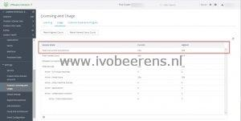
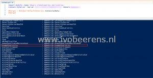
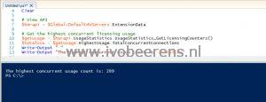

In some managed VMware Horizon environments, I wanted to know the highest concurrent users per month. This information can be found in the Horizon Administrator Console under Settings -> Product Licensing and Usage -> Usage.

[](images/1_HorizonAdmin.jpg)

Using the VMware Horizon Administrator console is a manual task. I wanted to automate this. To automated this use VMware PowerCLI which supports access to the View API.

[](images/2_API.jpg)

To automate retrieve thehighest concurrent users per month perform the following steps:
- Setup the Horizon PowerCLI module, [link](https://docs.VMware.com/en/VMware-Horizon-7/7.13/horizon-integration/GUID-0D876863-BD3E-4947-A305-5A2AB7CBD26A.html)
- The following PowerCLI code display the highest concurrent license usage

```powershell
Import-Module -Name VMware.VimAutomation.HorizonView
Connect-HVServer -Server <server> -Domain <domain name>
 
# Clear screen
Clear
 
# View API
$horapi = $Global:DefaultHVServers.ExtensionData
 
# Get the highest concurrent licensing usage
$getusage = $horapi.UsageStatistics.UsageStatistics_GetLicensingCounters()
$totalccu = $getusage.HighestUsage.TotalConcurrentConnections
Write-Output " "
Write-Output "The highest concurrent usage count is: $totalccu"
```

[](images/3.jpg)

- To reset the highest concurrent license usage use the following code

```powershell
# Reset the highest license usage
$horapi.UsageStatistics.UsageStatistics_ResetHighestUsageCount()
$totalccu = $getusage.HighestUsage.TotalConcurrentConnections
Write-Output "The highest usage count is: $totalccu"
```

By using this code you can create a scheduled task to get the highest concurrent license usage at the end of each month and perform a reset after it for example. So you know what is the highest concurrent license usage is that is connected to the VMware Horizon environment.