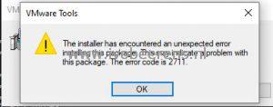
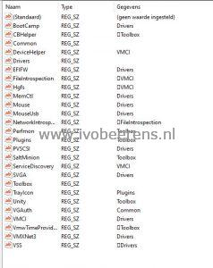

For a new Windows 10 image build, I used the latest supported VMware Tools In this case that was VMware Tools 12.0.0. VMware Tools is deployed using an unattended installation such as:

```
e:\setup64.exe /S /v "/qb REBOOT=R ADDLOCAL=All REMOVE=AppDefense,Hgfs,CBHelper,VmwTimeProvider,VSS,NetworkIntrospection,FileIntrospection" /l c:\windows\temp\vmware_tools_install.log
```

During the installation of VMware Tools, the following error occurred: "The installer has encountered an unexpected error installing this package. This may indicate a problem with this package. The error code is 2711."

[](images/3.jpg)

After comparing the syntax of the components and could not find any clue ([link](https://docs.VMware.com/en/VMware-Tools/12.0.0/com.VMware.vSphere.VMwaretools.doc/GUID-E45C572D-6448-410F-BFA2-F729F2CDA8AC.html)).

| Feature Name | Description |
| --- | --- |
| CBHelper | Helper to install of Carbon black Sensor on a virtual machine. |
| Perfmon | Utility for WMI performance logging. Enables performance monitoring between the Guest SDK and the WMI environment. |
| VmwTimeProvider | Time provider for VMware virtual precision clock device. |
| AppDefense | The VMware AppDefense component performs Application Security Monitoring. VMware Appdefense consists of glxgi.sys, giappdef.sys kernel mode drivers and gisvc.exe user mode service. |
| FileIntrospection | The NSX File Introspection driver, vsepflt.sys is the first of the two guest introspection drivers. You can install it separately, without installing the NSX Network Introspection driver. Note:This component is dependent on the VMCI driver.|
| NetworkIntrospection | The NSX Network Introspection driver, vnetflt.sys is the second of the two guest introspection drivers. Note:This component is dependent on the VMCI driver. VMware Tools 10.2.5 supports vnetWFP driver for Windows 7 and later. |
| ServiceDiscovery | The Service Discovery component enables the discovery of various services running inside a virtual machine. Note:This user-mode component is dependent on the VMCI driver. |
| DeviceHelper | The VMware Device Helper component helps to perform a device check and swap in your virtual machine. Note:This user-mode component is dependent on the VMCI driver. |
| Hgfs | Hgfs is a VMware shared folders driver that allows files to be shared between your virtual machine and the host computer. You can use this driver, if you plan to use this virtual machine with VMware Workstation, Player, or Fusion. Note: - If you exclude this feature, you cannot share a folder between your virtual machine and the host system. This component is dependent on the VMCI driver. |
| SVGA | The VMware SVGA driver enhances the performance of your virtual video card. Note:If you exclude this feature, it limits the display capabilities of your virtual machine. |
| VMXNet | The VMware VMXNet networking driver enhances the performance of your virtual network card. |
| VMXNet3 | The VMware VMXNet3 networking driver enahnces the performance of your virtual network card (ndis5/ndis6). This is the Next-generation VMware VMXnet networking driver for virtual machines that use virtual hardware version 7 and higher. For more information, see the VMware Knowledge Base article [KB 1001805](https://kb.VMware.com/s/article/1001805). VMXNET3 adds several new features, such as multiqueue support (also known as 'Receive Side Scaling' in Windows), IPv6 offloads, and MSI/MSI-X interrupt delivery. VMXNET 3 is not related to VMXNET or VMXNET 2. Receive Side Scaling is enabled by default. VMware Tools 10.3.0 adds receive data ring support for Windows VMXNET3 driver. Virtual hardware version 7 corresponds to ESX/ESXi 4.x compatibility.|
| PVSCSI | The VMware Paravirtual SCSI adapters enhances the performance of your paravirtual SCSI devices. |
| EFIFW | The EFIFW driver is used for EFI Firmware update. |
| MemCtl | The Memory Control Driver provides enahnced memory management of the virtual machine. You can use this driver, if you plan to use a virtual machine in the vSphere environment. Note:If you exclude this feature, it hinders the memory management capabilities of the virtual machine running in a vSphere environment. |
| Mouse | The VMware PS2 Mouse driver enhances the performance of your virtual PS2 mouse. Note:If you exclude this feature, the mouse performance of your virtual machine will decrease. |
| MouesUsb | The VMware USB Mouse Driver enhances performance of your USB mouse. |
| Audio | The Audio driver provides audio for your virtual sound card. Note:This Audio driver is for 64-bit Windows Vista and later operating systems.|
| VSS | The VSS driver is used for creating automatic backups. This driver is used, if the guest operating system is Windows Vista, Windows Server 2003, or other newer operating systems. Linux and older Windows operating systems use the Filesystem Sync driver. |
| BootCamp | The BootCamp driver provides Mac BootCamp support. |

So I decided to install VMware Tools 12 manually and search in the Windows registry for the components:

[](images/4.jpg)

As you can see, the AppDefense component doesn't exist anymore in VMware Tools 12. Removing the AppDefense component from the unattended VMware Tools installation command fixed the problem.

```
e:\setup64.exe /S /v "/qb REBOOT=R ADDLOCAL=All REMOVE=Hgfs,CBHelper,VmwTimeProvider,VSS,NetworkIntrospection,FileIntrospection" /l c:\windows\temp\vmware_tools_install.log
```

I filled in a feedback form on the VMware Tools 12 documentation page to change to remove the AppDefense component.