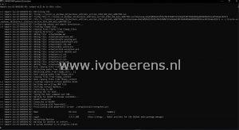

Most of the time I use Packer against a VMware vSphere and Microsoft Azure environment. But sometimes it’s useful to use VMware Workstation for local testing purposes. For building Windows 10 images with Packer and using VMware Workstation there is not much information available. In this blog post, I show how to build a Windows 10 image with Packer and VMware Workstation.

With Packer, the VMware-iso builder is used for creating images with VMware Workstation or VMware Fusion. In this example I create a Windows 10 image with the latest VMware Tools installed, the installation of the Evergreen module, and automatically install the latest Windows updates.

## **Pre-requisites**

- Windows a 10 ISO file. You can use this [link](https://www.ivobeerens.nl/2021/05/19/quick-tip-download-the-latest-windows-10-iso-file/) for downloading the latest Windows 10 ISO for example
- Install VMware Workstation. I use **VMware Workstation Pro 17.x**
- The newly created image must be able to access the internet for downloading the latest VMware Tools version
- During my first deployment, the following build issue occurred Build "**Could not determine network mappings from files in the path: C:/Program Files (x86)/VMware/VMware Workstation**". Colin Westwater of vGemba.net has blogged about a solution that can be found here, [**link**](https://www.vgemba.net/vmware/Packer-Workstation-Error/).

The solution to solve this error is:

>1. In Workstation go to `Edit...Virtual Network Editor`
>2. Click Change `Settings`
>3. Don’t change anything, just click `OK` <br>
>Now if you look in `C:\ProgramData\VMware` there is a new file called `netmap.conf`

- Use NAT in VMware Workstation.
- Install Hashicorp Packer, see [Download the latest Hashicorp Terraform, Packer, and Vault bits](https://www.ivobeerens.nl/2023/09/22/download-the-latest-hashicorp-terraform-packer-and-vault-bits/)
 for installing Packer.

## **Steps**

- Run the following PowerShell script ([link](https://raw.githubusercontent.com/ibeerens/Packer/main/workstation/windows10/download.ps1)). This script does the following things:
  - Create a download folder such as `c:\Packer\win10`
  - Download my Github Packer repository to the local download folder
  - Create within the download folder the Packer folder structure

  The script looks like this:

```powershell
# $ErrorActionPreference = "SilentlyContinue"
# Enable TLS 1.2
[Net.ServicePointManager]::SecurityProtocol = [Net.SecurityProtocolType]::Tls12
 
# Variables
$downloadfolder = 'C:\packer\win10\'
$github = 'https://github.com/ibeerens/Packer/archive/refs/heads/main.zip'
 
# Create Folder
$checkdir = Test-Path -Path $downloadfolder
if ($checkdir -eq $false){
    Write-Verbose "Creating '$downloadfolder' folder"
    New-Item -Path $downloadfolder -ItemType Directory | Out-Null
}
else {
    Write-Verbose "Folder '$downloadfolder' already exists."
}
 
# Go to the Packer download folder
Set-Location $downloadfolder
 
# Download Github files
Invoke-WebRequest -Uri $github -OutFile ${downloadfolder}packer.zip
Expand-Archive ${downloadfolder}packer.zip -DestinationPath $downloadfolder
# Remove the packer.zip
Remove-Item -Path ${downloadfolder}packer.zip 
 
# Create the folder structure
Move-Item ${downloadfolder}packer-main\workstation\windows10\setup -Destination $downloadfolder 
Move-Item ${downloadfolder}Packer-main\workstation\windows10\*.* -Destination $downloadfolder
# Remove the Github structure
Remove-Item -Path ${downloadfolder}Packer-main -Recurse -Confirm:$false -Force
```

- Browse to the download folder location
- Open the "win10-std-.auto-pkvars.hcl" file and edit the variables for your needs such as:
  - Line 2: The VM name
  - Line 17: The ISO location
  - Line 19: The ISO checksum. Use the PowerShell Get-Filehash command to get the checksum of the ISO

```json
// VM
vm_name                 =   "GI-W10-001" 
operating_system_vm     =   "windows9-64"
vm_firmware             =   "bios"
vm_cdrom_type           =   "ide"
vm_cpus                 =   "2"
vm_cores                =   "1"
vm_memory               =   "4096"
vm_disk_controller_type =   "nvme"
vm_disk_size            =   "65536"
vm_network_adapter_type =   "e1000e"
// Use the NAT Network
vm_network              =   "VMnet8"
vm_hardwareversion      =   "19"
 
// Removeable media
win10_iso = "c:/iso/feb2024/en-us_windows_10_business_editions_version_22h2_updated_feb_2024_x64_dvd_732d1707.iso"
// In Powershell use the "get-filehash" command to find the checksum of the ISO
win10_iso_checksum = "E433ADA123A50DBDEE946FEA5B34BD40038891F5C0ADBB1D72CACF5A633AD391"
```

- Open the `autounattend.xml` file in the setup folder and check and edit the following lines as needed:
  - Language and keyboard settings
  - Line 84: Administrator Password (must be the same as the `winrm_password`)
  - Line 92: Autologon Password (must be the same as the `winrm_password`)
  - Line 141: The ComputerName

- Edit the `build.ps1` file and check the following lines:
  - Line 2: Packer folder location
  - Line 14: The `winrm_password` matches the administrator password in the `autounattended.xml` file

```powershell
# Variables
$downloadfolder = 'C:\packer\win10\'
$packer_config = "windows.json.pkr.hcl" #Packer config file
$packer_variable = "windows.auto.pkrvars.hcl" # Packer variable file

# Show Packer Version
packer.exe -v

# Download Packer plugins
packer.exe init "$downloadfolder$packer_config"

# Packer Format configuration files (.pkr.hcl) and variable files (.pkrvars.hcl) are updated.
packer.exe fmt -var-file="$downloadfolder$packer_variable" "$downloadfolder$packer_config"

# Packer validate
# packer.exe validate .

# Packer build
# .\packer.exe build -force -var-file="${$win11_downloadfolder}${packer_variable}" "${$win11_downloadfolder}${packer_config}"
packer.exe build -force -var-file="$downloadfolder$packer_variable" -var "winrm_username=administrator" -var "winrm_password=ThisisagoodPassword!" "$downloadfolder$packer_config"
```

- Run the "build.ps1" file with PowerShell to start the Packer image build process.

[](images/PackerRun.jpg)

- After a while, the build process finishes and you have a new Windows 10 image deployed with Packer in VMware Workstation.

[](images/Windows.jpg)