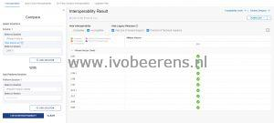
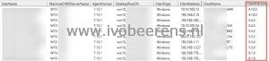

Before upgrading a VMware Horizon environment I want to known what VMware Horizon Client versions are in use. Just to be sure that the VMware Horizon clients are supported when upgrading to a new VMware Horizon version.

[](images/1.jpg)

Another use-case is to identify the VMware Horizon Client versions that are in use for security releated issues.  In the VMware Horizon Administrator you can allow what VMware Horizon client versions are able to connect.

The following script displays all the VMware Horizon sessions and the VMware Horizon client version that is used to connect to the VMware Horizon environment.

Make sure that the VMware.HV.Helper module is installed ([Link](https://github.com/VMware/PowerCLI-Example-Scripts)).

```powershell
<#
.SYNOPSIS
    HorizonClient.ps1.ps1
.VERSION
    1.0
.DESCRIPTION
    List all the Connection and displays the VMware Horizon client version. 
.NOTES
    Author(s): Ivo Beerens
    Requirements:  
        Make sure the VMware.HV.Helper module is installed, see: https://github.com/vmware/PowerCLI-Example-Scripts
        Copy the VMware.Hv.Helper to the module location.
.EXAMPLE
    PS&gt; ./HorizonClient.ps1
#>
 
# Variables
$connectionserver = 'srv-con-01'
$domain = 'lab.local'
$date = Get-date -UFormat "%d-%m-%Y"
$output = "C:\Temp\horclients-$date.csv"
 
# Import module
Import-Module VMware.Hv.Helper
 
Write-Output "", "Connecting to the Horizon Connection Server"
Connect-HVServer -Server $connectionserver -domain $domain
 
# List all Users and clients with the Horion client the are running
$localsessioninfo = (get-HVlocalsession).Namesdata | Select-Object UserName, MachineOrRDSServerName, AgentVersion, DesktopPoolCN, ClientType, ClientAddress, ClientName, ClientVersion, SecurityGatewayDNS, SecurityGatewayAddress | Sort-Object ClientVersion
 
# Export the output to a grid and CSV file
$localsessioninfo | Out-GridView -Title 'VMware Horizon Client versions'
$localsessioninfo | export-csv $output -Force -NoTypeInformation
 
Disconnect-HVServer * -Confirm:$false
```
[](images/Client-versions.jpg)

This script (HorizonClients.ps1) can be found on my GitHub repo ([Link](https://github.com/ibeerens/VMware-Horizon))