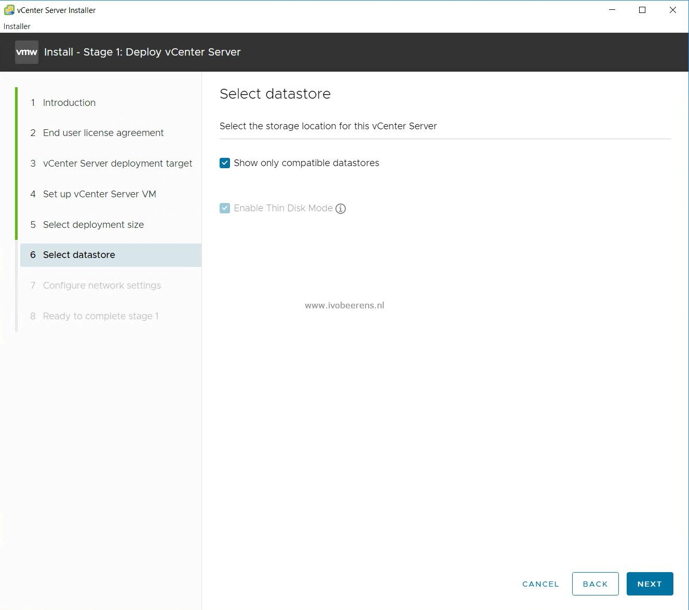

While upgrading a vCenter Server 6.7 to version 7 Update 3 using the vCenter Server 7 UI installer, I was not able to select a datastore for installing the new vCenter Server Appliance (VCSA).

The datastore selection was blank as shown in the following image.

  

This issue still exists in the vCenter Server 7 UI installer.

Here are the steps to solve this:
- Go to the %appdata% folder (it opens the C:\Users\<username>\AppData\\Roaming folder)
- Delete the installer folder.
- Run the VCSA installer again and you see the datastores again