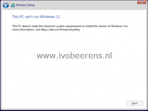
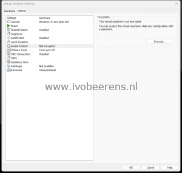
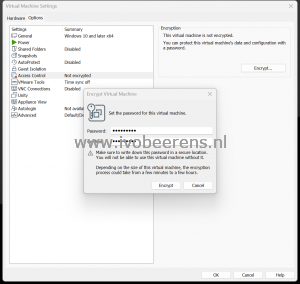
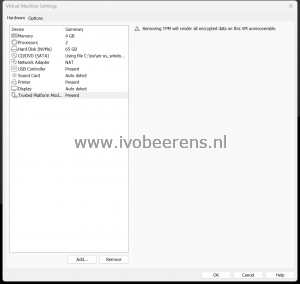

For testing purposes, I frequently use VMware Workstation to install Operating Systems such as Windows 11. The biggest challenge with Windows 11 is that you need a TPM 2.0 device. When installing Windows 11, if your computer does not meet the hardware requirements, you will see a message stating, “**This PC can’t run Windows 11**“.

Windows 11 requires the following minimal hardware specifications:
- CPU: 1 GHz or faster with 2 or more cores on the processor
- RAM: 4 GB RAM
- Storage: 64 GB or larger
- Firmware: UEFI, Secure boot
- TPM: Trusted Platform Module (TPM) 2.0

More info: [link](https://www.microsoft.com/en-in/windows/windows-11-specifications?r=1)

The following options are available when installing Windows 11 using VMware Workstation Pro/Player and Fusion:

**Option 1:** The physical endpoint such as a laptop or PC has a TPM 2.0 device. This requires adding encryption and adding a vTPM device.

**Option 2:** The physical endpoint such as a laptop or PC has compatible hardware but no TPM 2.0 device. VMware Workstation 16.2 Pro adds an experimental vTPM device that uses a new encryption mode with increased performance over fully encrypting the VM in option 1.

**Update October 17, 2022:** Wil van Antwerpen has a good blog post about the risks of this experimental feature.  Make sure that you read the blog before using this feature!

[What you should know about VMware's experimental vTPM - Vimalin](https://www.vimalin.com/blog/what-you-should-know-about-VMwares-experimental-vtpm/)

**Option 3:** The physical endpoint such as a laptop or PC has no compatible hardware such as a TPM 2.0 device. Use a registry hack to bypass the TPM check.

If you don't have a Windows 10/11 ISO, you can create one following this blog post: [Quick Tip: Download the latest Windows 10/11 ISO files - ivobeerens.nl](https://www.ivobeerens.nl/2021/05/19/quick-tip-download-the-latest-windows-10-iso-file/)

Here are the steps outlined for each option:

**Option 1. The physical endpoint such as a laptop or PC has a TPM 2.0 chip**

Start VMware Workstation and create a new Virtual Machine with the following configuration:

- Type of configuration: Custom (advanced)
- Virtual Machine hardware compatibility: **Workstation 16.2.x**
- Guest Operating System Installation: Installer disc image file (iso): Point to the downloaded Windows 11 ISO
- Guest operating system: Microsoft Windows
    - Version: **Windows 10 and later x64**
- Virtual Machine name: Name of the VM such as: Windows 11
    - Location: for example: c:\\vms\\win11
- Firmware: UEFI
    - Secure boot: Check
- Processors: 2 or more
    - Number of cores: 1 or more
- Memory (MB): 4096 or more
- Network Type: Use network address translation (NAT)
- SCSI Controller: LSI Logic SAS or Paravirtualized SCSI
- Virtual Disk Type: NVMe
- Disk: Create a new virtual disk
    - Maximum disk size (GB): 64 or more
- Disk file: Windows 10 and later x64.vmdk
- **The new VM will be created**.
- Edit the virtual machine settings
- Click on the options tab, choose Access Control, and select Encrypt

- Enter a virtual machine password twice

- The VM will be encrypted
- Select the Hardware tab and select Add
- Select the Trusted Platform Module and click Finish and OK

- Start the VM to install Windows 11

The VM is encrypted and has a TPM device configured.

**Option 2:** The physical endpoint such as a laptop or PC has compatible hardware but no TPM 2.0 device.

Since VMware Workstation 16.2 there is an experimental feature without the need fully encrypt the VM. Use it with care and read the blog from Wil van Antwerpen before using this feature!

- Follow the steps in step 1 till  " **The new VM will be created"**
- Before starting the VM close VMware Workstation
- Edit the VMX file of the created VM in notepad for example
    - Add the following line to the end of the file:
    - _managedVM.autoAddVTPM = "software"_
    - This line adds a TPM 2.0 device to the VM
    - Save the VMX file

- Open VMware Workstation
- Start the VM to install Windows 11

**Option 3:** The physical endpoint such as a laptop or PC has no compatible hardware such as a TPM 2.0 device. Use a registry hack to bypass the TPM check.

In 2021 I already blogged about this hack. More information can be found here: [Install Windows 11 as VM on VMware vSphere / Workstation without TPM 2.0 - ivobeerens.nl](https://www.ivobeerens.nl/2021/10/06/install-windows-11-as-vm-in-VMware-vSphere-workstation-without-tpm-2-0/)

With these 3 options, you are able to install Windows 11 on VMware Workstation Pro/Player and Fusion in most situations.