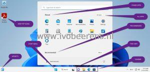
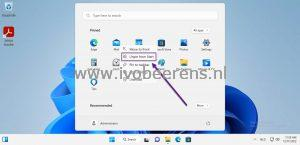
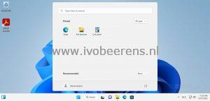
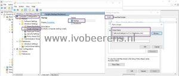

Start Menu management in Windows 11 is different than Windows 10. Microsoft recommended an MDM provider such as Microsoft Intune to manage the Windows 11 Start Menu.

[](images/2startmenu.jpg)

There are many environments (such as VDI and Azure Virtual Desktop(AVD) that don't use an MDM provider to manage their Windows 11 workspace environment. In this blog post, I will highlight how to manage the Start Menu with native tools such as Active Directory and Group Policies.

I will create several blog posts about how to customize the Windows 11 Start Menu, configure the taskbar, remove unwanted desktop icons and remove bloatware and apps.

- **Customize the Windows 11 Start Menu (this blog post)**
- **Customize the Windows 11 Desktop icons**
- **Customize the Taskbar icons**
- **Remove bloatware from the Start Menu**

In this blog post, I will highlight how to customize the Windows 11 Start Menu with native Active Directory Group Policies.

In Windows 10 you can export and import the Start Menu layout. With the **"Export-StartLayout"** PowerShell command, the Start Menu is exported to an XML file. With a Group Policy, you refer to the custom XML file.

In Windows 11, the Start Menu is exported to a JSON file. The command is like this:

```powershell
Export-StartLayout -Path "C:\Layouts\LayoutModification.JSON"
```

There is no Group Policy (Windows 11 22H2) to import a Start Menu JSON file. The Group Policy only works with an XML file.
Here is a workaround. In Windows 11 the Start Menu is stored in a single encrypted file in the following folder location:

```powershell
%LocalAppdata%\Packages\Microsoft.Windows.StartMenuExperienceHost_cw5n1h2txyewy\LocalState
```

In this folder, there is a **start.bin** or **start2.bin** (depending on the Windows 11 version) file. This file is the Windows 11 Start Menu that can be copied.

These steps will copy the modified Start Menu to a central location and when the endpoint starts the modified Start Menu will be copied to the default user profile. When new users logs in, they will get the customized Start Menu.

- Pin/unpin and organize the apps in the Start Menu the way you want.

[](images/3_unpin.jpg) [](https://www.ivobeerens.nl/wp-content/uploads/2022/12/4_startmenu.jpg)

- Copy the start2.bin file in from the **%LocalAppdata%\Packages\Microsoft.Windows.StartMenuExperienceHost_cw5n1h2txyewy\LocalState** folder to a central location (for example in a folder in the netlogon share of the domain controller (for example \\lab.local\netlogon\w11).
- Create a cmd file called w11startmenu.cmd with the following context:
```
copy "\\lab.local\netlogon\w11\start2.bin" "C:\Users\Default\AppData\Local\Packages\Microsoft.Windows.StartMenuExperienceHost_cw5n1h2txyewy\LocalState" /Y
```
- Open Group Policy Management console
- Create a GPO undder **Computer Configuration – Scripts (Startup/Shutdown) – Startup – Scripts** and browse to the cmd script file in the netlogon share (for example \\lab.local\netlogon\w11\w11startmenu.cmd)

[](images/5_GPO.jpg)

All users who log in with a new profile will get the customized Windows 11 Start Menu.

More information can be found in the following article, [link](https://learn.microsoft.com/en-us/windows/configuration/customize-start-menu-layout-windows-11).