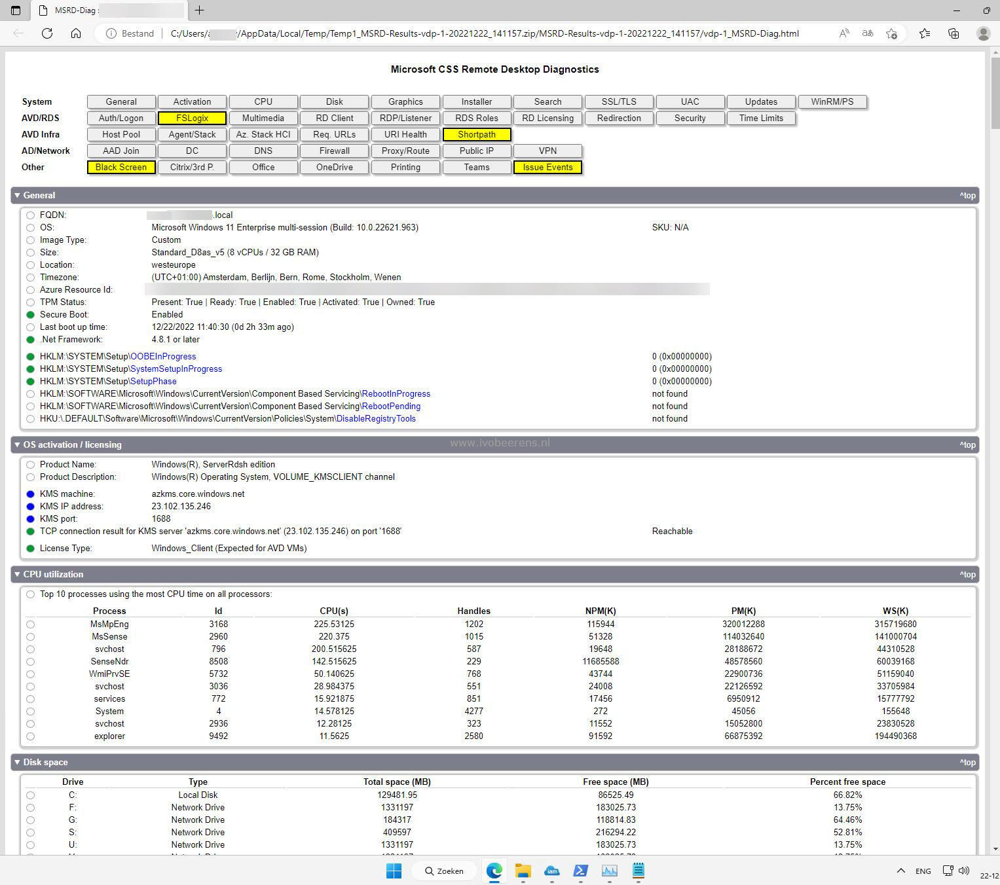
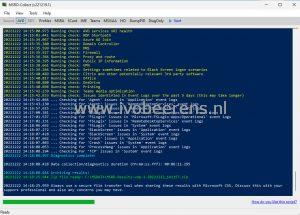
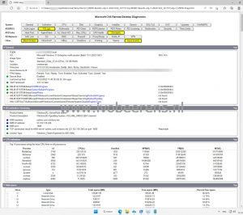
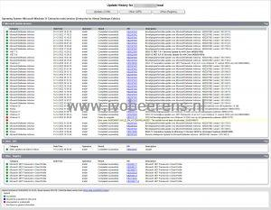

I recently stumbled on a cool tool called "MSRD-Collect". MSRD stands for Microsoft CSS Remote Desktop Data Collection and Diagnostic Script. MSRD-Collect is a PowerShell script with separate modules designed to collect information that will help Microsoft Customer Support Services (CSS) to troubleshoot issues in Azure Virtual Desktop or Remote Desktop Services environments.



MSRD-Collect is not only a handy tool for Microsoft CSS but can be used by AVD or RDS administrators having issues or who want to check the health of their session hosts. MSRD-Collect can be executed from the AVD session or Remote Desktop hosts. The tool is created and maintained by Robert Klemencz and Alexandru Olariu from Microsoft.

## What checks are performed?

The script performs the following diagnostics, from AVD, and RDS (RDP) environments:
- Overview of the system the script is running on (General information)
- OS activation / licensing
- Top 10 processes using the most CPU time on all processors
- Total and available disk space
- Graphics configuration
- Windows Installer information
- Windows Search information
- SSL/TLS configuration
- User Account Control (UAC) configuration
- Windows Update configuration
- WinRM and PowerShell configuration/requirements
- Authentication and Logon information
- FSLogix configuration and presence of the recommended Windows Defender Antivirus exclusion values for FSLogix (if present)
- Multimedia configuration (Multimedia Redirection and Audio/Video privacy settings)
- Remote Desktop client information
- Remote Desktop licensing configuration
- RDP and remote desktop listener configuration
- Information on installed RDS roles and their services (if present)
- Remote Desktop device and resource redirection configuration
- Antivirus information (if present)
- Remote Desktop related security settings and requirements
- Remote Desktop 'Session Time Limits' and other network time limit policy settings
- AVD host pool information
- AVD Agent and SxS Stack information
- Information related to AVD usage on Azure Stack HCI
- AVD required URLs accessibility
- AVD services API health status (BrokerURI, BrokerURIGlobal, DiagnosticsUri, BrokerResourceIdURIGlobal)
- RDP ShortPath configuration (Windows 10+ and Server OS) for both managed and public networks
- Azure AD-join configuration
- Check for Domain Controller configuration (trusted and available)
- DNS configuration (Windows 10+ and Server OS)
- Firewall configuration (Firewall software available inside the VM - does not apply to external firewalls)
- Proxy and route configuration
- Public IP address information
- VPN connection profile information
- Various settings that are sometimes related to Black Screen logon scenarios
- Installed Citrix software and some other 3rd party components potentially running on the system, which may be relevant in various troubleshooting scenarios
- Microsoft Office Configuration
- OneDrive configuration and requirements for FSLogix compatibility
- Printing information (spooler service status, available printers)
- Teams information and AVD media optimization configuration for Teams (if present)
- Known AVD agent-related issues over the past 5 days
- Known FSLogix-related issues over the past 5 days
- Known MSIX App Attach related issues over the past 5 days
- Known RDP ShortPath issues over the past 5 days
- Known Black Screen issues over the past 5 days
- Known TCP issues over the past 5 days
- Known Process and system crashes over the past 5 days
- Known Process hangs over the past 5 days

The data collected is not uploaded to Microsoft!

## **How to run the MSRD-Collect tool?**

- Download MSRD-Collect, [link](https://t.co/gVAK4kv0NH). or use the following URL:
```https://aka.ms/avd-collect```
- Extract the zip file
- Set the PowerShell execution mode:
```Set-ExecutionPolicy -ExecutionPolicy RemoteSigned -Force -Scope Process```
- Unblock the files
```Get-ChildItem -Recurse -Path C:\MSRD\_Path\Modules\*.ps\* | Unblock-File -Confirm:$false```
- MSRD-Collect can be run from the command line or with GUI. To run MSRD-Collect with a GUI, execute:
    - **MSRD-Collect.ps1** in a PowerShell session with elevated permissions in order to collect all required data
- Select AVD or RDS as a source and click on Start to begin gathering data

[](images/1-1.jpg)

- The data will default be stored in the c:\\MSDATA folder. This can be changed in the GUI or when running from the command line
- When the script finishes. a nice HTML page (<servername\_MSRD-Diag.HTML) is generated:

[](images/2.jpg)

The output contains all settings and links to other log files. Sections marked in Yellow need attention. For example, to view the latest Windows Updates installed, click on the Updates Section and then UpdateHistory.html:

[](images/WindowsUpdate.jpg)

## Conclusion

MSRD-Collect is definitely a tool that every AVD or RDS administrator must have in their toolbox. MSRD-Collect gives great detailed information about the state of the AVD/RDS environment and makes troubleshooting a lot easier. With the command line option, you can schedule the script to run at regular times.

Make sure you run this tool before calling Microsoft CSS when having issues with your AVD or RDS environment.