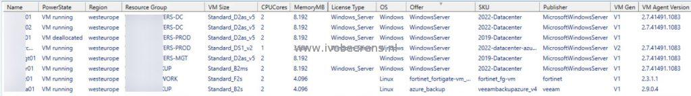

To generate quickly an overview of all the Virtual Machines (VMs) in an Azure subscription I made a PowerShell script that uses the Azure Az PowerShell module. This script will do an inventory of all VMs in a subscription.

The following VM information is displayed per subscription:

- `Name`
- `PowerState`
- `Region`
- `Resource Group`
- `VM Size`
- `CPU Cores`
- `Memory (MB)`
- `License Type`
- `Operating System`
- `Offer`
- `SKU`
- `Publisher`
- `VM Generation`
- `VM Agent version`
- `OS Name`
- `OS Version`
- `NIC Name`
- `VNet`
- `Private IP address`
- `Public IP address`
- `OS disk name`
- `OS disk size (GB)`
- `OS storage type`
- `OS disk caching`
- `Data disks count`
- `Data disks names`
- `Admin username`
- `If boot diagnostics is enabled`
- `Boot diagnostics storage account`
- `Tags`
- `The time the VM was created`

The output will be displayed in the PowerShell console, to a PowerShell GridView output, and saved to a delimited CSV file. The "**azurevm-inventory.ps1**" script can be found on my GitHub repo, [link](https://github.com/ibeerens/Azure).