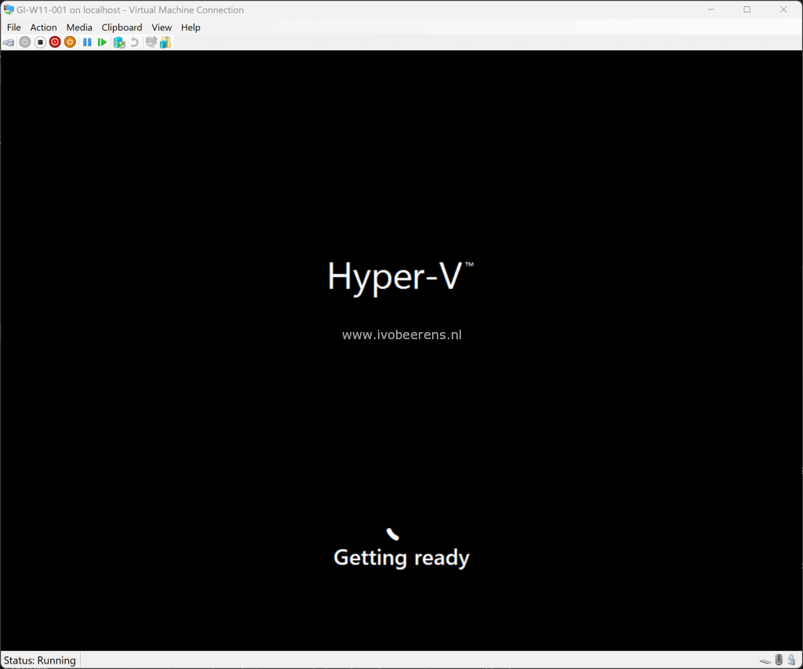
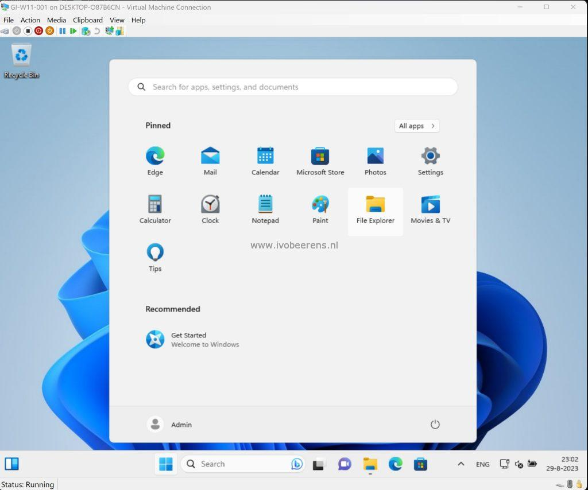

Some people ask if it is possible to create a Windows 11 VM in Hyper-V with Packer. The answer is YES. The Packer plugin that makes this possible is called “Hyperv”. Version 1.1.1 supports TPM. Enabling TPM in the Hyper-V VM makes it possible to install Windows 11 without any registry hacks.

So I decided to test Packer with Hyper-V and Windows 11 and create a blog post about it.

## So what are the prerequisites?
- Make sure the Hyper-V role is enabled in Windows 10/11
- Download the Windows 11 ISO and save the ISO to the following location: c:\\iso An example of downloading and creating a Windows 10/11 ISO can be found here: https://www.ivobeerens.nl/2021/05/19/quick-tip-download-the-latest-windows-10-iso-file/
- Install the Windows Assessment and Deployment Kit (32-bit version). https://learn.microsoft.com/en-us/windows-hardware/get-started/adk-install#download-the-adk-for-windows-11-version-22h2
- Add the following location the the system path variable: C:\\Program Files (x86)\\Windows Kits\\10\\Assessment and Deployment Kit\\Deployment Tools\\x86\\Oscdimg

When the prerequisites are met you can go further with the rest. To make it easy I created a PowerShell script called **\_1.build.ps1** ([link](https://github.com/ibeerens/packer/blob/main/hyper-v/windows11/_1.build.ps1)) that does all the work for you.

```powershell
# Enable TLS 1.2
[Net.ServicePointManager]::SecurityProtocol = [Net.SecurityProtocolType]::Tls12
# Speed up the invoke-webrequest command
$ProgressPreference = 'SilentlyContinue'
 
# Variables
$downloadfolder = "C:\temp\" # Packer location installed
$win11_downloadfolder = "C:\Temp\packer-main\hyper-v\windows11\"
$packer_config = "windows.json.pkr.hcl" #Packer config file
$packer_variable = "windows.auto.pkrvars.hcl" # Packer variable file
$github = "https://github.com/ibeerens/packer/archive/refs/heads/main.zip"
$product = "packer"
$packer_uri = "https://developer.hashicorp.com/packer/downloads"
 
# Check if the temp folder exist
If(!(test-path -PathType container $downloadfolder))
    {
      New-Item -ItemType Directory -Path $downloadfolder
}
 
# Go to the Packer download folder
Set-Location $downloadfolder
 
# Download Github files
Invoke-WebRequest -Uri $github -OutFile ${downloadfolder}packer.zip
Expand-Archive ${downloadfolder}packer.zip -DestinationPath $downloadfolder -Force
 
# Remove zip file
Remove-Item -Path ${downloadfolder}packer.zip 
 
# Download the latest version of Packer
$packurl = Invoke-WebRequest -Uri $packer_uri| Select-Object -Expand links | Where-Object href -match "//releases\.hashicorp\.com/$product/\d.*/$product_.*_windows_amd64\.zip$" | Select-Object -Expand href
$packdown = $packurl | Split-Path -Leaf
$packdownload = $downloadfolder + $packdown
Invoke-WebRequest $packurl -outfile $packdownload
 
# Unzip Packer 
Expand-Archive $packdownload -DestinationPath $win11_downloadfolder -Force
# Remove the Packer ZIP file
Remove-Item $packdownload
 
# Go to the Packer download folder
Set-Location $win11_downloadfolder
```

- Line **7-13**: This is the variable block. Change if needed
- Line **13-19**: Here are the variables located. Change if needed
- Line **21-25**: The script creates a c:\\temp folder if it does not exist
- Line **30-32**: Downloads the GitHub files for creating a Windows 11 VM
- Line **37-41:** Downloads the latest version of Packer

After running the **\_1.build.ps1** script it is time to change the variables:
- Get the hash of the ISO file with the PowerShell Get-Filehash command and change the variable in the **windows-auto-pkvars.hcl** file
- Change the other variables in the windows-auto-pkvars.hcl such as **win\_iso** for the exact iso name
- Run the following **\_2.run\_packer.ps1** script

```powershell
# Show Packer Version
.\packer.exe -v
 
# Download Packer plugins
.\packer.exe init "${$win11_downloadfolder}${packer_config}"
 
# Packer Format configuration files (.pkr.hcl) and variable files (.pkrvars.hcl) are updated.
.\packer.exe fmt -var-file="${$win11_downloadfolder}{$packer_variable}" "${$win11_downloadfolder}${packer_config}"
 
# Packer validate
.\packer.exe validate .
 
# Packer build
.\packer.exe build -force -var-file="${$win11_downloadfolder}${packer_variable}" "${$win11_downloadfolder}${packer_config}"
```

- Line **2**: Show the Packer version
- Line **5**: Download Packer plugins such as the hyper-v and Windows update plugin
- Line **8**: Formats the config and variable HCL file syntax
- Line **11**: Performs a validation to make sure the variable and config file are ok
- Line **15**: Starts Packer to create a Windows 11 VM



The creation of a Windows 11 VM starts. When the image is created it is stored and needs to be imported in the Hyper-V manager.

- Start the Hyper-V Manager
- Select Import Virtual Machine
- Browse to the created image folder C:\\Temp\\packer-main\\hyper-v\\windows11\\output-windows11\\
- Select the VM
- Register the VM in-place
- Start the VM



On my laptop, I have in 35 minutes a fresh copy of Windows 11 running with the latest updates installed running in Hyper-V. How cool is that! The scripts can be found on my GitHub page ([link](https://github.com/ibeerens/packer/tree/main/hyper-v/windows11)). 

Have fun creating Windows 11 VMs.