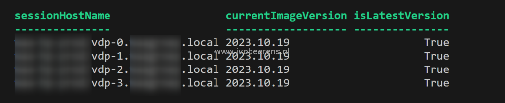

When you want to identify which AVD session host is deployed from what image version there is a PowerShell module called [AzAvd](https://github.com/srozemuller/AzAvd) created by Sander Rozemuller that can help. The AzAVD module contains the `Get-AvdImageVersionStatus `command that helps to identify which AVD Session Host is deployed from what image version using the Azure Compute Gallery (ACG).

## **Pre-requisites**

- [PowerShell 7](https://learn.microsoft.com/en-us/PowerShell/scripting/install/installing-PowerShell-on-windows?view=PowerShell-7.3#installing-the-msi-package) is installed and used

## **Script**

Below is an example PowerShell script to get the image version of one or more session host(s) in the host pool:

```powershell
# Install and import the module 
Install-Module Az.Avd 
Import-Module Az.Avd

# Variables # Change the variables as needed 
$TenantId = "tentant\_id" 
$SubscriptionId = "subscription\_id" 
$hostpool = "hostpool\_name" 
$resourcepool = "resource\_group\_name"

# Connect 
Connect-Avd -DeviceCode -TenantID $TenantId -SubscriptionId $SubscriptionId

# Another way to connect is using a Service Principal # $TenantId = "000000-00000" # Connect-Avd -ClientID xxxx -ClientSecret "xxxxx" -TenantID $Tenantid -SubscriptionId $SubscriptionId

# List the Image version used 
Get-AvdImageVersionStatus -HostPoolName $hostpool -ResourceGroupName $resourcepool | Select sessionHostName,currentImageVersion, isLatestVersion 
```



After running the script you get an output of all the AVD Session Hosts in the pool, the version of the image that is used, and if it is the latest image available in the Azure Compute Gallery.