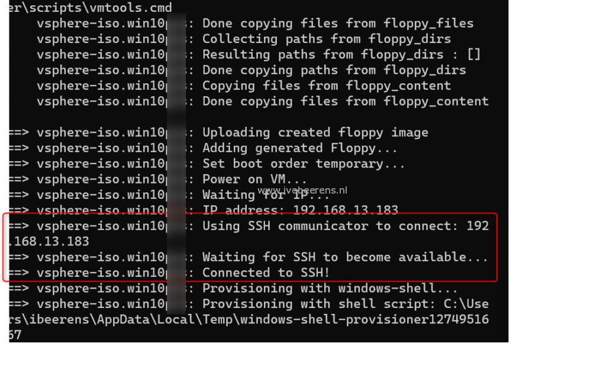

Packer communicators are used to upload files and execute scripts when creating images. The two most common communicators are:
   - ssh – An SSH connection will be established to the machine. This communicator is used by Linux
   - winrm – A WinRM connection will be established. This communicator is used by Windows.

OpenSSH is available as an Optional Feature in Windows 10 (version 1809 and higher), Windows 11, Windows Server 2019, and Windows Server 2022. OpenSSH uses the SSH protocol (port TCP 22) which encrypts all traffic between client and server.

To configure the SSH communicator for creating Windows images, follow the steps below.

**Prerequisites**

The following prerequisites are needed:
   - A device running at least Windows Server 2019 or Windows 10 (build 1809).
   - PowerShell 5.1 or later.
   - An account that is a member of the built-in Administrators group.

**Step 1: Enable SSH in the Windows image**

Create a PowerShell to install the OpenSSH client and server in the Windows image. OpenSSH enables the SSH protocol. This script is executed during the provisioning of the Windows image in the autounattend.xml file.

script name: **enable-ssh.ps1**

```PowerShell  
# Install the OpenSSH Client
Add-WindowsCapability -Online -Name OpenSSH.Client~~~~0.0.1.0
 
# Install the OpenSSH Server
Add-WindowsCapability -Online -Name OpenSSH.Server~~~~0.0.1.0
 
# Start the sshd service
Start-Service sshd
 
# Start the SSH service automatic at startup
Set-Service -Name sshd -StartupType 'Automatic'
 
# Confirm the Firewall rule is configured. It should be created automatically by setup. Run the following to verify
if (!(Get-NetFirewallRule -Name "OpenSSH-Server-In-TCP" -ErrorAction SilentlyContinue | Select-Object Name, Enabled)) {
  Write-Output "Firewall Rule 'OpenSSH-Server-In-TCP' does not exist, creating it..."
  New-NetFirewallRule -Name 'OpenSSH-Server-In-TCP' -DisplayName 'OpenSSH Server (sshd)' -Enabled True -Direction Inbound -Protocol TCP -Action Allow -LocalPort 22
} else {
  Write-Output "Firewall rule 'OpenSSH-Server-In-TCP' has been created and exists."
}
```

This script is saved in the scripts folder in the Packer folder and mounted as a floppy drive.

**Step 2: Add the script in the autounattend.xml**

Add the script created in step 1 in the FirstLogonCommands section (**lines 19-23**) of the autounattend.xml.

```xml  
<FirstLogonCommands>
   <SynchronousCommand wcm:action="add">
      <CommandLine>%SystemRoot%\system32\WindowsPowerShell\v1.0\PowerShell.exe -Command "Set-ExecutionPolicy -ExecutionPolicy RemoteSigned -Force"</CommandLine>
      <Description>Set Execution Policy 64-Bit</Description>
      <Order>1</Order>
      <RequiresUserInput>true</RequiresUserInput>
   </SynchronousCommand>
   <SynchronousCommand wcm:action="add">
      <CommandLine>%SystemRoot%\system32\WindowsPowerShell\v1.0\PowerShell.exe -Command "Set-ExecutionPolicy -ExecutionPolicy RemoteSigned -Force"</CommandLine>
      <Description>Set Execution Policy 32-Bit</Description>
      <Order>2</Order>
      <RequiresUserInput>true</RequiresUserInput>
   </SynchronousCommand>
   <SynchronousCommand wcm:action="add">
      <CommandLine>a:\vmtools.cmd</CommandLine>
      <Order>3</Order>
      <Description>Install VMware Tools</Description>
   </SynchronousCommand>
   <SynchronousCommand wcm:action="add">
      <CommandLine>%SystemRoot%\system32\WindowsPowerShell\v1.0\PowerShell.exe -File a:\enable-ssh.ps1</CommandLine>
      <Order>4</Order>
      <Description>Enable SSH</Description>
   </SynchronousCommand>
</FirstLogonCommands>
```

**Step 3: Add the SSH communicator to the Packer config**

In the Packer HCL config file add the SSH communicator. Here is an example:

```shell
source "vSphere-iso" "win10test" {
floppy_files = ["${path.root}/scripts/"]
 
 // SSH
communicator = "ssh"
ssh_username = local.SSHUser #add your own SSH username
ssh_password = local.SSHPass #add your own SSH password
ssh_timeout = "2h"
ssh_clear_authorized_keys = "true"
}
```
During the deployment of the image, you see when the communicator connects using SSH to the image.



If you use Packer for creating Windows and Linux images, only 1 firewall port (TCP 22) needs to be opened when using the SSH communicator.