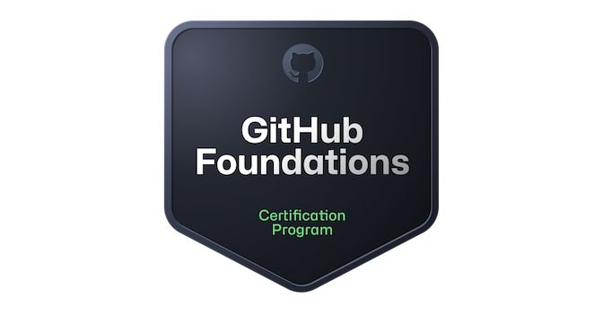

In january 2024 GitHub launched his certification program. There are 4 certifications available:

- **GitHub Foundations**. Designed to introduce learners new to the GitHub platform fundamental concepts and products of GitHub.
- **GitHub Actions**. Designed to learn how to build CI/CD pipelines, manage GitHub Actions for enterprises.
- **GitHub Advanced Security (GHAS)**. Designed to teach you how to secure your code with advanced security features at every stage of your development lifecycle. GHAS is specific to GitHub Enterprise!
- **GitHub Administration**. Designed to teach you everything you need to maintain a healthy, robust, and secure GitHub environment that supports the needs of your organization. 

The first exam I prepared for is the **GitHub Foundations** exam.

I passed the exam on march 23, 2024.

Here is a collection o# f resources I used to prepare for the GitHub Foundations exam.

|**Name** | **Description** | **Link** | 
| --- | :---: | --- | 
| GitHub Certifications overview | Overview of the Github Exams   and registration page |  [link](https://resources.github.com/learn/certifications/)
| Exam registration | GitHub exam registration | [link](https://examregistration.github.com/) |
| Study guide | GitHub Foundations study guide | [link](https://assets.ctfassets.net/wfutmusr1t3h/1kmMx7AwI4qH8yIZgOmQlP/79e6ff1dfdee589d84a24dd763b1eef7/github-foundations-exam-study-guide__1_.pdf) |
| GitHub Foundations Learning Path | GitHub learning modules |  [link](https://aka.ms/learn/github-foundations) | 
| GitHub Skills | Learn to use GitHub with interactive   courses | [link](https://skills.github.com/)
| GitHub Certification Fundamentals events | 4 sessions available on Microsoft Reactor  | [link](https://www.youtube.com/@MicrosoftReactor/search?query=github) |
| GitHub Certified tests | Free GitHub practice tests | [link](https://ghcertified.com/) |
| Exam Pro GitHub Foundations training | Exam Pro GitHub Foundations training   Created by Andrew Brown | [link](https://www.exampro.co/github-foundations) 
| GitHub Foundations Certification Course   Pass the exam in 10 hours! | GitHub Foundations Certification Course   Pass the exam in 10 hours!   Created by Andrew Brown | [link](https://youtu.be/Jdc0i7RcBv8?si=qLh345Hjupre41qk)
| Udemy GitHub Foundations Certification   Practice Exam 2024 | 4 GitHub Foundations Practice Exams   Created by Bryan Krausen | [link](https://www.udemy.com/course/github-foundations/) |
---

If you have other resources for preparing let me know!