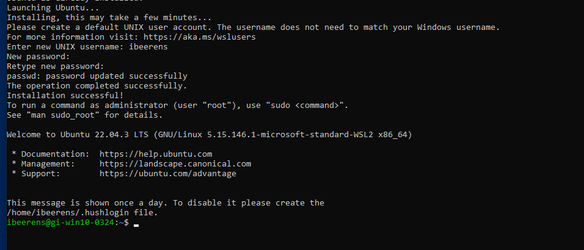

As a development environment, I frequently use a Windows Virtual Machine (VM). This VM can be hosted on different platforms such as VMware (ESXi/Workstation or Fusion), Hyper-V, or Azure for example. I created a couple of PowerShell scripts to install the tools and extensions I need for creating and updating my Terraform, Packer, Bicep, and PowerShell scripts.


To install a local development environment I have defined 3 steps:</br>
**1. Install the Windows Subsystem for Linux (WSL).** WSL enables to to run Linux distribution(s) on Windows. Default Ubuntu is enabled with the WSL.</br>
**2. Install the software packages.**</br>
**3. Install the Visual Studio Code Extensions.**</br>

Each step is explained below:

## 1. Install the Windows Subsystem for Linux (WSL)

For WSL you need to enable **Hardware Virtualization - [V] Expose hardware assisted virtualization to the guest OS** option in the CPU properties on the VM configuration in VMware ESXi for example.


- Install WSL (Run as Administrator) </br>
- Enter the following command: **`wsl --install`**
- Reboot the VM
- After the reboot the post WSL configuration will be performed. Enter the username and password for the Ubuntu VM. </br>


If you forgot to enable Hardware Virtualization the following error will be displayed:
> Launching Ubuntu...</br>
> Installing, this may take a few minutes...</br>
> WslRegisterDistribution failed with error: 0x80370102</br>
> Please enable the Virtual Machine Platform Windows feature and ensure virtualization is enabled in the BIOS.</br>
> For information please visit https://aka.ms/enablevirtualization</br>

**Check the WSL version**

- Enter the following command: `wsl -l -v`

```
  NAME      STATE           VERSION
* Ubuntu    Running         2
```

## 2. Install the software packages

Run the **`_2-install-packages.ps1`** PowerShell script as Administrator. The following software (latest versions) are installed:
- WinGet
- Azure CLI
- Docker Desktop
- Visual Studio Code
- PowerShell 7
- Microsoft Windows Terminal
- Git
- Microsoft Bicep
- Hashicorp Terraform
- Hashicorp Packer
- Hashicorp Vault
- GitHub CLI
- GitHub Desktop
- Azure Export for Terraform
- Az PowerShell Modules
- VMware PowerCLI
- Microsoft Graph SDK

When the script has finished, reboot the VM.

Run the `_2-install-packages.ps1` script.

```powershell
<#
    .TITLE
        Install packages
    .AUTHOR
        Ivo Beerens
        www.ivobeerens.nl
    .DESCRIPTION
        PowerShell script that enables
    .NOTES
        Run as Administrator
        Find WinGet packages: https://winget.run/
    .VERSIONS
        1.0 19-04-2024 Creation
#>

# Variables
$downloadfolder = "c:\temp\apps\"

$ProgressPreference = 'SilentlyContinue'
# Enable TLS 1.2
[Net.ServicePointManager]::SecurityProtocol = [Net.SecurityProtocolType]::Tls12

# Create Folder
Write-Host "Create Temp folder: $downloadfolder"
$checkdir = Test-Path -Path $downloadfolder
if ($checkdir -eq $false){
    Write-Host "Creating '$downloadfolder' folder"
    New-Item -Path $downloadfolder -ItemType Directory | Out-Null
}

# Install the latest Windows Package Manager (WinGet) version
$winget = Get-AppPackage -name 'Microsoft.DesktopAppInstaller'
if(!$winget) {
    Write-Host "Install WinGet"
    Invoke-WebRequest -Uri https://www.nuget.org/api/v2/package/Microsoft.UI.Xaml/2.8.6 -OutFile $downloadfolder"microsoft.ui.xaml.2.8.6.nupkg"
    Rename-Item -Path $downloadfolder"microsoft.ui.xaml.2.8.6.nupkg" -NewName $downloadfolder"microsoft.ui.xaml.2.8.6.zip" -Force
    Expand-Archive -path $downloadfolder"microsoft.ui.xaml.2.8.6.zip" -DestinationPath $downloadfolder
    Add-AppxPackage -Path $downloadfolder"tools\AppX\x64\Release\Microsoft.UI.Xaml.2.8.appx"
    Add-AppxPackage -Path $downloadfolder"tools\AppX\x86\Release\Microsoft.UI.Xaml.2.8.appx"

    # List the Xaml versions
    # Get-Appxpackage Microsoft.UI.Xaml.2.8 -allusers | Select-Object Name, Architecture

    Invoke-WebRequest -Uri https://aka.ms/getwinget -OutFile $downloadfolder"Microsoft.DesktopAppInstaller_8wekyb3d8bbwe.msixbundle"
    Invoke-WebRequest -Uri https://aka.ms/Microsoft.VCLibs.x64.14.00.Desktop.appx -OutFile $downloadfolder"Microsoft.VCLibs.x64.14.00.Desktop.appx"

    Add-AppxPackage $downloadfolder"Microsoft.VCLibs.x64.14.00.Desktop.appx"
    Add-AppxPackage $downloadfolder"Microsoft.DesktopAppInstaller_8wekyb3d8bbwe.msixbundle"

    # Get-AppxPackage Microsoft.VCLibs.140.00 -allusers

    Write-Host "Winget Installed"
    winget -v
}
else {
    Write-Host "Winget already installed"
}

# Install Azure CLI
Invoke-WebRequest -Uri https://aka.ms/installazurecliwindows -OutFile $downloadfolder\AzureCLI.msi
Set-Location $downloadfolder
Start-Process msiexec.exe -Wait -ArgumentList '/I AzureCLI.msi /quiet'

# Install Winget Packages
# Find packages: https://winget.run/
$processlist = @(
    "Docker.DockerDesktop",
    "Microsoft.VisualStudioCode",
    "Microsoft.PowerShell",
    "Microsoft.WindowsTerminal",
    "Git.Git",
    "Microsoft.Bicep",
    "Hashicorp.Packer",
    "Hashicorp.Terraform",
    "GitHub.cli",
    "GitHub.GitHubDesktop",
    "JGraph.Draw",
    "Notepad++.Notepad++"
    "Microsoft.Azure.AztfExport"
)

foreach ($item in $processlist) {
    Winget install -e --id $item --accept-source-agreements --accept-package-agreements
}

# Upgrade all the other packages
Winget upgrade --all --accept-source-agreements --accept-package-agreements

# AZ Powershell modules
# PowerShell 5
Install-PackageProvider -Name "NuGet" -RequiredVersion "2.8.5.208" -Confirm:$false -Force 
Install-Module -Name PowerShellGet -Force
Install-Module -Name Az -Repository PSGallery -Force

# Install VMware PowerCLI
Install-Module VMware.PowerCLI -AllowClobber -Force

# Install the Microsoft Graph PowerShell SDK
Install-Module Microsoft.Graph -Scope AllUsers -Force

# Get an overview of all installed PowerShell modules
# Get-InstallModule

# Remove downloadfolder
Remove-Item $downloadfolder -Recurse -Force
```

## 3. Install the Extensions needed for Visual Studio

The **`_3_Install-vsc-ext.ps1`** PowerShell script installs the Visual Studio Code Extensions and sets the GitHub username and email address.

The following Visual Studio Code Extensions are installed: </br>
- Azure Account
- Azure CLI Tools
- Azure Terraform
- GitHub Actions
- Gitignore
- Hashicorp HCL
- Hashicorp Terraform
- Markdownlint
- PowerShell
- WSL
- Docker
- Dev Containers

Run the `_3_Install-vsc-ext.ps1` script.
```powershell
<#
    .TITLE
        Install Visual Studio Code Extensions
        Set the Git username and email address
    .AUTHOR
        Ivo Beerens
        www.ivobeerens.nl
    .DESCRIPTION
        Install Visual Studio Code Extensions
    .NOTES
        Install VS Code extensions
        List existing extensions: code --list-extensions
        Extensions are stored in:  %USERPROFILE%\.vscode\extensions
    .VERSIONS
        1.0 19-04-2024 Creation
#>

# Variables
$git_usernane = "Ivo Beerens"
$git_password = "info@ivobeerens.nl"

$processlist = @(
    "github.vscode-github-actions",
    "hashicorp.hcl",
    "hashicorp.terraform",
    "ms-azuretools.vscode-azureterraform",
    "ms-vscode.azure-account",
    "ms-vscode.azurecli",
    "ms-vscode.azurecli",
    "ms-vscode.powershell",
    "codezombiech.gitignore",
    "davidanson.vscode-markdownlint",
    "eamodio.gitlens",
    "ms-vscode-remote.remote-containers",
    "ms-vscode-remote.remote-wsl"
)

foreach ($item in $processlist) {
    code --install-extension $item 
}

# Configure Git credentials
git config --global user.name $git_usernane
git config --global user.email $git_password
```

## Testing the Azure login

With the **`az`** command you can login to Azure and set the active subscription. Here are the commands.

### Login to Azure
```
az config set core.allow_broker=true
az account clear
az login
```

### List the active Subscription </br>
`az account list -o table`

### Set Subscription
`az account set --subscription <subscription_id>`

## Conclusion

These scripts can be customized to deploy the software you need in your local development environment. You can automate the OS deployment by using Packer for example and run these scripts automatically to fully automate your local developer environment.

These scripts can be found on my [GitHub](https://github.com/ibeerens/dev-environment) repository.